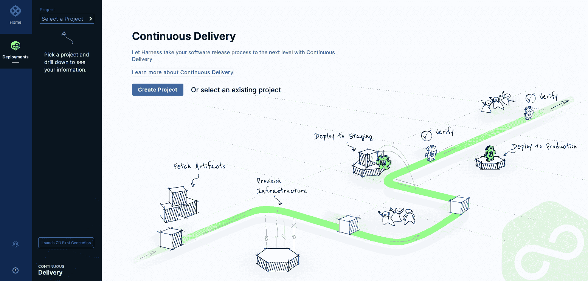

# 线束 CD 平台现可通过源可用许可证获得

> 原文：<https://devops.com/harness-cd-platform-now-available-via-source-available-license/>

Harness 今天宣布[其连续交付(CD)平台的免费社区版](https://www.prnewswire.com/news-releases/harness-opens-continuous-delivery-service-with-free-source-available-license-to-enable-seamless-adoption-of-world-class-cicd-platform-301463652.html)现在可以在源代码可用许可证下获得，而不是更传统的开源许可证。

Harness 的首席营销官斯科特·桑切斯(Scott Sanchez)表示，目标是让开发人员和 DevOps 团队能够像他们当前的 CI 平台一样访问 CD。Harness 已经发布了其持续集成(CI)平台的开源版本。

Harness CD 平台根据 Polyform Shield 许可证提供，该许可证提供对该平台的免费访问，包括使用、修改和分发该平台的权利，但不提供竞争产品。源代码可用许可证是开源许可证的替代方案，它允许组织潜在地创建 Harness CD 的一个分支，例如，可以作为云服务交付。这个特定的问题导致了这样的情况，创建开源项目的供应商发现他们自己在与云服务提供商竞争收入，而云服务提供商不一定致力于贡献和维护主要的开源项目。在这个节骨眼上，还不清楚有多少其他在开源许可下提供软件的厂商可能会采取类似的策略。

虽然大多数采用 DevOps 的组织已经成功实施了一套 CI 最佳实践，但实施 CD 的组织数量却没有这么多。其中一个原因是跨平台的自动化部署从来都不容易。每个平台都倾向于定制到难以自动化应用程序部署的程度。实际上，每个平台都是它自己独特类型的“雪花”

然而，随着数字业务转型计划的数量持续稳步增长，定期更新应用程序体验的需求将要求更多组织实施一套 CD 最佳实践。Sanchez 指出，源代码可用的许可证应该有助于增加可以访问和试验 CD 平台的 DevOps 团队的数量。当然，挑战在于许多应用程序现在都基于微服务，组件广泛分布在整个 IT 环境中。

从历史上看，在 CI/CD 平台的上下文中，CI 和 CD 是同义词。目前还不清楚 DevOps 团队会在多大程度上更好地利用他们已经部署的 CI/CD 平台，而不是为 It 运营团队部署专用的 CD 平台，让开发人员选择他们喜欢的 CI 平台。总的来说，持续交付基金会最近进行的一项调查发现，在拥有两名或两名以上员工的公司工作的 80%的受访者都在某种程度上参与了开发运维。

无论采用何种方法，未来的一年将会有更多的组织将 DevOps 计划提升到新的水平。可以说，随着越来越多的组织意识到他们如何依赖软件来区别于竞争对手，交付新的应用程序体验的能力变得至关重要。这些工作的核心是一组 DevOps 最佳实践，它们将最终决定这些组织的竞争力。