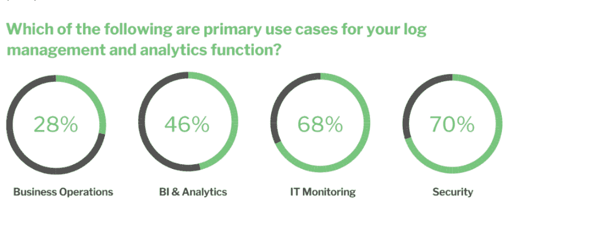
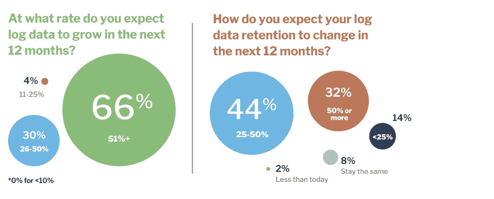

# 利用日志数据分析的价值

> 原文：<https://devops.com/harnessing-the-value-of-log-data-analytics/>

每天，普通企业的云应用程序、容器、计算节点和其他组件都会产生数百万个小日志。每个日志都是一个文件，其中的数据描述了一个事件，如用户操作、服务请求、应用程序任务或计算错误。日志还捕获应用程序和其他组件相互发送的消息。

这些日志中隐藏着丰富的信息和价值，这就是为什么企业如此热衷于使用它们来满足客户参与、IT 安全和云运营等业务需求。

理解和管理这些数据的需求如此之高，以至于市场和市场对日志分析数据 市场的估价在 2020 年达到 19 亿美元。分析师预测，到 2025 年，这一数字将增长至 37 亿美元。推动这个市场的不仅仅是纯粹的数据增长，还有获取业务洞察力的需求。

这就是为什么 ChaosSearch 最近进行了一项 [调查](https://www.chaossearch.io/resources/log-data-management-2021-benchmark-report) ，以更好地了解企业目前如何使用和管理他们的[日志数据](https://devops.com/?s=log+data)。见解是从 50 个大中型企业组织的从业者那里收集的。调查发现，组织看到了利用日志数据在业务和 IT 功能方面取得更好成果的巨大价值。也就是说，这些从业者面临着处理规模需求的挑战，他们知道还有更多机会来扩大日志管理的范围和规则。

## **顶级用例**

这项研究证实，企业正在以多种方式使用日志数据，跨越业务和 IT 职能。我们发现，超过 90%的受访者在至少两种主要使用情形下使用日志管理和分析。不足为奇的是，日志管理的主要使用情形是安全性(70%)和 It 监控(68%)，但许多人也优先考虑 BI 和分析(46%)以及业务运营(28%)。

更仔细地观察安全使用案例很有意思:调查(45%)和[内部威胁](https://securityboulevard.com/?s=insider+threats) (45%)在 SecOps 日志数据使用列表中名列前茅。审计和合规(32%)、威胁追踪(32%)和异常检测(30%)也榜上有名。

## **支持业务运营的需求日益增长**

我们还看到，这些从业者希望使用日志数据来支持业务运营，特别是推动更好的业务成果和提高竞争力。例如:

1.  一家全球工业设备制造商将物联网设备连接到农场设备上，以跟踪天气、温度、湿度、一天中的时间、种植深度、土壤条件、种植的种子和农场的地理路径。中央日志分析解决方案不断收集和分析这些原始数据，从而使供应商能够向客户提供农场生产力报告和建议。
2.  一家生物制药公司通过温度和湿度警报跟踪细胞培养日志。该公司使用其日志分析平台来存储长期数据，以运行有助于假设检验的查询。他们还进行各种长尾分析，揭示趋势，让科学家对未来的实验做出明智的决定。
3.  一家大型在线零售商利用来自网络访问和其他客户活动的日志数据来开发 360 度客户概况，并分析“客户之旅”中的各个步骤，以发现提高效率和增加收入的机会。

## **应对增长和复杂性的挑战**

尽管对将日志数据用于安全和业务运营更感兴趣，但接受调查的从业者提出了一系列挑战。前三名是:复杂的基础设施(48%)、管理成本(42%)和管理增长(34%)。他们还表示，缺乏集中化、报告和数据质量是问题所在。这些挑战可能会因为预期数据将继续增长和数据保留将会增加而加剧。

驱动日志数据生成量的变量有很多，如用户、设备、应用程序、IT 环境和基础架构元素的数量。调查发现有两件事是普遍的——数据增长率很高，这是一个难题，数据保留越来越重要。

在参与者中，94%的人每天摄取至少 1tb 或更多的数据，18%的人在 10TB 以上。想想看，这些公司的平均每日接收量为 7.9 TB！

问题是，尽管每天都有大量的数据被摄取，但目前只有 28%的受访者捕获 80%或更多的日志数据。78%的人认为捕获 80%以上的日志数据是理想的。差距真大。

## **从业者认为最重要的日志管理功能**

我们还了解到，这些从业者普遍对他们现有的解决方案感到满意，但他们中的许多人仍然期望在未来三年内引入新的日志管理和分析解决方案。这是因为他们想要更好的规模和云原生解决方案。

当我们询问日志管理平台的重要功能时，可扩展性(58%)、弹性(54%)和高级分析(52%)位居榜首。

## **预算增加以满足日志分析需求**

为了应对面前的这些挑战和机遇，调查受访者正在增加预算；86%的人预计他们的预算将至少增长 20%，36%的人预计增长 50%或更多。这些预算不仅可以支持更多的数据捕获和延长保留期，还可以帮助他们应对不断增长的业务支持用例。事实上，68%的受访者表示，他们预计未来 12 个月内用例的数量将会增长。

毫无疑问:重视日志数据并投资于获取数据的公司将利用这些洞察推动其业务向前发展。