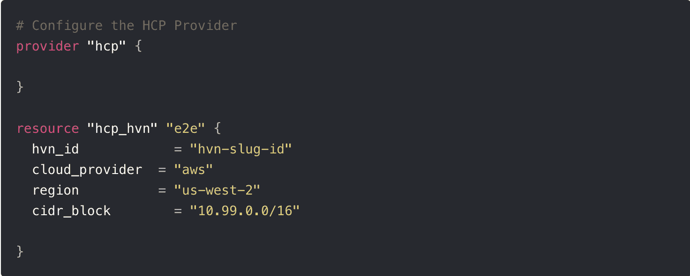

# HashiCorp 扩展托管服务产品

> 原文：<https://devops.com/hashicorp-expands-managed-services-offerings/>

HashiCorp 今天宣布其 Consul service mesh 在 HashiCorp 云平台 (HCP)上作为托管服务正式发布，同时在 HCP 发布了 HCP 金库托管实例的测试版，这是一个[秘密管理](https://devops.com/?s=secrets%20management%20)平台。

HCP 目前托管在亚马逊网络服务(AWS)平台上，该公司在该平台上以托管服务的形式提供其完整的产品组合。从长远来看，HashiCorp 计划在所有主要的云平台上提供其托管服务。

HashiCorp 的产品营销总监克里斯·肯特(Chris Kent)说，尽管开源服务网格(service mesh)的替代品越来越多，但许多组织更愿意采用由单一供应商提供的服务网格，而不必进行供应和维护。HashiCorp 的 Consul service mesh 提供了一种轻量级替代方案，可通过连接授权和加密实现服务对服务的联网和安全性，并使用相互传输层安全(mTLS)协议跨越 Kubernetes 集群和虚拟机平台。

然后，应用程序可以在服务网格配置中使用 sidecar 代理来为入站和出站连接建立 TLS 连接，而不必直接与 Consul 本身进行交互。

HashiCorp 是在开源服务网格平台(如 Istio、Linkerd 和库马)的支持者之间爆发自相残杀之际，为 Consul 提出理由的。Kent 说，Consul service mesh 为开发人员提供了一种更简单的替代方案，可以在 Kubernetes 集群上运行的基于微服务的应用程序和虚拟机上运行的传统单片应用程序之间进行整合。相比之下，Istio 和 Linkerd 仅设计用于 Kubernetes 环境。

服务网格的采用仍处于早期阶段。除了简化服务之间的应用流量路由之外，服务网格的另一个好处是，它在较低级别的网络应用编程接口(API)和协议之上提供了一个抽象层，开发人员更容易访问该抽象层。随着开发人员对服务网格越来越熟悉，在 DevOps 工作流中以编程方式包含网络和安全操作的能力将会提高。HashiCorp 将 Consul 和 Vault 共同定位为创建零信任架构的基础组件。

与此同时，每个 IT 组织都需要确定哪种类型的服务网格最适合他们的环境。在许多情况下，组织可能会发现自己采用多个服务网格来解决不同的用例。不管他们选择哪一个，服务网格将很快成为众所周知的太阳系中的一个永久固定设备，IT 服务围绕着它旋转。

哈希公司声称，超过 2000 个组织注册参加 HCP 领事和 HCP 保险库测试程序。这种兴趣水平表明，人们越来越倾向于将 IT 作为一种服务，而不是一个需要内部 IT 团队部署的平台来使用。与云服务提供商或第三方 It 服务提供商相比，组织在多大程度上更愿意直接使用供应商提供的服务还有待观察。