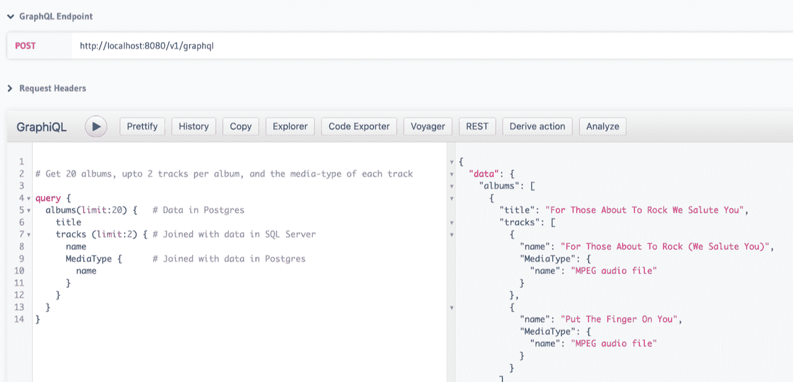

# Hasura 扩展了 GraphQL API 平台的范围

> 原文：<https://devops.com/hasura-extends-scope-of-graphql-api-platform/>

在其在线 an[Hasura con’21](https://hasura.io/events/hasura-con-2021/)会议期间，Hasura 今天宣布，它已经使开发人员能够使用 GraphQL 应用程序编程接口(API)来启动对驻留在多个数据库中的数据的查询。

与此同时，Hasura 宣布了模式共享功能的预览，以及对基于 GitOps 流程的工作流的支持，它将在今年晚些时候全面推出。Hasura 云平台现在可以通过一个简单的 git push 来部署从暂存到生产的本地迁移，此外还可以在每次向 git 存储库发出 pull 请求时访问应用程序的预览。

添加到 Hasura GraphQL 引擎中的模式共享功能旨在通过允许初学者和高级用户共享和安装权限、关系和元数据的示例，在他们之间架起一座桥梁。除了改进协作，目标是随着项目的发展和变得更加复杂，让软件工程师更容易参与进来。

GraphQL 最初由脸书开发，现已成为 REST APIs 的流行替代方案，因为它使开发人员能够在更细粒度的级别检索数据，从而提高了性能。

Hasura 是 GraphQL 引擎实例的提供商，该公司围绕一个项目开发了这个引擎，该项目现在由 Linux 基金会的一个分支 GraphQL 基金会托管。GraphQL 基金会的成员包括 Airbnb、亚马逊网络服务(AWS)、阿波罗、Coursera、Elementl、脸书、GitHub、IBM、Intuit Hasura、Paypal、Prisma、Shopify 和 Twitter。

GraphQL 提供了对通过 API 可用的数据的完整描述，并按照类型和字段而不是传统的端点来组织。除了阐明哪些数据可以通过 API 获得之外，开发人员还可以使用类型来避免编写手动解析代码。

自去年夏天以来，Hasura 一直在提供一个 GraphQL 实现的试点，它能够支持跨不同数据库的远程连接。这种能力至关重要，因为与特定业务流程相关的数据集最终可能会存储在多个数据库中。

Hasura 首席执行官 Tanmai Gopal 表示，开源的 Hasura GraphQL 引擎今年已经被下载了超过 2.5 亿次。2020 年下载量达到 1 亿。Gopal 指出，面临的挑战是，尽管 GraphQL 提供了 REST API 的更好的替代方案，但组织中存在的大多数 API 工具仍然是围绕 REST API 设计的。

为了适应这一现实，Hasura 提供了一个工具，可以将使用 GraphQL 设计的查询转换成一组与 REST APIs 兼容的调用。Gopal 指出，开发人员仍然能够获得能够启动更细粒度查询的好处。

一般来说，随着组织采用基于微服务的应用程序，REST APIs 变得越来越有问题。由于 REST APIs 试图从各种数据源获取大量数据，刷新一个简单的仪表板通常需要几分钟。随着组织接受数字化业务转型，他们也遇到了应用程序延迟问题，这些问题可以追溯到从多个微服务调用的数据量。

Hasura 表示，除了提供更有效的方法来访问数据，Hasura 还致力于为其核心引擎添加缓存功能，以进一步提高性能。

目前还不清楚 GraphQL 会以怎样的速度取代 REST APIs，但是 DevOps 团队应该假设组织在未来几年将会混合使用这两者。随着组织越来越依赖 API，挑战将是确定何时进行转换。