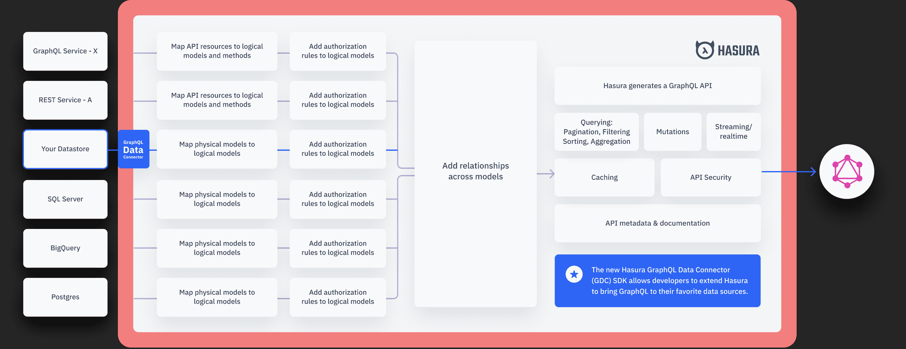

# Hasura SDK 将 GraphQL 平台与更多数据源集成在一起

> 原文：<https://devops.com/hasura-sdk-integrates-graphql-platform-with-more-data-sources/>

在其[Hasura con’22](https://hasura.io/events/hasura-con-2022/)大会上，Hasura 今天在[宣布了软件开发套件](https://www.businesswire.com/news/home/20220628005474/en/Hasura-to-Allow-Anyone-to-Turn-Any-Data-Source-into-a-GraphQL-API) (SDK)的早期发布，该套件将 GraphQL 平台的范围扩展到了其他数据源。

此外，Hasura 正在与 GitHub 存储库集成，支持 Hasura 云平台中的 OpenTelemetry Traces 和 Microsoft SQL 事件触发器。

最后，Hasura Cloud 现在可以部署在谷歌云平台上，而 Hasura Cloud 企业版现在可以在亚马逊网络服务(AWS)市场上使用。

Hasura 首席执行官 Tanmai Gopal 表示，尽管该公司已经为 Postgres 数据库等广泛使用的数据源提供了支持，但组织还希望能够通过 GraphQL 应用程序编程接口(API)查询许多数据源。他补充说，组织希望能够使用 GraphQL 连接数据，而不管它驻留在什么存储库中。

该公司产品核心的开源 Hasura 引擎自动从数据源生成 GraphQL 模式。这样就可以用来加速 API 的开发，让更多的开发者更容易构建应用程序来聚合来自多个数据源的数据。

Gopal 指出，这种方法消除了 IT 团队在将 GraphQL APIs 添加到已经有一系列内部 IT 团队支持的 API 的应用程序环境中时遇到的后端复杂性。

GraphQL 最初是由脸书创建的，但目前还不清楚 GraphQL APIs 会在多大程度上取代 REST APIs。开发人员倾向于使用 GraphQL APIs，因为它们对访问哪些数据提供了更细粒度的控制。挑战在于公开 GraphQL APIs 的后端服务的数量仍然相对有限。

It 团队不太可能在一夜之间用基于 GraphQL 的 API 取代 REST APIs，但依赖 GraphQL APIs 的新应用程序的比例将稳步上升。总体而言，随着更多基于微服务的应用程序的部署，IT 环境中采用的 API 数量正在快速增长。每个微服务都生成自己的 API。随着时间的推移，IT 团队将会发现他们管理着更多种类的 API。

挑战在于并不总是清楚 it 组织中谁将管理这些 API。它们通常由开发人员创建，并留给 IT 运营团队来维护。对于 It 团队来说，发现自己管理数百个，甚至数千个 API 并不罕见。

此外，许多这样的组织现在通过其他组织公开的 API 来消费数据。随着时间的推移，API 和应用程序之间的相互依赖程度将使应用程序环境变得更加复杂，难以管理。

与此同时，DevOps 团队将需要扩展现有的 DevOps 工作流，以支持和保护基于 GraphQL 的 API。通过这些 API 访问的大量敏感数据可能会加快组织采用 [DevSecOps](https://devops.com/?s=DevSecOps) 最佳实践的速度。让我们希望这发生在他们醒来发现 GraphQL APIs 已经遍布整个企业之前。