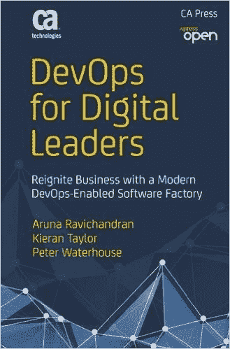

# 节日传统:2017 年连续交货预测

> 原文：<https://devops.com/holiday-tradition-continuous-delivery-predictions/>

每年的这个时候。随着日历年的结束，我们许多人都在遵循悠久的传统:为假期做准备，计划一些应得的假期，享受与朋友和家人在一起的时光。

在商界，年终也带来了自己的传统，其中第一项就是对来年进行预测。我不是一个放弃传统的人，所以在这篇文章中，我将在持续交付运动的背景下分享我对即将到来的一年的想法。

总的来说，连续交付是软件开发和测试的最先进和最现代的状态——并且是成功的 DevOps 策略的核心。能够实现连续交付的组织可以快速开发、测试和发布应用程序，并且质量更高，成本更低。

简而言之，更持续地交付软件的能力是应用程序经济中最大的优势之一，在应用程序经济中，消费者忠诚度的战场通常是交付优秀应用程序的能力。

现在我们知道了持续交付的含义，让我们来看看我对 2017 年的预测:

1.  **连续交货意味着连续一切** 

连续交付仍然是一个相对较新的概念，也是许多组织努力实现的目标。作为一个新概念，它受到经常困扰新兴技术或趋势的一些误解的困扰。许多技术提供商抓住这个术语不放，声称提供“持续交付解决方案”,实际上只解决了持续交付挑战的一小部分。

真正的连续交付软件意味着软件开发生命周期(SDLC)中的所有任务都必须优化为并行和连续发生。这意味着开发必须是连续的，测试必须是连续的，对于发布和操作也是如此。

2017 年将是行业接受端到端持续交付价值流重要性的一年。2016 年，许多组织通过解决 SDLC 的某些方面开始了他们的持续交付之旅；2017 年，许多组织将开始实现真正开放和集成的持续交付工作流。

2.  **民主化的持续交付工具(通过云)** 

如上所述，针对连续交付优化 SDLC 的所有方面意味着相关工具需要更易于使用和访问。拥有测试工具的开发人员(左移)可以提高他们生产的代码的质量。类似地，能够更快地获得设计需求的 QA 工程师可以更早地创建更准确的测试数据和场景。

然而，要做到这一点，工具必须易于访问和使用。开发人员避免了复杂的测试框架，但是有了简单易用的工具——通常以 SaaS 的形式——开发人员当然可以将测试整合到他们的方法中。

2016 年，CA 收购了 BlazeMeter，该公司开创了基于云的性能测试概念，采用了一种简单易用(但非常强大)的产品。我们预计这一趋势将在 2017 年扩展到持续交付价值链中的其他工具。

3.  **业界拥抱开源(真的)** 

在过去，我们已经注意到商业动机的技术提供商试图保持开源技术“一定的距离”可能有一些口头上对开放的支持，但实际上许多商业提供商感到受到开源解决方案的威胁，这些解决方案被视为对他们的产品有竞争力。

这种看法已经开始改变，但我相信 2017 年将标志着一个转折点，公司将真正接受开源解决方案作为其战略的一部分；那些持续抵制(双关语)的公司将处于明显的劣势。

开源之所以重要，有很多和云一样的原因:它被广泛采用是因为它在上市时间、质量和成本效益方面创造了优势。拥抱开源——我指的是与开源解决方案集成并将其作为产品策略的一部分——只会产生良好的商业意义。它帮助软件开发团队实现他们的目标，以更低的成本更快地交付高质量的软件。

又一年即将结束，我们对 2017 年充满期待。

关于持续交付的话题，向前看意味着在整个 SDLC 中传播持续交付，更多地使用云并拥抱开源。

所有这些结合在一起，将有助于我们作为一个行业共同推进持续交付运动。为新一年的持续交付进步干杯！

别忘了，你还可以拿起我的同事的新书《 [DevOps for Digital Leaders:重燃业务与支持现代 DevOps 的软件工厂](https://www.amazon.com/DevOps-Digital-Leaders-Reignite-DevOps-Enabled/dp/1484218418)》来仔细看看持续交付和其他 DevOps 相关趋势的持续发展如果你在假期有额外的时间，你会发现这是一次有趣的深度潜水。

— [杰夫·谢弗](https://devops.com/author/jeff-scheaffer/)