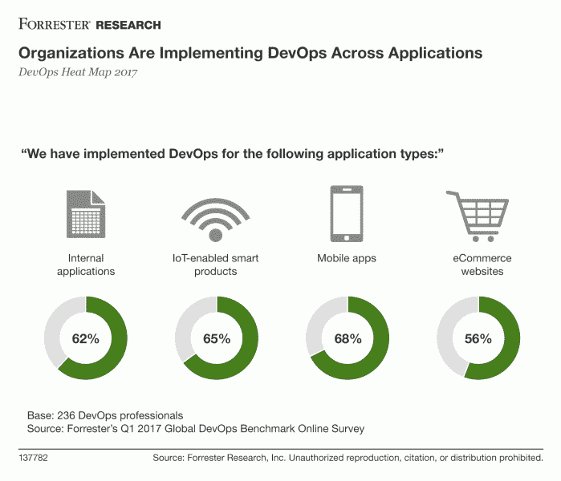

# DevOps 2017 的希望和失败

> 原文：<https://devops.com/hopes-and-fails-in-devops-2017/>

在 2016 年底，DevOps 爱好者和福音传道者都预测甚至宣布 2017 年为“DevOps 年”。DevOps 福音传道者 J. Paul Reed 在 TechBeacon 的[采访中说得更有说服力，“2017 年将是 DevOps 最终宣布 1.0 稳定的一年。”](https://techbeacon.com/7-devops-trends-watch-2017)

然而，并不是所有的预测在 2017 年都有了结果。让我们回顾一下 2017 年 DevOps 的希望和失败。

# 德沃普一家希望

## **DevOps 已经成为主流**

Chef 的沟通总监卢卡斯·a·韦尔奇(Lucas A. Welch)在 DevOps Digest 中预测，2017 年 DevOps“将从利基运营模式向现代 IT 的简单‘做事方式’迈出重大步伐。”另请阅读:“[devo PS 是圣杯吗？](https://squadex.com/insights/devops-holy-grail/)

最值得注意的是，DevOps 大师 Gene Kim 在 2017 年接受 [TechTarget](http://searchitoperations.techtarget.com/news/450297784/QA-DevOps-transformation-is-not-just-for-devs-and-unicorns) 采访时表示，DevOps 不再是脸书、网飞、Etsy 等所谓“独角兽”的专利，这一点已经被反复证明。各种规模企业的业务和 IT 领导都在积极实施 DevOps 实践，以实现全面的 DevOps 转型。

* * *

**相关内容:**

[DevOps 对 2018 年的预测](https://devops.com/devops-predictions-2018/)

【2018 年高管层的 5 大技术预测

* * *

然而，DevOps 已经成为主流的事实不应该让任何人感到震惊。如果我们从业务角度来看 DevOps，它缩短了上市时间，同时创建了稳定、高性能的产品。从技术的角度来看，快速交付高质量的软件而没有任何孤岛或麻烦，对 QA、开发和运营团队来说都是一件幸事。正如我们在下图中看到的，DevOps 已经在多种应用中实施:

尽管 2017 年中小企业采用 DevOps 的热情高于企业，但差距正在缩小。软件创建和发布实践以及 DevOps 的商业优势不言自明。我们预计未来一年 DevOps 的采用速度会更快:

不管你怎么看 DevOps，从任何角度看都是双赢。

## **2017 年微服务和容器崛起**

fixate.io 的分析师 Chris Riley 准确地预测，将会有“容器原生工具、容器原生安全和容器原生发布自动化的持续增长。”微服务的采用在 2017 年显著增长，由于其定义明确的接口、隔离的性质以及在不使更广泛的系统面临风险的情况下缩短周期时间的能力，微服务适合于开发运维。容器可以作为兼容的微服务部署工具，因为它们被设计为以最小的部署和运行时开销运行。

尽管 Docker 已经成为开发容器的标准，但就运行时、集群和编排环境而言，市场上仍有许多变化。

## **CI/CD 在 2017 年淘汰了手动测试**

如果说持续集成/持续交付(CI/CD)只是“引起了轰动”,这是一种轻描淡写的说法。TechBeacon 的撰稿人 TJ Maher 本人也是一名自动化测试人员，他预测 CI/CD 的影响将会如此巨大，以至于将会颠覆整个行业:

> 持续集成和持续交付将 Selenium WebDriver 的巨大水花变成了一场海啸，冲走了几乎所有的软件测试行业，淹没了许多手工测试人员，侵蚀了他们的就业基础。

CI/CD 已经改变了开发人员和测试人员部署软件的方式。由于 DevOps 的兴起，传统的软件开发和交付方法正迅速变得过时。还记得公司每月、每季度甚至每年部署新软件的日子吗？那些日子已经过去很久了。在 DevOps 时代，每天多次发布是新的规范。

下面的图表说明了持续交付对软件开发的影响:

CI/CD 的另一大后果是软件测试员的角色正在走向灭绝。不仅仅是因为测试变得自动化，还因为 DevOps 模糊了角色之间的界限——其他角色承担了测试职责，甚至转移到了离岸团队。

# DevOps 失败

## **DevOps 歧义**

[《DevOps 手册*》的合著者 Jez Humble*](https://twitter.com/jezhumble?lang=en) ，说“devo PS 不是一个目标，而是一个永无止境的持续改进过程。”2017 年，“DevOps”一词偏离了这一定义，被超载、过度使用和误解。

组织继续相信，通过投资技术，他们可以解决文化和组织问题以及人才缺乏，这最终会导致项目失败。正如 Jez Humble 在《DevOps 手册》*[*中所写的那样，没有一步可以持续变得更好*](https://www.amazon.com/DevOps-Handbook-World-Class-Reliability-Organizations/dp/1942788002)*

## ***与 DevOps 转型的斗争***

*尽管 DevOps 的采用已经成为主流，但对于许多公司来说，这仍然是一个艰苦的过程。也许最大的原因是 DevOps 是一种文化变革。DevOps Research and Assessment 创始人兼首席执行官 Nicole Forsgren 表示，DevOps 转型存在两个基本问题:*

> *首先是规模。你如何从一个团队或一条业务线上获得成功，然后帮助向外传播？在较小的组织中，这很困难，但更简单。在大型企业中，这可能是一个更大的挑战。*
> 
> *另一个严峻的挑战是错综复杂的，它是:我们如何识别我们的成功(和失败！这样我们就可以利用它们(或向它们学习)，然后更广泛地传播这些知识？*

*当然，要建立成功指标，我们必须首先定义“成功”，因为这个定义会因公司而异。衡量成功的标准通常包括四个方面:部署频率、平均恢复时间、变更的准备时间和变更失败率。这种“左移”的转变绝对值得投资。*

*为了实现持续改进，以下是一些你必须做的事情:*

**

*带着所有这些希望和失败，2018 年肯定会带来更多发展，并在 2017 年的成功基础上更上一层楼。DevOps 在 2018 年有什么打算？敬请期待一探究竟！*

*— [斯坦尼斯拉夫·伊瓦申科](https://devops.com/author/stanislav-ivaschenko/)*