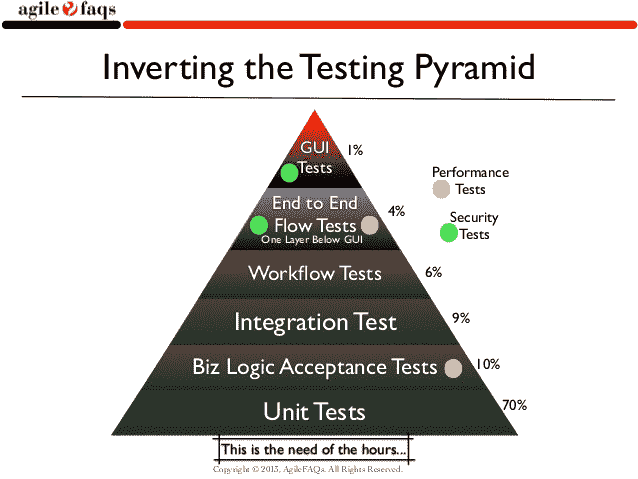

# 自动化测试如何帮助最新的 C-Level 问题:质量软件

> 原文：<https://devops.com/how-automated-testing-can-help-the-latest-c-level-issue-quality-software/>

每年，开发人员都会聚集在圣荷西参加苹果公司一年一度的 WWDC(T2)，在这里，软件质量通常是讨论的重点。今年，该公司从 2017 年漏洞百出的软件灾难中全面进步——这是一项正面努力，其标志是行业领导者将 2018 年命名为软件质量年。

这给软件行业本身带来了一些更大的问题。现代 IT 已经变得如此复杂，以至于“无 bug”软件的概念不再现实，尤其是对于苹果这样规模的公司？还是苹果认识到了这个痛点，将重心转移到软件质量上，力图成为变革的先行者？

当然，在质量问题上，苹果并不孤单。如今，来自各种组织的有缺陷的软件依然存在，但是它不能被忽视。质量差的软件会造成客户信心下降、品牌侵蚀和收入损失的长期影响。这些都是整个高管团队非常关心的问题。质量不再是仅限于开发人员或运营人员的问题，它对每个组织的成功都至关重要。

例如，考虑到 88%的消费者表示，如果他们遇到错误或故障，他们会放弃一个应用程序(来源:QualiTest)。如果他们每天都遇到一个 bug，将近一半的人可能会完全停止使用一个应用程序。32%的人说他们会在遇到小故障的时候放弃一个应用。

获得一个新客户的成本是留住一个现有客户的 5 到 25 倍。通过持续测试的文化第一次就把软件做好对每个企业来说都是至关重要的，因为这直接转化为留住客户。

质量保证和测试的预算预计将从今年的 31%上升到 2019 年的 40%。然而，三分之一的开发人员仍然承认他们没有足够的时间在软件部署前进行适当的测试。这个行业的每个人都知道，开发人员跑得很快。最重要的是确保软件实际上运行良好，并提供预期的客户体验。垃圾进，垃圾出的模式不是一个选项。为了填补这个空白，越来越多的组织开始转向自动化测试。

任何重复性的劳动密集型任务都是自动化的典型候选，包括那些与测试相关的任务。自动化测试包括在 web 或移动应用程序上执行预先规定的测试，测试数据可以在详细的报告中访问，以帮助开发团队快速识别代码中的问题，以及自动化脚本本身中的任何问题。

自动化框架及其脚本的性能至关重要，应该是一个高度关注的领域。规定的测试分为组成测试金字塔的不同类别。它们包括:

1.  单元测试
2.  代码覆盖率
3.  代码语法检查
4.  代码中的安全测试和检查
5.  集成测试
6.  针对网络、混合和移动应用的用户界面测试——在各种平台和操作系统版本的多个跨浏览器上进行

自动化测试一旦创建，就可以一次又一次地运行，而不需要额外的成本——这在源代码改变时特别有用。由于与手工测试相比，自动化测试要快得多，因此可以节省大量的时间和成本。

鉴于市场上浏览器、操作系统和设备的多样性，自动化测试尤其有价值。如今，消费者在不计其数的这些设备上运行应用程序，因此开发人员必须能够使用任何可以想象的组合来提供最高水平的性能。如果你的应用程序在世界的某个地方受到用户的欢迎，而用户使用的平台与你测试的平台不同，那么如果它不能正常运行(进而赚钱)，那它还有什么用呢？

确保软件在尽可能多的选项上工作，可以让企业接触到最大数量的用户。这就是自动化测试可以发挥作用的地方，在每一次测试运行中执行数千个不同的复杂测试用例。测试效率可以通过并行或网格执行测试，并行执行 CI/CD 作业来实现。例如，在 staging 中部署一个代码，团队可以同时开始工作来测试浏览器和跨浏览器、应用程序和本地化等。结果是获得了通过手工测试不可能获得的覆盖率。团队可以快速扩展应用程序，最大化 CI/CD 工作流，并更快地交付更高质量的软件。

获得 CI/CD 并自动完成创建实时测试系统的所有任务是下一场软件大战的战场之一。更重要的是，随着软件继续蚕食世界，高管们再也不能忽视劣质软件吞噬你的业务的影响。苹果将 2018 年确定为软件质量年的大胆举措是呼吁其他组织也这样做。

自动化测试是解决方案的关键部分。你的组织是如何应对软件质量挑战的，并且延伸开来，如何应对不断发展的客户体验标准的？

— [里泰什·阿罗拉](https://devops.com/author/ritesh-arora/)