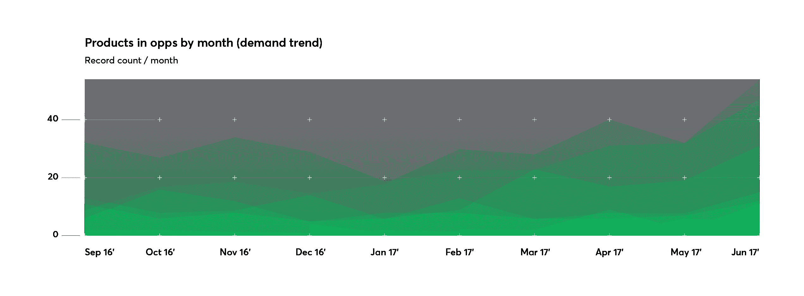

# 明确的可预测性如何让您的企业规模翻倍

> 原文：<https://devops.com/how-nailing-predictability-can-double-the-size-of-your-business/>

在快速变化的世界中，可预测性从未如此强大。它也从未被如此低估过。虽然很容易从重复甚至单调的角度考虑可预测性，但商业中的可预测性意味着能够正确估计完成一个项目需要多长时间以及风险有多大。但保持可预测性意味着其他一些重要的事情:更好的资源分配，更少的项目超支，以及跨团队对项目进展的更深入了解。所有这些都导致了每个企业最终都关注的一件事:利润。

业务中最大的难点之一是按时按预算交付项目。你最新的项目可能是创新的，对你公司未来的成功至关重要，但事实是，它很可能会比你想象的花费更多——尽管你尽了最大的预算努力——并且需要更长的时间来完成。事实上，一项研究发现，软件行业 66%的项目没有按时完成，33%的项目超出了预算，17%的项目没有获得利益相关者期望的回报。当我们看到 17%的项目有可能拖垮整个公司时，这是一个不容忽视的问题。

这仍然是软件行业的一个大问题。我们需要的是在流程中增加透明度和更高水平的可预测性，从而消除诸如项目超支、延迟和客户不满等障碍。我从亲身经历中了解到这一点。我们设法在九个月内将核心流程的可预测性提高了 102 %,因此，我们一半的新合同都是由满意的客户推荐的，这些客户反过来会收到他们与我们合作的项目的更准确的报价和时间框架。

为了实现这一点，您需要建立定义可预测性的 KPI，然后设计整合和利用这些数据的工具。这并不容易，但你将拥有比以往更多的控制权——这是创新的完美基础。首席运营官·马雷克·塔拉奇克在 2017 年 1 月将变得更加可预测并实施必要的工具、流程和指标作为优先事项，这一直是我们的目标之一。当你能准确地衡量一件事要花多长时间，风险有多大时，你就能计划成本和收入，从而成为其他商业实体的有价值的合作伙伴。关键利益相关者的问题也会更少，从而提高客户的满意度和信任度。一旦你的可预测性数据被整合到一个平台上，你也将能够使用它在未来做出更好的招聘决策，或者像我们一样，开发一个交通灯系统，该系统使用机器学习算法来识别哪些项目可能有问题，然后隔离潜在的原因。诸如此类的工具帮助我们在 18 个月内将规模扩大了近一倍。在我们努力之前，我们经常浪费时间和金钱来处理项目危机。

最重要的是，能够帮助其他公司变得更可预测的公司将在软件、设计和数字化转型方面引领潮流。这意味着他们可以在产品发布之前为他们的业务和营销策略制定一个精确的计划——这不是基于最佳情况的猜测，而是基于可靠的数据。关于成本爆发的尴尬、不满意的会议也会减少；您的关键利益相关者可以为开发成本做好准备，不会对突然需要额外预算感到惊讶。

请记住，我们的目标是准确预测您的项目将如何进行——而不是根据这些新工具生成的 KPI 来判断团队成员。克服这种担心是我们面临的第一个障碍，但这只是解释你真实意图的问题。这一切都是为了解决问题，同时预测挑战和障碍。

— [维克特·施密特](https://devops.com/author/wiktor-schmidt/)