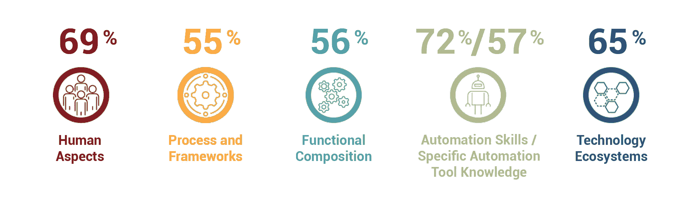
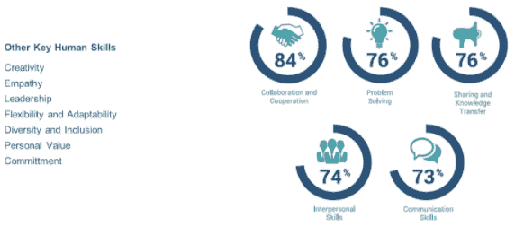
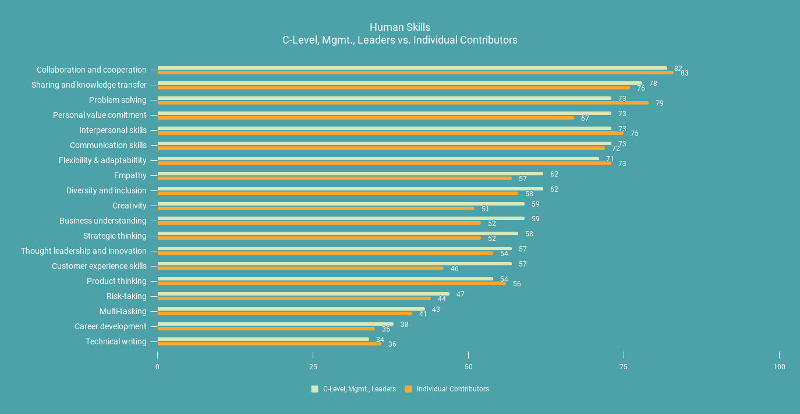
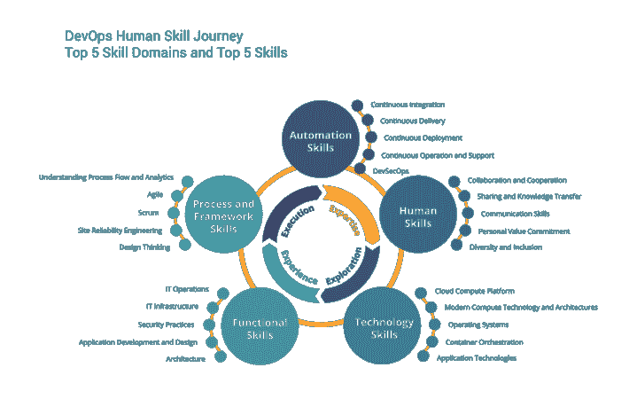

# DevOps 技能之旅如何培养学习文化

> 原文：<https://devops.com/how-the-devops-skill-journey-fosters-a-learning-culture/>

除其他因素外，人类技能一直很重要；现在比以往任何时候都多。同理心、多样性、创造力、个人承诺都受到了考验。远程工作的增加往往以独特的方式挑战个人，这些人类技能变得至关重要。

## 2021 年前 5 大技能领域

今年，【2021 年技能提升:企业开发运维技能报告的 69%受访者告诉[开发运维学院](https://devops.com/?s=devOps%20Institute)他们认为人力技能是开发运维人员“必备或非常重要”的技能，以及其他优先事项，围绕如下所示的技能领域:

毫不奇怪，围绕 DevOps 之旅的挑战继续围绕人员、流程和技术，所有受访者都给予了同等的重视(33%)。

为了在 DevOps 中继续繁荣发展或开启 DevOps 之旅，个人、领导和组织应采取行动发展这些领域的技能。对吗？

那么，为什么只有 39%的受访者表示他们有一个正式的技能提升计划呢？另外 61%面临的挑战是什么？认识到这些技能领域的重要性是一回事，做点什么似乎又是另一回事。为什么在提高技能方面做得很少？

这些技能可以教吗？嗯，也许是，也许不是。

[研究表明](https://psycnet.apa.org/record/1999-01933-002)知识和技能*可以由大多数人*发展而来，而能力、个人能力和性格则是与生俱来的。此外，现有的人的能力是促进个人学习、适应性和发展的结构，即使在环境发生剧烈变化时也能保持其价值。

在我们的研究中，当我们问组织如何优先考虑人的技能[时，我们发现人的能力或领域是五大必备技能领域之一。我们还发现，组织已经将学习型组织和安全文化的概念作为开发运维的两个重要组成部分。](https://info.devopsinstitute.com/2021-upskilling-report-download)

## 关于人类或“软”技能需要了解的 3 件事

1.  人类的技能或领域是完全不同的。虽然技术技能——如容器编排、CI/CD 自动化技术和云基础设施——可以通过培训培养(这些技能可以通过认证),但人力技能领域有些不同。首先，一些人类技能是通过我们个人和工作生活中的经验和实践形成的。例如，协作和沟通技能是在项目期间形成的，可以根据组织的文化进行调整。其他技能，比如好奇心，可能是在生命早期发展起来的，或者是天生的。
2.  盘点一下你最擅长的人类技能。我们的调查受访者对开发运维中最重要的必备人力技能提出了深刻见解。然而，每种情况都是不同的，但是看看这些，并对你的人际技能进行自我检查。
3.  人类技能发展需要指导和持续的反馈。无论组织利用什么方法，一个关键的方面是个人和领导者都应该有一个教练或导师来提供指导和支持。同样重要的是围绕个人发展的持续反馈。今天的人力资源团队也许能够提供帮助。如果没有，与可能已经建立了所需技能模型并能提供支持和指导的其他人建立联系。

## 根据首席管理人员的说法，必须具备人力技能

下图显示，在涉及人员技能时，高管、管理层和个人贡献者都有相似的优先考虑事项。(蓝色代表高管和管理层，橙色代表个人贡献者)

在多任务处理、客户技能、思维领导力、业务理解、创造力、多样性和包容性、同理心、个人价值、沟通、人际交往技能、分享和知识转移方面，观点存在一些差异。

如何识别个人在软技能和其他技能发展方面的潜力？不幸的是，这不是一门精确的科学。一种可能性是首先了解需要什么样的 DevOps 能力，然后执行技能清单检查。那么，问题就变成了，你如何鼓励个人发展他们的技能？

## 通向学习型组织的技能之旅

学习型组织是由个人和领导者组成的，他们都对提高自己的能力和技能感兴趣，以实现他们关心的结果。学习如何做某事是非常有益的，同时，如果学习与所需的能力相一致，就可以实现特定的组织目标。

首先，评估 DevOps 缺少什么功能，再加上 DevOps 团队成员的技能路线，这是一个双赢的局面。

## DevOps 之旅的 5 个小贴士

1.  让持续学习成为 DevOps 之旅的一部分。持续学习和教育必须是您发展之旅中的一项基本最佳实践。第一步始终是教育，提供学习资源，让工程师和个人参与到社区中并向其他人学习。
2.  **不要隐藏专家。**另一个关键步骤是确定主题专家是否受到保护或隔离。相反，要学会如何将这些人融入团队，这样他们就可以通过潜移默化的方式向团队中的其他人传播他们的专业知识。
3.  技能的增长需要时间和预算。根据 Jayne Groll 的说法，“企业应该采取有意识的措施来支持其开发人员的成长。”有些人可能认为工程师是有机学习的，但事实上，工程师需要时间和预算资源来开发新技能，磨练现有技能，试验和提高他们的能力。这可以是参加虚拟会议、参加培训课程、在沙盒中练习和/或进行点对点指导的时间。例如，看看网站可靠性工程师，他们的任务是花一半的时间通过自动化来减少辛劳，从而“让明天比今天更好”。DevOps 工程师也应该分配相同的时间来做同样的事情。
4.  采用伙伴制。采用教练或伙伴系统来进一步帮助个人学习和成长是一个很好的主意；将技能较低的开发人员和工程师与技能高、经验丰富的人员配对，观察增长的发生。这有助于双方的成长——无论是对有经验的伙伴还是对经验不足的人，在学习和教学方面。
5.  装备你的领导。领导者应该知道如何做事，对吗？想知道所有的答案？不完全是。一些[研究显示](https://www.ccl.org/)当今最大的一群领导者是“偶然领导者”，60%的一线领导者说他们从未接受过任何新角色的培训。领导者也需要学习和提高技能。

过去一年的挑战显示了人类技能在变革努力中的重要性。如果没有全世界 it 专业人员的精神、意愿、协作、合作和能力，许多企业将无法适应疫情推动的经济中快速变化的业务模式。随着我们进入下一个十年，组织应该计划投资于提升他们的人类技能，与他们的技术一样多(甚至更多)。