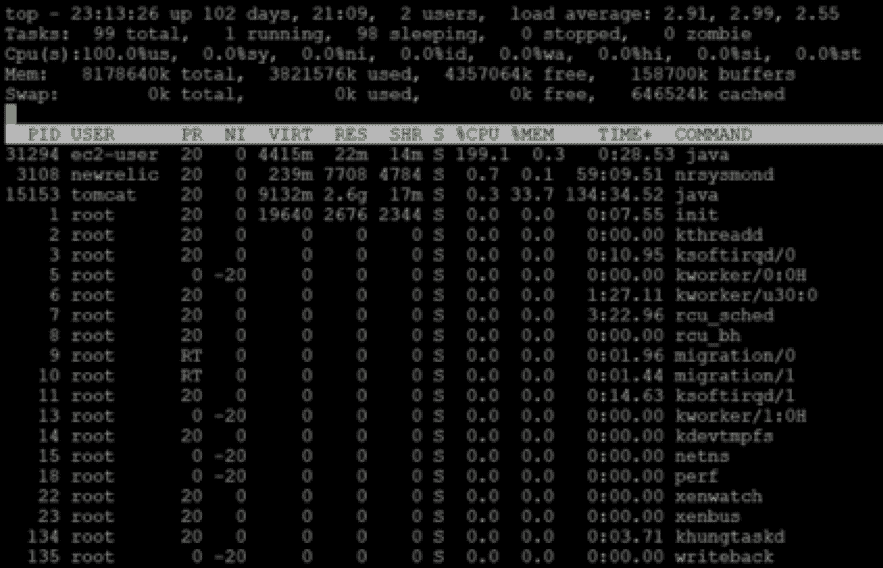
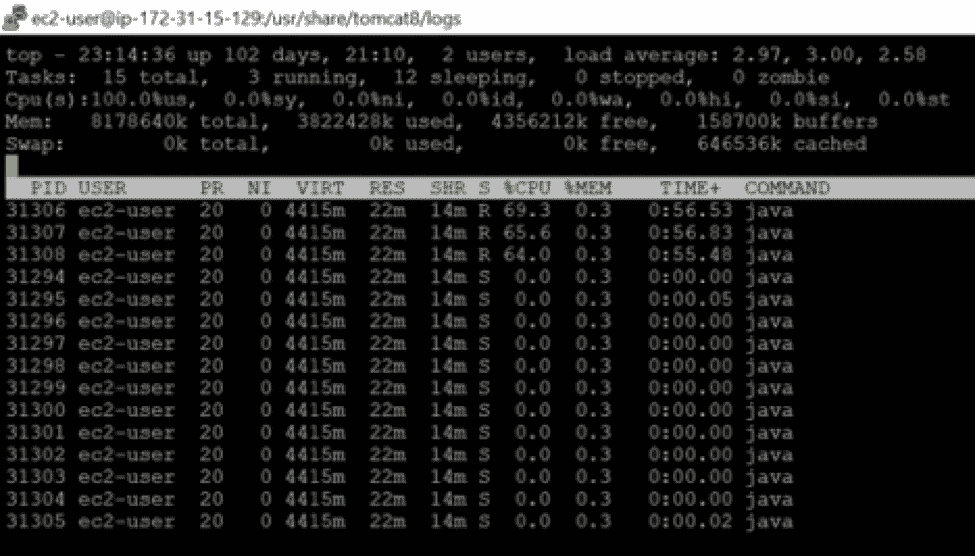
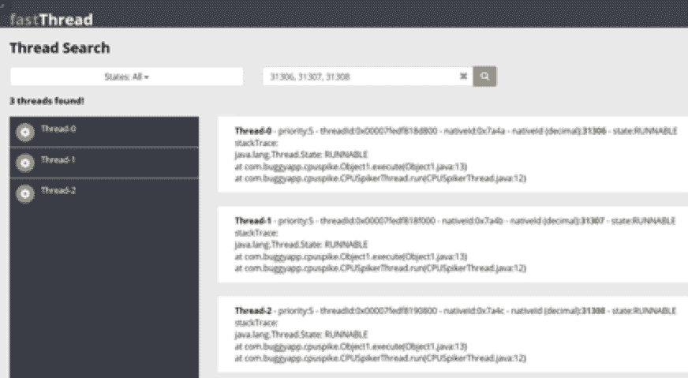

# 如何解决 CPU 问题

> 原文：<https://devops.com/how-to-troubleshoot-cpu-problems/>

在云环境中对生产中的 CPU 问题进行诊断和故障排除可能很棘手。您的应用程序可能有数百万行代码，因此确定导致 CPU 峰值的确切代码行可能相当于大海捞针。本文展示了如何在几秒钟/几分钟内找到那根针(即 CPU 尖峰代码行)。

为了帮助读者更好地理解这种故障排除技术，我们构建了一个示例应用程序，并将其部署到 AWS EC2 实例中。该应用程序在启动时导致 CPU 消耗飙升至 199.1%。以下是我们解决此问题的步骤:

1.  识别消耗 CPU 的线程。
2.  捕获线程转储。
3.  找出导致 CPU 峰值的代码行。

## 识别导致 CPU 峰值的线程

在 EC2 实例中，可以运行多个进程。第一步是确定哪个进程导致了 CPU 高峰，最好的方法是使用*nix 风格的操作系统中的“TOP”命令。

从控制台发出命令“top”

**< <开始:代号> >**

**$ top**

**< <结束:代号> >**

该命令将显示 EC2 实例中运行的所有进程，高 CPU 消耗进程显示在顶部。当我们在 EC2 实例中发出命令时，我们看到了下面的输出:

Fig: ‘top’ command issued from an AWS EC2 instance

从输出中可以看到，进程#31294 消耗了 199.1%的 CPU，这是很高的消耗。

既然我们知道了 EC2 实例中的哪个进程导致了 CPU 峰值，下一步就是识别进程中导致峰值的线程。

从控制台发出命令“top -H -p {pid}”。示例:

**< <开始:代号> >**

**$ top -H -p 31294**

**< <结束:代号> >**

该命令将显示 31294 进程中导致 CPU 峰值的所有线程。当我们在 EC2 实例中发出这个命令时，我们收到了下面的输出:

Fig: ‘top -H -p {pid}’ command issued from an AWS EC2 instance

从输出中您可以看到:

*   线程 Id 31306 消耗了 69.3%的 CPU。
*   线程 Id 31307 消耗了 65.6%的 CPU。
*   线程 Id 31308 消耗了 64.0%的 CPU。
*   其余线程消耗的 CPU 资源可以忽略不计。

既然我们已经确定了导致 CPU 峰值的线程，下一步就是捕获线程转储，这样我们就可以确定导致 CPU 峰值的代码行。

## 捕获线程转储

线程转储是应用程序中所有线程的快照。线程转储中报告了应用程序中每个线程的线程状态、堆栈跟踪(即线程正在执行的代码路径)和线程 ID 相关信息。

有八个不同的选项来捕获线程转储。你可以选择对你方便的选项。进行线程转储的一个最简单的选择是使用工具“jstack ”,它是在 JDK 打包的。这个工具可以在$JAVA_HOME/bin 文件夹中找到。下面是捕获线程转储的命令:

**< <开始:代号> >**

**jstack-l { PID }>{文件路径}**

**< <结束:代号> >**

其中 pid:是应该捕获其线程转储的应用程序的进程 id，file-path:是线程转储将被写入的文件路径。

示例:

**< <开始:代号> >**

**jstack-l 31294>/opt/tmp/thread dump . txt**

**< <结束:代号> >**

在本例中，进程的线程转储将在/opt/tmp/threadDump.txt 文件中生成。

## 识别导致 CPU 峰值的代码行

下一步是分析线程转储，以识别导致 CPU 峰值的代码行。我们通过免费的在线线程转储分析工具 [fastThread](http://fastthread.io/) 来分析我们的线程转储。

一旦我们上传了捕获的线程转储，工具就会生成这个包含多个部分的[报告](http://fastthread.io/my-thread-report.jsp?p=c2hhcmVkLzIwMTgvMTIvMTAvLS10aHJlYWQtZHVtcC12Mi50eHQtLTIzLTMyLTEw)。在报告的右上角是一个搜索框，我们在其中输入消耗高 CPU 的线程的 id——基本上就是我们在第 1 步中识别的线程 id:31306、31307 和 31308。

fastThread 显示了线程的堆栈跟踪，如下所示。

Fig: FastThread tool displaying CPU consuming thread

您可以注意到所有三个线程都处于可运行状态，并且正在执行这行代码:

**< <开始:代号> >**

**com . buggyapp . cpuspike . object 1 . execute(object 1 . Java:13)**

**< <开始:代号> >**

显然，下面是应用程序源代码:

**< <开始:代号> >**

**1:打包 com . buggyapp . cpuspike；**

**2:**

**3: /****

4: *

**5:* @作者测试用户**

**6: */**

**7:公共类对象 1 {**

**8:**

**9:公共静态 void execute() {**

**10:**

**11: while (true) {**

**12:**

**13:do something()；**

**14: }**

**15: }**

**16:**

**17:public static void do something(){**

**18:**

**19: }**

**20: }**

**< <结束:代号> >**

你可以看到 object1.java 的第 13 行是“do something()；”。您可以看到‘do something()’方法什么也没做，但是它被调用了无数次，因为它没有终止，而是由于第 11 行而循环。**如果一个线程开始无限次循环，CPU 将开始尖峰**。这正是在这个示例程序中发生的事情。如果 11 号线中的非终接循环得到修复，CPU 峰值问题就会消失。

## 结论

总而言之，首先我们需要使用“TOP”工具来识别导致 CPU 峰值的线程 id，然后我们需要捕获线程转储。最后一步是分析线程转储，以确定导致 CPU 高峰的确切代码行。

享受故障排除和快乐黑客！

— [拉姆·拉克什马南](https://devops.com/author/ram-lakshmanan/)