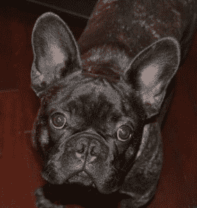

# 如何使你的关系网非驯化:DevOps！

> 原文：<https://devops.com/how-to-undomesticate-your-network-devops/>

当我看到这些年来合规性和法规如何影响网络安全时，我想起了这些年来养狗者的标准和法规对狗的影响。我将使用这个类比来说明网络已经变得过于驯化，以至于当面对互联网上的天敌时，它们无法适应并茁壮成长。在我看来，DevOps 是一种使您的网络非家庭化的方式，这样，流程和技术可以以最自然的方式处理威胁，达到复杂生态系统中描绘的平衡。

这整个思考过程始于我和我的好友雨果一起出去玩的时候。他是我一岁大的法国斗牛犬。我们经常在一起，有几次我觉得他用心灵感应帮我解决了棘手的技术问题(但那是题外话)。不管怎样，如果你了解法国斗牛犬，你就知道它们是变种人。它们已经被培育到了这样的程度:它们的呼吸受到损害，当温度过高时，它们会过热而死亡。他们有常见的背部和脊柱疾病，我可以继续说下去，但他们本质上需要人类在这一点上让他们活着。如果我们在水边，我必须给可怜的雨果穿上救生衣，因为虽然所有的狗都会游泳，但他的头太重了，过不了一会儿他就会淹死。尽管如此，他在很多方面都是我的伙伴，我们都缺乏在更恶劣的环境中茁壮成长的祖先的重要特征。

虽然我可以继续谈论我的好友 Hugo，但我想说的是，虽然 PCI 等标准有助于提高在线安全措施的标准，但我必须停下来问一问:针对谁的安全措施？在等式的威胁端发生的创新、变化和适应的水平超过了安全标准制度化和实施的速度。因此，你的网络可能像我的雨果一样可爱，甚至可能赢得一两条丝带，但当面临高级威胁时，它也不会存活。

当我们把驯养的狗追溯到几万年前，我们就到了灰太狼。他们成群结队地旅行，他们每天都面临威胁，他们在非常恶劣的环境中茁壮成长并适应环境。DevOps 带我们回到狼在狼群中找到力量的时代，狼群在面临冲突时也在狼身上找到力量。生存很真实，很实用；没有必须遵循的认证级别、清单或确定性流程。这是进攻者和防守者之间微妙的舞蹈，不管喜欢与否，我们正朝着那个方向前进。

DevOps 为我们带来了不断呈现日常生活中不断变化的威胁的机会——任何与互联网相关的事物都是如此。它回到了野外，回到了生物层面的损失意味着物种层面的进化和恢复的时代。我们的目标从保护我们的网络转变为发展我们的网络，因为这种变化的速度增加了对手的成本。DevOps 使您的网络攻击成本更高！