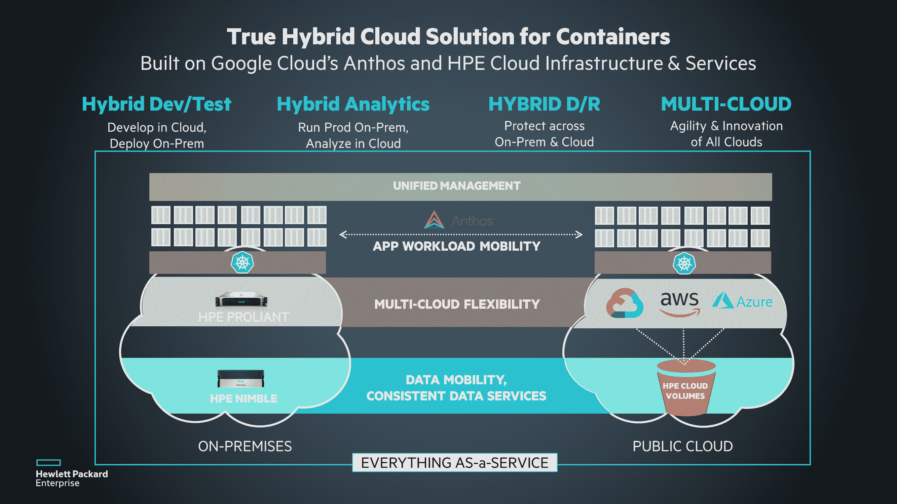

# HPE 扩展混合云计算战略

> 原文：<https://devops.com/hpe-extends-hybrid-cloud-computing-strategy/>

惠普企业(HPE)公司今天在其 [HPE 探索 2019](https://www.hpe.com/events/discover/) 大会[上宣布与谷歌结盟，在混合云计算环境中拥抱 Kubernetes](https://community.hpe.com/t5/Around-the-Storage-Block/Introducing-True-hybrid-cloud-for-containers/ba-p/7050851#.XQkjLvZFwYy) ，然后将其用于构建私有云的软件定义的基础设施扩展到传统 ProLiant 服务器，从而推进其混合云计算战略。

HPE 软件定义和云集团的营销总监劳伦·怀特豪斯(Lauren Whitehouse)表示，HPE 可组合云现在已经超越了新的 ProLiant 服务器，包括从传统硬件到运行虚拟机的云计算平台，或者作为针对 Kubernetes 优化的裸机服务器。

为了实现后一个目标，HPE 将有可能在 HPE 管理的平台上部署谷歌 Anthos，这是一个之前宣布的框架，用于跨公共云和内部 it 环境提供云原生计算服务。

HPE 为客户提供了部署配置本地服务器的选项，这些服务器带有采用 VMware vSAN 存储软件或 HPE SimpliVity 超融合基础架构平台的虚拟机。此外，客户可以选择在这些平台上部署 Kubernetes，或者在裸机服务器上运行 Kubernetes。在这些堆栈之上，HPE 还嵌入了 HPE OneView IT 基础设施管理和 HPE 可组合结构网络解决方案，以创建该公司所谓的可组合机架环境。

最后，HPE 宣布将 HPE InfoSight 人工智能引擎的范围扩展到其数据中心产品组合的其余部分，该引擎是在收购 Nimble Storage 时获得的，用于存储环境。

Whitehouse 表示，通过扩展其可组合计算战略的范围以包括传统服务器，HPE 寻求在更大的混合云计算战略的背景下更容易地实现内部 it 环境的现代化。

如此多的工作负载被部署在云中的主要原因之一是因为 IT 环境固有的灵活性。HPE 正在投资于更高级别的基础设施抽象，以便将同等数量的敏捷性注入内部 IT 环境。Whitehouse 说，这些努力将使组织更容易在混合云计算环境中扩展最佳 DevOps 实践。她补充说，该公司现在正在消除组织的反对意见，即必须在其整个内部 IT 环境中实施叉车式升级才能实现这一目标。

目前还不清楚在这个勇敢的混合云计算新世界中，谁将管理什么。应用程序开发人员对平台的影响力越来越大，而自动化的进步似乎预示着本地数据中心内管理功能的整合。随着能够管理计算、存储和网络基础设施的站点可靠性工程师或所谓的“超级管理员”不断涌现，企业中围绕工作职能建立的筒仓正在被打破。事实上，越多的组织采用 DevOps 最佳实践，工作职能的整合就越快。

与此同时，无论是谁提供内部 IT 环境中的基础设施，都最好能够让本地 IT 团队像应用程序开发人员可能遇到的任何云服务提供商一样灵活。

— [迈克·维扎德](https://devops.com/author/mike-vizard/)