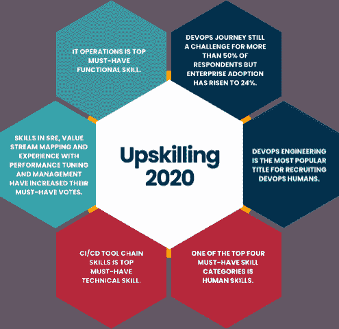

# 人类的转变孕育了开发技能和成功

> 原文：<https://devops.com/human-transformation-breeds-devops-skills-and-success/>

作为推进开发运营人力资源的使命的一部分，开发运营人力资源研究所发布了其 [2020 提升技能:企业开发运营人力资源技能报告](https://devopsinstitute.com/upskilling-2020) 。同比数据建立在 2019 年首次项目的基础上，但比去年更具洞察力和区域性。DevOps Institute 非常感谢在过去的一年中有 1，300 名受访者花时间分享他们的见解，使我们能够向社区展示这项重要的研究。    有一点非常清楚，那就是人类转型是为企业 IT 组织启用 DevOps 实践和模式的最关键的成功因素。传统的技能提升和人才培养方法将很快不足以让大型企业保持竞争力。这是因为对具有核心人类技能的 IT 专业人员的需求日益增加，这是商业领袖一生中从未见过的。如果今年的报告只有一个行动呼吁的话，那就是我们必须通过新的技能组合来更新我们的人类，就像我们的技术一样频繁，并且有同样的关注点。

## **对技能的思考**

我们继续看到数字化转型所需的技能与新老人才所具备的技能之间存在公认的差距。58%的技能提升报告受访者表示，找到有技能的开发人员是一个巨大的挑战，而 48%的受访者表示，留住有技能的开发人员是一个挑战。

不幸的是,“技能”这个术语太宽泛了，这助长了一种信念，即只有一堆能力才能保证企业的成功。那根本不是真的。现代 IT 专业人员必须具备至少四类技能:流程、功能、自动化和核心/人力技能。在每个类别中，个人必须知道哪些技能被认为是必须具备的，哪些技能被认为是必须具备的，哪些技能被认为是不重要的——，这就引出了一个问题:你是如何知道的？寻找这个问题的答案是 DevOps 学院的提升技能:企业 DevOps 技能报告项目的起源。

## **2020 年技能提升:企业开发技能报告的其他要点**

*   至少 50%的受访者认为开发运维之旅很困难，因为它改变了传统的 it 结构。
*   由于流程技能和知识(69%)、自动化技能(67%)和人类技能(61%)是 2020 年前三大必备技能类别，DevOps 人员必须具备一套混合技能。
*   技能提升现在需要引起注意，因为只有 31%的受访者有正式的技能提升计划，而 38%的人没有，21%的人说他们正在努力建立一个计划。
*   敏捷、DevOps 和 ITIL 正面临来自 SRE 站点可靠性工程公司的激烈竞争，该公司从 2019 年起增长了 5%。价值流管理和系统思维也越来越受欢迎。

了解更多， [下载技能提升 2020:企业技能报告](https://devopsinstitute.com/upskilling-2020/) **。** 这些数据非常精细，可以作为个人和企业计划提升技能的参考点。

— [杰恩·格罗](https://devops.com/author/jgroll/)