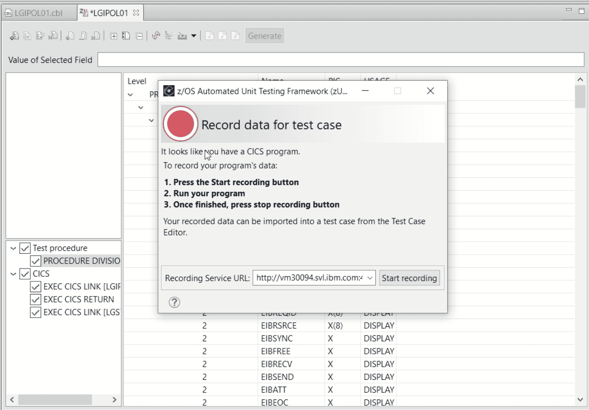

# IBM 在大型机上推进 DevOps

> 原文：<https://devops.com/ibm-advances-devops-on-the-mainframe/>

IBM 通过在 IBM Developer for z/OS(IDz)v 14 . 2 . 1 中添加针对使用 Db2 的 CICS COBOL 程序的自动化单元测试功能，扩大了将 DevOps 最佳实践引入大型机的努力。

IBM Z DevOps 主管 Sanjay Chandru 表示，这两种能力将在使已经投资大型机的 IT 组织更加敏捷方面发挥关键作用。他说，Docker x86 功能将使开发人员能够在不需要访问大型机的情况下构建和测试应用程序，而 IBM 的自动化单元测试工具提供了比前几代工具更轻量级的替代工具。

Chandru 说，除了自动化断言和通过/失败检查之外，IDz 的自动化单元测试能力使得从工具本身内部或者作为持续集成/持续交付(CI/CD)管道的一部分调用测试成为可能。他补充说，DevOps 团队现在还可以将测试与正在开发的代码一起存储在现代源代码管理应用程序中。

IBM 单元测试工具现在可以拦截 CICS 下的 EXEC CICS 和 EXEC SQL 应用程序调用，以允许在实时运行期间进行数据捕获。Chandru 说，这些记录的数据可以用于在虚拟环境中创建额外的测试，包括阴性测试，而无需 CICS，因为测试现在是作为批处理作业运行的。

最后，除了 JUnit 和 SonarQube 格式之外，IBM 还使导出 PDF 或 XML 格式的测试结果成为可能。

Chandru 表示，随着组织接受数字化业务转型计划，在大型机环境中应用最佳 DevOps 实践的兴趣大幅增加。他指出，项目几乎总是访问在大型机环境中运行的应用程序，但仍然在企业 IT 环境中处理大部分数据。他补充说，许多组织现在正在开发基于微服务的应用程序，这些应用程序依赖于后端的大型机。

然而，Chandru 说，考虑到这些应用程序的开发速度，构建和部署大型机应用程序的传统方法无法跟上现在预期的创新速度。他说，因此，IBM 鼓励拥有大型机的组织将构建和部署应用程序的责任进一步向左转移。

Chandru 说，从长远来看，IBM 希望让为大型机开发应用程序变得“不起眼”,因为为任何平台构建和部署应用程序的工具在大型机上都应该工作得很好。他指出，这种方法将大大扩大可以为大型机构建应用程序的开发人员的范围。

在大型机环境中广泛采用 DevOps 最佳实践可能还需要一段时间，其中许多都沉浸在应用程序开发的遗留瀑布方法中。然而，大型机环境中的一些 IT 团队开始意识到需要能够更快地响应不断变化的需求。现在剩下的唯一问题是确定大型机的最佳 DevOps 实践将被接受到什么程度。

— [迈克·维扎德](https://devops.com/author/mike-vizard/)