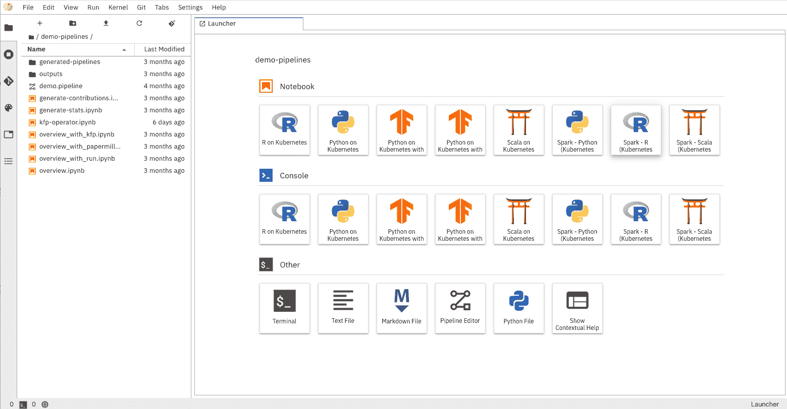
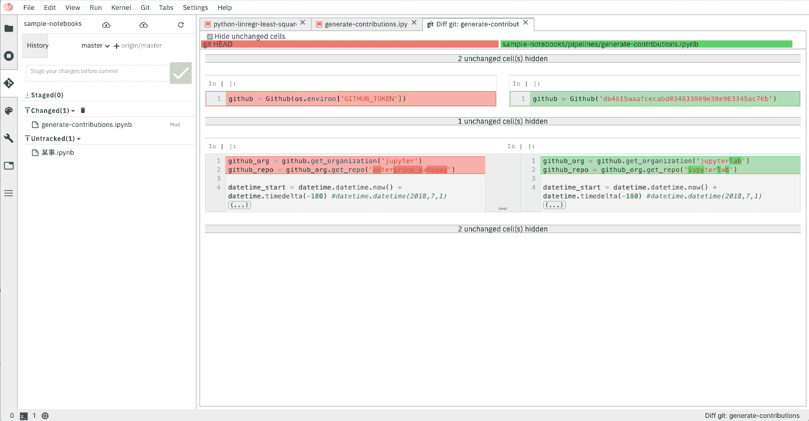
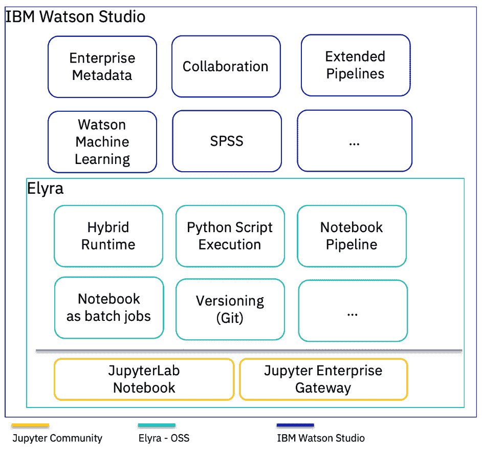

# IBM 宣布 Elyra AI Toolkit，这是一套以人工智能为中心的 Jupyter 笔记本扩展

> 原文：<https://devops.com/ibm-announces-elyra-ai-toolkit-a-set-of-ai-centric-extensions-to-jupyter-notebooks/>

Elyra AI Toolkit 是一个新的开源项目，它扩展了 JupyterLab 用户界面，以简化数据科学和 AI 模型的开发。

由[Luciano Resende](https://developer.ibm.com/profiles/lresende)T2 出版 2020 年 4 月 29 日

Jupyter Notebooks are now the open standard for data science and artificial intelligence (AI) model development. In keeping with our commitment to open source and the Jupyter community, in particular, IBM is proud to announce [Elyra](https://github.com/elyra-ai), a set of open source AI-centric extensions to Jupyter Notebooks, and, more specifically, the new JupyterLab user interface.The initial release of Elyra includes:

*   笔记本管道可视化编辑器
*   能够将笔记本电脑作为批处理作业运行
*   混合运行时支持(基于 Jupyter 企业网关)
*   编辑器中的 Python 脚本执行功能
*   基于 Git 集成的笔记本版本管理
*   运行时的可重用配置

我们很高兴宣布 Elyra，并帮助 Jupyter 生态系统发展新的人工智能模型开发工具。

[https://www.youtube-nocookie.com/embed/Nj0yga6T4U8](https://www.youtube-nocookie.com/embed/Nj0yga6T4U8)

> “我很高兴看到 IBM 与 Jupyter 和科学开源社区合作，他们在这一领域做出了持续的贡献。尽管人工智能工具依赖于大量的数据和计算资源，但人在循环中仍然是提出正确问题和负责任地做出决策的关键因素。这就是 Jupyter 发挥作用的地方，我很高兴看到 Elyra 这样的新工具将帮助 Jupyter 生态系统内的人工智能工作流。”—费尔南多·佩雷斯，Jupyter 项目联合创始人兼联合总监

## 笔记本电脑渠道

为一个模型建立一个人工智能管道是困难的。分解和模块化管道更加困难。典型的机器和深度学习管道始于一系列预处理步骤，然后是实验、优化，最后是部署。当将深度学习模型从开发引入生产时，这些步骤中的每一步都代表了其在实施、执行、调度和运营方面的独特挑战。

Elyra 提供了一个可视化编辑器，用于构建基于笔记本的 AI 管道，简化了多个笔记本到批处理作业或工作流的转换。通过利用基于云的资源来更快地运行他们的实验，数据科学家、机器学习工程师和人工智能开发人员的工作效率会更高，从而使他们能够花时间使用他们的技术技能。

下图显示了启用管道可视化编辑器的 Elyra Canvas 组件。Canvas 用户界面最初是作为 IBM Watson Studio 的一部分开发的，现在作为 Elyra 的一部分被开源。因此，现有的 IBM Watson Studio 和 IBM SPSS Modeler 用户应该对 Elyra 感到舒适。

Elyra 还扩展了笔记本 UI，以简化单个笔记本作为批处理作业的提交，如下图所示。

## 混合运行时支持

Elyra 利用我们在 Jupyter 企业网关方面所做的工作，使 Jupyter 笔记本电脑能够跨 Apache Spark、Kubernetes 和 OpenShift 等分布式集群共享资源。

它简化了在云机器上以交互方式运行笔记本电脑的任务，因此您可以使用基于云的资源，这些资源支持使用专用硬件，如 GPU 和 TPU。

## Python 脚本执行支持

利用混合运行时支持，Elyra 将 Python 脚本作为一等公民公开，允许用户在本地编辑他们的脚本，并针对本地或基于云的资源无缝地执行它们。

## 基于 Git 集成的版本控制

对 Git 存储库的集成支持使得跟踪变更更加容易，允许用户回滚到代码的工作版本、备份，最重要的是，在团队成员之间共享。这种协作的工作环境提高了生产率。

## 运行时的可重用配置

Elyra 引入了“共享配置服务”,简化了工作区配置管理，使诸如访问外部运行时的信息等内容只需配置一次，就可以在多个组件之间共享。

## Elyra 和 IBM Watson 工作室

IBM 最近宣布了新发布的用于数据的 IBM Cloud Pak 和 T2 沃森工作室，除了经典的 Jupyter 笔记本之外，还增加了 T4 Jupyter lab。Watson Studio 的当前版本已经提供了基于 Git 集成的版本控制，并继续与开源社区合作，以整合其他 Elyra 扩展。

## 摘要

Elyra 建立在 Jupyter Notebooks 基础上，这是数据科学家、机器学习工程师和人工智能开发人员的事实上的工具，它提供了一个旨在帮助解决模型开发任务复杂性的工具包。

以前，Jupyter Enterprise Gateway 的工作解决了围绕扩展企业工作负载的挑战，现在 Elyra 解决了使工作负载开发更容易的挑战。此外，IBM 正在为 TensorFlow、PyTorch、Spark、KubeFlow、KubeFlow Pipelines、ONXX 和 Egeria 做出贡献，以解决更广泛的企业数据和 AI 开发挑战。

我们希望你能参与这个项目。请阅读我们的投稿指南，如果您有任何问题、对新功能的建议或遇到任何问题，请创建新问题。我们也欢迎通过 GitHub pull 请求投稿。

#### 有关系的