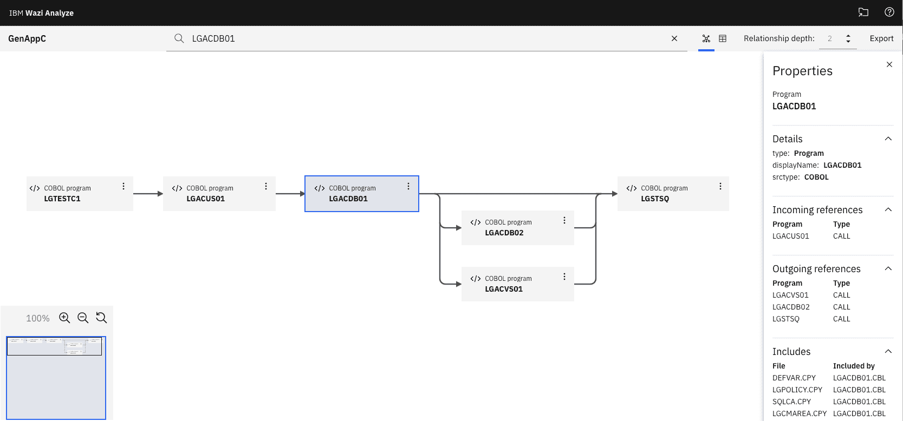

# IBM 深化了 DevOps 对大型机的见解

> 原文：<https://devops.com/ibm-deepens-devops-insights-on-mainframes/>

IBM 今天通过更新其提供的分析工具，进一步努力使拥有大型机的 IT 组织能够采用 DevOps 最佳实践。

IBM Z Software 副总裁汤姆·麦克弗森(Tom McPherson)表示，针对 IBM Z tools 的 IBM [应用发现和交付智能](https://www.ibm.com/products/app-discovery-and-delivery-intelligence) (ADDI)套件的 6.0 版本更新通过利用新版本的 Wazi Analyze 提供了更细粒度的见解，Wazi Analyze 现在可以在发生变化后立即分析代码。这一能力至关重要，因为运行在大型机上的大多数工作负载都经过了高度调优。麦克弗森说，任何可能发生的问题通常都可以直接追溯到对环境进行的最新软件更新。

Wazi Analyze 现在也可以作为一组容器进行部署，McPherson 说这意味着 IT 团队可以选择在除了大型机之外的平台上运行分析应用程序。

ADDI 也已经过更新，通过使多级动态汇编程序宏调用更容易分析来改进汇编程序支持。还添加了一组应用程序编程接口(API ),用于将数据反馈给持续集成/持续交付(CI/CD)管道。

最后，IBM 透露，它与 ITP 软件系统有限公司(ITP)签署了一项许可协议，以增强应用程序分析能力。该功能将被添加到 IBM Z 混合云的未来版本 DevOps 中，该版本包括 ADDI 和 IBM Wazi Developer，使组织能够确定如何在传统单片应用程序过渡到基于微服务的云原生计算环境时，以最佳方式实现其现代化。

当然，并不是每个单一的应用程序都会被转换成一系列的微服务。然而，McPherson 说，很明显需要分析工具，使 it 团队能够更容易地确定应用程序的哪些元素更适合重新配置为可以部署在例如 Red Hat OpenShift 集群上的微服务。

在过去几年中，IBM 一直鼓励拥有大型机的 IT 组织采用 DevOps 最佳实践，作为将大型机定位为另一种类型的分布式计算平台的更大努力的一部分。总体目标是通过减少对专家管理大型机应用程序环境的依赖来降低大型机的总体拥有成本。每年，越来越多的专家退休。IBM 希望让组织用 it 通才取代专家变得更加可行，比如那些通常管理分布式计算环境的通才。同时，由于 DevOps 的兴起，分布式计算环境的管理变得更加自动化。

当然，大型机流程已经高度自动化了几十年。管理大型机的 IT 团队可能仍然主要依赖基于瀑布的流程来部署应用程序，但是底层基础架构旨在根据应用程序工作负载的需求进行扩展。说服几十年来一直采用相同流程管理大型机的 IT 团队通常需要大量的文化变革。

然而，不管动机如何，DevOps 变革之风现在正猛烈地吹过大型机环境，就像它们吹过 IT 的其他部分一样。