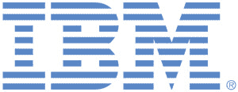
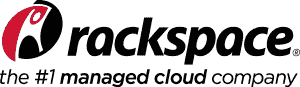

# IBM 和 Rackspace 成为休斯顿开发营的主要赞助商，门票现在只需 5 美元

> 原文：<https://devops.com/ibm-joins-premier-sponsor-camp-devops-houston-tickets-now-5/>

我们非常高兴地宣布，IBM 和 Rackspace 已经签约成为 2014 年 10 月 28 日 [Camp DevOps Houston](http://www.campdevops.com) 的主要赞助商。他们加入 CA Technologies ITInvolve 和 JumpCloud，成为此次活动的主要赞助商。Camp DevOps Houston 的其他赞助商包括 BlueMeric、CloudBees、PagerDuty、VictorOps、Automic、Qwinix 和 Incapsula。我们非常感谢这种支持。

在赞助商的大力支持下，DevOps.com 将 DevOps Houston 夏令营的入场费降到了 5 美元！

其原因是，DevOps 营地的设立是为了教育和将 DevOps 带到可能从未接触过现场 DevOps 教育和会议的地区。我们相信休斯顿也是一个引进 DevOps 的好市场。只要支付会议的费用(包括早餐、午餐和茶点)，我们的任务就在这方面完成了。收取 5 美元入场费的唯一原因是为了防止人们注册后不参加，从其他想参加的人那里抢走一个座位。

DevOps 夏令营的演讲者阵容已经差不多满了。Sanjeev Sharma 是《傻瓜 DevOps》一书的作者，他是一个关于各种 DevOps 主题的演讲者阵容。有多种途径针对技术和业务途径。你可以在 CampDevOps.com 得到更多的信息。你只需花 5 美元就可以注册:http://www . eventbrite . com/e/camp-devo PS-Houston-tickets-12489234637

如果你在休斯顿地区，或者认识技术人员，一定要来加入我们。我们认为这将是大约一个月后的一件大事。

