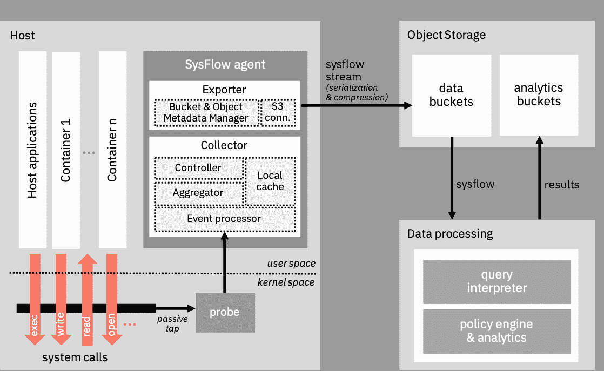

# IBM 开源 SysFlow 监控平台

> 原文：<https://devops.com/ibm-open-sources-sysflow-monitoring-platform/>

IBM 宣布其 SysFlow 监控平台现在可以作为一个开源项目使用。

IBM Research 认知网络安全情报组的研究科学家 Fred Araujo 表示，IBM 开发了轻量级 SysFlow 代理软件和监控工具，作为一种提供更多关于正在收集的遥测数据的上下文的方法，同时减少了需要存储的数据量。

Araujo 说，SysFlow 将系统活动的表示编码成一种紧凑的格式，记录应用程序如何与其环境交互，并指出，这种上下文级别提供了从容器工作负载到网络安全取证的更深入的可见性。然而，与现有的监控平台不同，SysFlow 不需要 IT 组织收集大量数据来实现这一目标——它旨在提供一个 NetFlow 框架的超集，用于分析网络流量模式以捕捉系统事件，他说。

Araujo 指出，IBM 并不认为 SysFlow 会消除对传统日志分析平台的需求，因为它们提供了一种分析日志数据的方法。然而，SysFlow 确实使 IT 组织能够通过类似图形的可视化将分析应用于表面模式，这超出了相对简单的基于规则的方法，Araujo 说。例如，SysFlow 的方法将更容易揭示构成网络安全攻击的各种事件之间的关系，并随后确定采用什么对策来创建适当的杀伤链响应。他说，这还应该大大减少网络安全团队因追踪误报警报而产生的疲劳。

SysFlow 的设计初衷是通过开放的序列化格式和相关库，与 Apache Spark 等开源框架和商业分析平台相集成。IT 组织还可以利用一组可重用的组件和 API 来简化遥测探头的部署。IT 组织还可以利用可扩展的策略引擎，该引擎可以接收以声明性输入语言描述的可定制的安全策略，然后可以根据 SysFlow 捕获的记录检查这些策略。

Araujo 表示，IBM 开发 SysFlow 是为了解决与管理公共云中的应用程序工作负载相关的挑战，但该框架可以应用于任何内部 IT 环境，以创建单一窗口，通过该窗口可以监控多个平台。

Araujo 说，不管在哪个平台上部署工作负载，在 DevOps 时代，随着管理和保护应用程序的责任越来越多地转移到开发人员身上，这些团队需要获得更复杂的工具，这些工具随时可用且易于部署。有几个开源项目正在进行中，以提供这种可见性，有一天它们中的许多可能会合并成一个单独的项目。

与此同时，随着应用程序和 it 基础架构之间的依赖性不断增加，很明显，IT 监控作为任何一套最佳开发运维实践的核心部分，现在是实现和维护可观察性的绝对要求。

— [迈克·维扎德](https://devops.com/author/mike-vizard/)