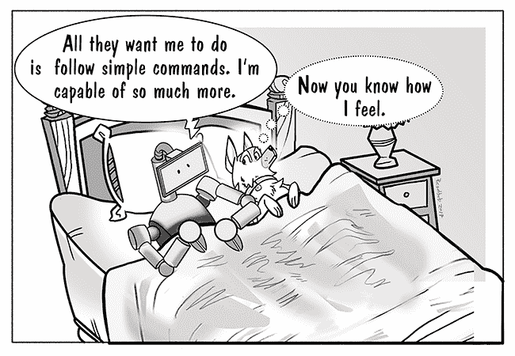

# IBM Z:不是狗的问题。这是诀窍

> 原文：<https://devops.com/ibm-z-not-dog-trick/>

有一种传统智慧在科技界盛行:你不能教老狗新把戏。据说，一旦人们迷恋上一项技术并长期使用它，他们就会厌恶采用新技术。我们都听说过，有些人相信。我吗？我不相信这一点，就像我不相信你不能教一只新狗老把戏一样。在我看来，好的魔术就是好的魔术，就这样！

所以让我们来谈谈一个非常好的技巧:大型机计算。这是一种被许多商业部门使用的技术——航空公司、保险公司和银行。而且，它从一开始就被设计为支持来自数百个(如果不是数千个)用户的交互。然而，许多人认为这是老掉牙的把戏，那就是它不适用于现代计算。

其实恰恰相反。这是一个重要的技巧，任何狗都应该使用，不管是新的还是老的。这是一个适应性的问题:如何在任何情况下让这个技巧变得有用。

先把恶作剧和狗的类比放在一边，直接说。公司坐拥大量大型机资产，可以而且应该在这个移动设备、API、微服务和光速开发运维部署实践的世界中加以利用。问题是，怎么做？

要使大型机技术在现代基于云的范例中可行，它必须满足四个条件。该技术必须:

*   使用现代 API 标准支持信息交换；
*   支持现代编程环境中的编码；
*   在整个部署过程中支持自动化测试；和
*   可根据 DevOps 最佳实践进行部署。

基于大型机的技术 IBM Z 在满足这些条件方面做得很好。IBM 为 IBM Z 技术提供的各种产品和工具集使得在当今的云计算环境中使用 IBM Z 变得异常容易。让我们来看看细节。

# 支持信息交换的 REST APIs

REST 正在成为通过互联网在系统间交换信息的标准。随着移动设备和物联网成为用户与应用程序交互的手段，这些应用程序需要的数据可以使用 REST 实时访问。如今，REST 是 IBM Z 技术领域的一等公民。IBM Z Application Discovery and Delivery Intelligence(ADDI)的一个关键特性是能够发现运行在 IBM Z 硬件上的应用程序，并将它们识别为潜在的 REST API 候选者。对 REST 的支持使得 IBM Z 应用程序可用于多种计算设备。此外，支持 REST 意味着 IBM Z 应用程序可以与标准的 DevOps 测试和部署实践轻松集成。

ADDI 提供了对 REST 的支持，这使得 IBM Z 成为互联网上的一个不可知资源

在现代世界中，基于云计算的 REST 是信息交换的通用语言。支持 REST 使得 IBM Z 数据和事务可用于现代数字生态系统。

# 使用 Eclipse IDE 支持 COBOL 和 PL/1 编程

IBM Explorer for z/OS 是 z Systems 的应用交付基础(ADFz)工具套件的一部分，它允许 COBOL 和 PL/1 开发人员在 Eclipse 集成开发环境(IDE)中编码。Eclipse 为使用 Java、PHP、Node 和 Python 等语言的广大开发人员所熟知。使用 Eclipse 在 COBOL 和 PL/1 下进行 IBM Z 编程允许开发人员有一个共享的编程体验，并且平均提高 15%的生产力。

尽管开发人员创建的实际代码行将特定于开发人员选择的编程语言，但是 Eclipse 提供的单元测试和调试体验是相似的，与语言无关。开发人员使用 Eclipse 在开发过程中对代码进行单元测试。如果测试失败，开发人员将设置断点并启动调试会话，以便在运行时检查代码。Eclipse 中进行代码-测试-代码-调试的方式是一致的。因此，使用 Eclipse IDE 获得的技能可以很容易地在不同语言之间转换。

让所有开发人员在一个公共的开发环境中工作可以创造一种共享的体验——这是打破组织孤岛的重要一步。减少将知识工作者相互隔离的孤岛，使他们能够跨团队和地域更好、更快地协作，结合在自动化 CI/CD 管道中部署代码，大大加快了公司将代码推向市场的能力，同时也使跨团队和跨地域的协作更加容易。

# 支持广泛的测试技术

对于一个在 CI/CD 基础设施中可行的软件开发框架，它必须支持各种各样的测试功能。此外，测试需要通过自动化来验证。如上所述，IBM Explorer for z/OS 允许开发人员在 COBOL 和 PL/1 代码上创建单元测试。一旦创建了单元测试，它们就可以在整个开发过程中自动使用。通过自动化的测试重用大大加快了部署过程。

然而，代码级的测试是不够的。随着代码在现代部署管道中移动，它必须接受负载和性能测试。习惯于使用主流工具如 [Apache JMeter](https://jmeter.apache.org/) 或[Rational Performance Tester](https://www.ibm.com/developerworks/downloads/r/rpt/)的测试工程师使用 IBM Z Workload Simulator for z/OS 进行负载和性能测试不会有什么问题。负载和性能测试背后的概念是相似的，不管驱动开发过程的语言和环境如何。例如，Workload Simulator for z/OS 允许测试工程师模拟成百上千的用户来测试软件。能够以可控的、可报告的方式在系统上产生压力，对于获得良好的性能测试指标是至关重要的。

# 支持开发运维部署实践

DevOps 最佳实践的基础是快速和增量地发布高质量软件的概念。DevOps 实践是尽可能快地一次发布一个特性，而不是等待几个月来发布一个包含许多特性的版本。在 DevOps 世界中，发布周期不再是几周或几个月，而是几天，甚至几小时。为了实现开发运维的快速发布周期，部署管道的管理必须自动化。

然而，当涉及到大型机资产时，在部署单元方面有一个障碍。在微计算软件环境中，部署单元通常采用可执行文件的形式，支持依赖文件或脚本文件，例如。exe，。罐子，。另外，考虑到容器技术的兴起，部署单元可以是容器本身。就 IBM Z 而言，部署单元是文件和作业。

IBM Z 的工程师已经采取了聪明的方法来管理资产部署。文件和作业已经成为可以通过 IBM Explorer for z/OS Atlas API 访问的抽象部署单元。因此，IBM Z 组件可以被视为部署管道中的任何其他工件。DevOps 工程师使用 Atlas 公开的 API 来取消作业或删除相关文件。使用 REST APIs 标准化对 IBM Z 部署管道的直接访问，为 DevOps 工程师提供了快速发布工作代码所需的灵活性。

DevOps 工程师不仅可以自动化管道，而且如果需要特别的干预，他们还可以使用 Atlas APIs 来立即做出所需的更改。将 Atlas APIs 与 ADDI 收集、关联、计算和生成关键任务应用和测试健康指标的能力以及趋势分析相结合，使 IBM Z 成为认知开发领域的一流参与者。

# 把所有的放在一起

互联网所做的最伟大的事情之一就是创造了一种标准化的方式，通过这种方式，任何计算系统都可以与另一个系统进行交互。只要系统支持 REST，不管它是智能手表、手机还是 IBM Z 这样的大规模计算环境，它都是互联网上可利用的资产。此外，如果系统满足定义 DevOps 最佳实践的条件，那么它可以通过参与作为现代软件开发一部分的危险发布周期所需的控制和可预测性程度来管理。这个系统是新的还是旧的并不重要，只要它能适应当前的需求。适应性是长寿的关键，不管狗的年龄或技巧。

鲍勃·雷瑟曼