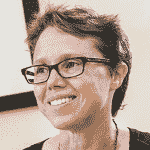

# Ignition Partners 为微软的构建带来了一点西雅图的气息

> 原文：<https://devops.com/ignition-partners-brings-a-little-bit-of-seattle-to-the-bay-area-for-microsoft-build/>

[点火伙伴](http://www.ignitionpartners.com/)正在开派对！我们将与我们投资组合中的四家公司——[Chef](https://www.chef.io/)、 [Cloudera](http://www.cloudera.com/content/cloudera/en/home.html) 、Couchbase 和[Xamarin](https://xamarin.com/)——一起举办一场与【2015 年微软构建开发者大会相关的特别招待会。

该活动将于 5 月 29 日(星期三)下午 6 点至 9 点在[记者俱乐部](http://www.pressclubsf.com/)举行，该俱乐部位于旧金山芳草地巷 20 号，靠近正在建设的 Moscone 中心。

Ignition Partners 的三位管理合伙人中有两位——Frank Artale 和 John Connors——与微软和西雅图地区都有很深的渊源，我们的想法是，与我们的四家投资公司一起，我们将为聚会和会议带来一点西雅图的传统。

我们将重点介绍两个主要的西雅图企业云平台，微软的 Azure 和亚马逊网络服务。Ignition 代表其投资组合公司，特别是位于旧金山湾区的面向云的公司，在西雅图与这些云市场制造商建立我们的档案。

该网络活动将为微软内部的云决策者提供一个开放访问的机会，并创造可能导致新项目的协同效应。与会者将能够与思想领袖交流，深入了解微软和亚马逊生态系统。能够提供与 Azure 协同工作的产品和服务的新公司可能会利用旧金山市场以外的新的未开发的商业机会。

记者俱乐部见，记住，一切都是为了建设！

**关于作者/瑞秋·查尔莫斯**

 雷切尔·查尔莫斯于 2013 年加入点火公司，担任校长。她负责企业和云基础设施、“大数据”和“物联网”方面的交易；为投资组合公司提供建议，并就行业趋势提供咨询。

在加入 Ignition 之前，Rachel 在 451 Group 工作了 13 年，这是一家专注于企业 IT 创新业务的独立技术行业分析公司。她最近是该公司的研究副总裁，监督企业基础设施软件的所有工作。涵盖的领域包括虚拟机管理程序、操作系统、配置和自动化、应用程序开发、性能监控和生命周期管理。在 451 岁时，Rachel 是第一批涵盖 Opsware、BladeLogic、VMware、Splunk 和 Cloudera 的分析师之一。

在成为技术分析师之前，Rachel 是美国和澳大利亚的一名记者。她帮助发起了计算机周，后来的澳大利亚 PC 周，并且是 Computerwire 的互联网编辑，在那里她写了关于软件和开源技术的文章。

Rachel 拥有悉尼大学的英语学士学位和都柏林三一学院的哲学硕士学位，主要研究英国-爱尔兰文学。她是 Ada Initiative 的顾问，Ada Initiative 是一个支持女性参与开放技术和文化的非营利组织。