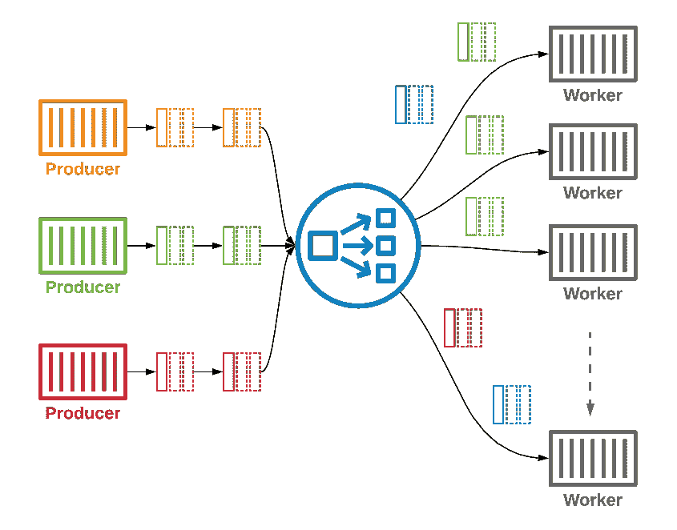
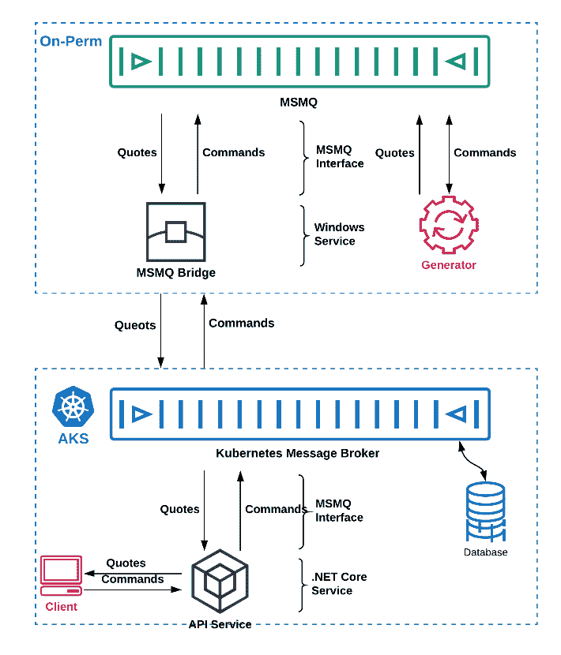

# 2019 年最佳:在 Kubernetes 中实现消息队列

> 原文：<https://devops.com/implementing-message-queue-in-kubernetes/>

在我们结束 2019 年之际，我们 DevOps.com 想要强调今年最受欢迎的五篇文章。以下是我们为期一周的 2019 年最佳系列中的第四个。

Kubernetes 作为企业首选工具的采用率正在快速增长。因此，支持生产环境的体系结构考虑和操作需求已经获得了越来越多的关注。在规划由 Kubernetes 编排的可扩展微服务架构(MSA)时，要考虑的一个主要挑战是如何管理系统中繁重的消息流量。

从 monolith 架构迁移到微服务架构或建立新的 MSA 后，每个微服务都保留其数据模型，并与系统的其余部分分离。当扩展时，可以观察到一个项目可以增长到数百个或更多的微服务，并且在每天生成数百万条消息的系统中，消息流量会变得巨大。因此，需要在微服务之间建立新的健壮通信。

使用点对点连接(比如 REST)来解决 Kubernetes 中的通信鸿沟，最终会在服务之间创建一个复杂的结构。其结果是，每次服务需求改变时，开发团队都需要进行全面的维护。这就是消息队列系统在处理 MSA 和 Kubernetes 中的消息挑战时派上用场的地方。每个服务用自己的语言与一个焦点(消息代理队列)通信，消息队列系统负责将消息传递给等待它的服务。

要为 Kubernetes 构建一个管理良好的消息传递解决方案，消息队列系统应该是 Kubernetes 固有的，支持相关的消息传递模式，健壮且安全。在库本内特斯土生土长是在库本内特斯实现健康系统的一个关键参数。它包括简单快速地部署到 Kubernetes(而不是在 Kubernetes 集群之外)，低 DevOps 维护，以及很好地连接到 Kubernetes 生态系统以进行日志记录、监控和跟踪。

## 混合云

混合云解决方案使企业能够同时利用内部和公共云服务。混合云的一个优势是它提供的灵活性，例如，当容量和成本发生变化时，允许工作负载在两种环境之间交替。敏感工作负载和数据可以托管在私有云中或本地，而不太重要的工作负载则托管在公共云中。数据处理和存储的法规要求可以在私有云中提供。公共云服务的商业优势是成本，包括资本支出和运营支出，因为它提供的可扩展性允许组织只为其使用的资源付费。在 Kubernetes 中部署消息队列提供了允许混合云平滑透明地连接和交互的技术。

## 用例

消息队列有许多用例。消息队列需要支持多样化的消息传递模式，从而能够灵活地创建不同的用例。

这里是消息队列系统在 Kubernetes 中应该支持的一些常见用例。

## **多级管道**

当我们需要在工作流中以协调的方式处理消息时，使用同步模式。管道用例允许在服务之间按顺序处理消息。每个服务都可以被视为一个阶段，消息按顺序在所有阶段之间传递。在某些情况下，如果消息丢失或无法处理(出于任何原因)，死信队列机制会获取消息并以预定义的方式处理它。

## **作业/任务分布式队列**

当我们需要在工人之间分配任务/工作时，A-synchronous 模式被一些生产者用于许多消费者。在这个用例中，不需要在任务之间进行协调。每个服务都从队列中取出消息进行处理。处理消息的顺序并不重要，因为每个工人都从队列中取出任务，并在自己的时间内处理它。

Figure 1: Tasks/Jobs Distributed Queue.

## **流**

当我们需要从许多外部来源(大数据、物联网)传输数据并在专用服务(如数据库、管道、机器学习、存储等)中处理数据时，会使用 A-synchronous 模式。这种情况通常会将许多生产者聚集到少数消费者中。消息的顺序并不重要，重要的是传递保证。

## **实时发布/订阅**

A-synchronous 模式适用于少量生产者向许多消费者发送实时数据的情况。充当发布者的服务向通道发送消息，一组服务订阅该通道并获取消息。

## **应用解耦**

edge、API、数据库、存储等服务之间的连接就像路由器一样，消息顺序并不重要；生产者和消费者之间的超时和同步很重要。

## **易用性**

微服务架构的一个关键特性是易于使用。部署它可以统一开发和运营工作流程，从而为您的组织节省时间和资金。消息队列系统也需要易于使用。它的易用性和 DevOps 的友好性应该最大限度地减少对专业专家的需求，同时加快开发和生产周期。考虑到这一点，重要的是要确保支持低延迟的大容量消息传递、有效的内存使用和基本的消息传递模式(实时发布/订阅、请求/回复和队列)不受影响。

## **逐渐迁移到 Kubernetes**

当 IT 专业人员评估使用 Kubernetes 环境的显著优势时，他们不能忽视维护创收的整体基础设施所必需的操作需求。遗留系统还包含与正在进行的业务相关的流程和数据，对于服务应急来说至关重要。

为了支持保持业务运营的渐进迁移，Kubernetes 消息队列必须支持新旧环境之间的连接。需要一个桥来将遗留端连接到 IBM MQ、TIBCO、MSMQ 或 Kafka(仅提及几个流行的企业解决方案)，连接到 Kubernetes 消息队列，该队列允许在遗留 monolith 环境中的服务和 Kubernetes 环境中基于微服务的部署之间无缝双向转置消息。

安装在遗留环境中的桥代表 Kubernetes 环境中的相关服务“监听”MQ，确保指定的消息从 monolith 传输到 Kubernetes，反之亦然。这种桥接功能通过逐步替换旧环境中的组件或创建仍能与遗留资源连接的新服务来实现逐步迁移。

Figure 2: An example of gradual migration from MSMQ on the on-premises environment to AKS.

要了解更多关于集装箱化基础设施和云原生技术的信息，请考虑参加 11 月 18 日至 21 日在圣地亚哥举办的 [KubeCon + CloudNativeCon NA](https://events.linuxfoundation.org/events/kubecon-cloudnativecon-north-america-2019/) 。

— [Lior Nabat](https://devops.com/author/lior-nabat/)