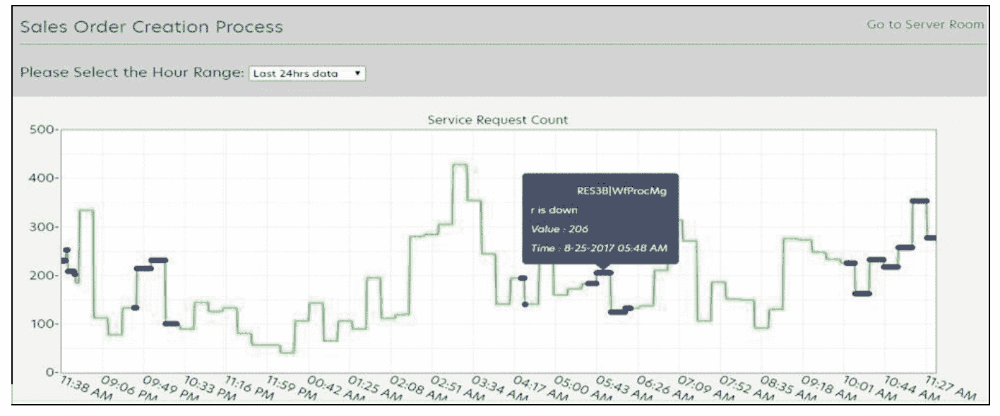

# 行动中避免事故发生

> 原文：<https://devops.com/incidence-avoidance-in-action/>

如今，首席信息官们面临着让企业技术的性能与面向消费者的技术领导者(如脸书或网飞)的产品不相上下的挑战，这意味着技术或服务可以无缝提供，没有性能延迟。当然，这些期望并不总是与管理复杂的混合企业系统的现实相一致，这些系统并不一定是为了提供这种性能而设计的。

另一方面，支持新时代“数字”业务服务的 IT 运营正在处理由软件定义的数据中心支持的按需资源，这些数据中心通过使用无服务器计算平台扩展到公共云中。这就产生了一个“新的代混合企业”，它必须交付功能，并作为 [实时](https://urldefense.proofpoint.com/v2/url?u=https-3A__www.gartner.com_doc_398766_realtime-2Dinfrastructure-2Dvision-2Dprogress&d=DwMFaQ&c=5oszCido4egZ9x-32Pvn-g&r=FcUcZmod5hQP57LGA9ShtK4isJlvm2mS_iuivsPKjR0&m=WKnLtR3EjyHSShkK-WTaiYq4RsknOF4fv2bo-xdqfxY&s=x_lDcY_TfkdqWkJNlWMVLeYymlw5hrdWmbpEnX3sJ4I&e=) 基础架构来运营。

[Lexmark](https://www.lexmark.com/en_us.html) 是一家总部位于美国的全球性公司，生产激光打印机和成像产品，希望实现零延迟运营性能，并增强其业务流程以避免事故或错误。

本文详细介绍了利盟的 IT 目标和 Wipro Ltd .实施的解决方案，Wipro ltd .是一家全球信息技术、咨询和业务流程服务公司。

**问题:** Lexmark 需要一种技术解决方案来提供对其核心业务流程(托管打印服务)的可见性。该解决方案还需要考虑其他支持系统和功能流程。目标是通过最大限度地减少错误和风险来实现卓越运营。

**解决方案:**为了解决这一关键的 IT 运营问题，Wipro 整合了独特的设计原则，创建了一个操作简单、可扩展且有针对性的解决方案，使 IT 和业务流程负责人就避免事故达成共识。

Wipro 建立了一种新的可视化运营管理方法，该方法基于 IT 运营分析(或现在称为 AI 运营)奠定的基础。

Wipro 和 Lexmark 仅使用 Lexmark 已经拥有的工具和数据，创建了一个测量 Lexmark 托管打印服务业务心跳的系统。心跳与打印机数据收集系统同步，阈值完全由机器学习技术确定。每个底层系统都被安排在一个“服务器机房”中主可视化面板中仅显示超出方差的条件，只需单击一下鼠标即可找到根本原因。本白皮书深入探讨了 IT 企业在向客户交付按需解决方案时所面临的挑战，这与数字化发展的 B2C 公司所提供的解决方案类似。

**使用混合环境的数字企业必须实时响应，并需要实现事故避免，而不是事故管理。**

如果我们看看今天行动指挥中心的幕后，我们会看到努力跟上步伐的行动。很少有行动是从零开始的。在企业环境中，如果 IT 支持无法找到问题的根本原因，严重级别为 1(被业务用户归类为高影响的事件)的事件解决时间仍会持续几个小时。原因通常是缺少适当的配置管理数据库(CMDB)、日志记录不足或缺少应用程序发现和依赖关系映射。每个 IT 专业人员都能认识到这些缺陷，然而纠正这些缺陷的项目似乎从未获得必要的资金拨款。显然，需要一种新的方法来解决这个问题。

## **识别业务流程**

该流程应该从识别核心业务运营的关键驱动力或心跳开始。根据行业的不同，这种心跳可能是客户订单、服务请求或供应商采购订单。所有其他系统都连接到这个心跳。要选择合适的属性作为心跳进行监控，首先要从对日常运营斗争有良好感觉的业务分析师开始。这些分析师通常会运行一系列脚本报告来跟踪系统运行状况。更高级的分析师甚至可能会自动发出警报。通过利用这些信息并使用数据发现技术，我们发现可以将这些值配置为业务 KPI。

在 Lexmark 的情况下，Wipro 实时传输 KPI 值，并通过使用人工智能和机器学习技术支持的现有流分析平台，使用机器和有线数据来广播底层监控组件。我们发现，评估流程运行状况所需的数据量对时间很敏感，通常在这段时间内显示的数据少于 24 小时。

上面显示的平台可视化跟踪业务部门销售订单的创建。绿线代表订单在系统中的流动。底层系统中的任何异常都会直接反映到这个流程中。这是通过使用业务 KPI 的流分析和人工智能技术实现的。

## **应用架构覆盖图**

下一步是将支持基础设施从属于业务流程心跳。这一壮举是在没有复杂的业务规则和复杂的编排引擎的情况下完成的。我们称之为“服务器机房”，它是一个网页上整个基础架构的视图，利用点阵图表格式便于比较。这些底层组件中的每一个都将对业务流程产生直接影响。

应用相同的流分析和 AI/ML 技术来识别业务流程中的异常，我们可以识别导致异常的原因，并快速发现问题所在。

颜色编码有助于技术人员快速了解事件的严重性。蓝色表示系统性能尚未违反设定的阈值，但存在底层基础架构问题，需要主动解决。琥珀色表示系统违反了警告阈值。红色表示系统违反了临界阈值，这是我们设计时绝不允许发生的情况。

用户可以在任何给定点上滚动，一个标注框将显示实际的级别，以及关于出现错误的简要说明和时间戳。

分析师现在可以立即将精力集中在处于错误状态的特定系统上，即使某个事件尚未造成事故。

## **机器学习定义异常阈值**

什么是正常行为？这通常是最难回答的问题，因为常见的监控和管理流程依赖于在实施过程中设置的单个数据值。但是阈值必须非常灵活，以捕捉业务流程不断变化的本质。在确定正确的阈值时，必须考虑午夜运行的批处理作业、月末结算活动、换班和许多其他潜在变量。

对于任何支持业务流程的组件，我们都需要理解目前什么是正常的。为了确定这一点，在利盟，我们应用机器学习，根据我们建立的健康业务 KPI，在月、日和小时级别动态设置每个子系统的阈值。

## **事故避免，而非事故管理**

为了充分理解这种方法的潜力，有必要改变系统分析师与系统交互的方式。已经做了几年系统支持的 IT 专业人员可能会习惯于对他们队列中的工作做出反应。完善的事件管理流程是可以预防紧急情况的主动行动的敌人。

通过使底层系统活动和阈值与业务流程保持一致，IT 专业人员可以真正了解整个环境，而不仅仅是他们的单个技术组件。最有效的分析师会将他们的知识扩展到其他业务领域。在 Lexmark，我们发现我们能够通过简单地增加硬件或容量来解决“棘手的”性能问题。

集成 IT 运营不是目标，而是实时管理数字企业的手段。实现实时管理的途径是通过服务容量保证、性能和可用性管理，以及在业务流程环境中使用异常检测，在事故发生之前及早发现问题。我们建议从小处着手，为进程的心跳建立一个异常检测系统，使您能够看到森林和树木。

*本文由 [Wipro 有限公司](https://www.wipro.com/en-US/)转型服务云和基础设施服务总经理 Murthy Malapaka 合著。他帮助企业以数字化方式重新架构其运营，在混合 IT 环境中运行，以实现事故避免，而不是事故管理。他在应用和基础架构领域担任过各种技术领导角色，专攻可用性和可靠性。Murthy 一直为首席信息官和首席技术官提供咨询服务，帮助他们实现从客户端服务器到按需基础设施服务的转变。*

— [布拉德·克莱](https://devops.com/author/brad-clay/)