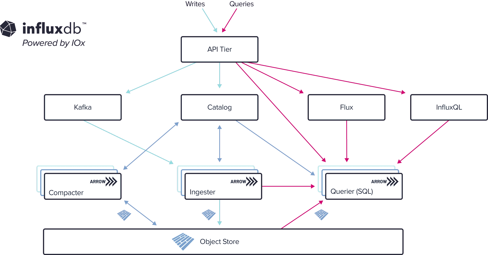

# InfluxData 提供改进的实时处理数据库

> 原文：<https://devops.com/influxdata-delivers-revamped-database-for-real-time-processing/>

InfluxData 兑现了提供下一代时序数据库的承诺，该数据库支持 DevOps 团队使用的[可观察性](https://devops.com/?s=observability)和监控工具以更具成本效益的方式接收大量数据。

此外，[influx db 数据库的最新迭代](https://www.influxdata.com/blog/influxdata-deploys-next-generation-influxdb-time-series-engine/)第一次支持事实上的标准 SQL 查询语言。开发人员可以使用 SQL 或现有工具(如 InfluxDB 应用程序编程接口(API)、Flux 脚本语言或 InfluxQL 查询语言)运行无限的时间序列工作负载，并不受限制地将数据置于任何维度的上下文环境中

InfluxData 的物联网(IoT)和新兴技术总监 Brian Gilmore 表示，InfluxDB 现在基于一个名为 IOx 的列引擎，该引擎利用开源的 Apache Arrow 内存格式和 Rust 编程语言，通过公司代表应用程序开发人员管理的多租户 InfluxDB 云服务进行访问。他指出，需要处理大量数据(如指标、事件、跟踪和其他高基数数据)的用例现在可以在几毫秒内进行查询。

目标是在向 IT 团队提供他们可以自己安装的版本之前，通过托管云服务提供 InfluxDB 的最新版本。

随着应用程序环境中生成的数据量持续快速增长，改进后的 InfluxDB 架构应运而生。许多 DevOps 团队尤其难以处理和存储由云原生应用程序生成的所有数据，这些云原生应用程序由生成稳定的日志、指标和跟踪流的微服务组成。

当然，InfluxData 对其数据库有着超越应用程序开发和部署环境的雄心。例如，边缘计算平台将越来越多地在数据生成和消费点实时处理和分析数据。同样，注入了机器和深度学习算法的应用程序将需要能够大规模处理数据的数据库。然而，不管使用情形如何，随着应用程序的部署和持续更新，显然会有更多的 it 团队采用 DataOps 最佳实践和 DevOps 来管理数据。

有多少可观察性和监控工具可能包含 InfluxDB 数据库的最新迭代还有待观察，但很明显，随着这些平台所依赖的底层数据库继续发展，DevOps 团队应该会看到重大进步。目标是最终消除现在经常发生的收集和分析多少数据与处理和存储数据的成本之间的权衡。

同时，DevOps 团队将需要决定他们是否想要自己管理数据库，因为在云时代，更多的托管服务变得更容易调用。如今，大多数数据库选择是由开发团队做出的，他们并不特别渴望承担通常由数据库管理员执行的任务。托管服务本质上是将管理数据库的责任外包给服务提供商，而不是要求 IT 团队自己雇佣数据库管理员。

然而，无论如何，现在可以实时处理数据的速度应该会大大减少对现有的笨重的面向批处理的数据处理方法的依赖。