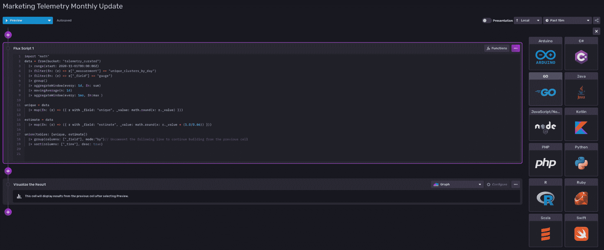

# InfluxData 简化了时序数据库的应用程序开发

> 原文：<https://devops.com/influxdata-simplifies-appdev-for-time-series-databases/>

在一次在线 [InfluxDays 北美 2021 虚拟体验](https://www.influxdays.com/influxdays-north-america-2021-virtual-experience/)会议上，influx data todays[在其时间序列数据库的基础上使用其 Flux 查询语言扩展了其应用程序开发工具](https://www.businesswire.com/news/home/20211026005361/en/InfluxData-Kicks-Off-InfluxDays-North-America-Releasing-New-Features-to-Expedite-Application-Building)的功能。

该公司增强了其 InfluxDB 笔记本工具，使开发人员能够快速设置警报，建立任务或编写 Flux 脚本，而不必离开他们的浏览器。

此外，开发人员可以编写包含在客户端代码中的 Flux 查询，然后在用 10 多种不同编程语言编写的应用程序中自动生成这些查询。现在还有一个 Visual Studio 代码的扩展，使创建 Flux 脚本、查询 InfluxDB、创建 Flux 任务和管理 buckets 变得更加简单。

最后，InfluxData 增加了在 InfluxDB 中显式定义 bucket 模式的功能，以防止不必要的更改；一个应用程序编程接口(API)工具，称为 API Invocable Scripts，使定义参数化 Flux 脚本和从 Alerta、WebEx 团队和 ServiceNow 向 InfluxDB 云平台发送通知的能力变得更简单。

InfluxData 的产品副总裁蒂姆·霍尔(Tim Hall)表示，总体目标是降低开发人员在构建运行于时序数据库上的应用程序时遇到的复杂程度。这些应用程序中的许多现在是数字业务转型计划的核心，需要随着时间的推移对数据进行处理和分析。霍尔指出，实际上，时间戳数据为任何应用程序增加了另一个维度。

时间序列数据库通常由独立软件供应商(ISV)用来创建(例如)监控应用程序，或者由企业 IT 团队用来构建适用于需要在一段时间内进行跟踪的数据的应用程序。

在大多数情况下，构建在时间序列数据库上的应用程序与通常使用 SQL 调用的关系数据库一起部署。因此，InfluxDB 通过该公司添加到 [Flux](https://devops.com/?s=flux) 中的 SQL 集成，使跨关系和时间序列数据的数据连接变得更加简单，Hall 指出。

当然，DevOps 团队并不总是急于添加他们需要支持的另一个数据库，但是随着应用程序的不断发展，随着组织试图管理和分析的数据量不断增长，越来越多的组织正在采用混合的专用数据库来开发应用程序。

从长远来看，时序数据库显然将在推动数字业务转型计划中发挥关键作用。大多数组织现在面临的挑战是确定这些计划中的哪些优先。Hall 说，时间序列数据库与 InfluxData 提供的开发工具相结合，将使 IT 团队能够更快地构建驱动这些过程的应用程序。

与此同时，IT 团队最好至少更熟悉时间序列数据库，因为知道事件发生的时间正成为更大的应用程序需求。毕竟，知道事情发生的时间现在和记录实际发生的事情一样重要。