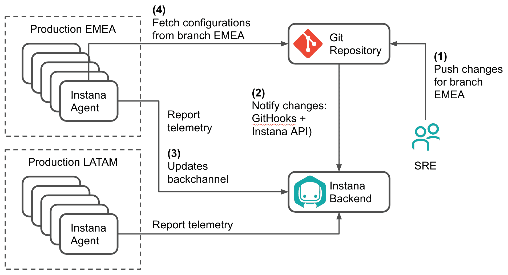

# Instana 将 DevOps 应用于 APM 代理管理

> 原文：<https://devops.com/instana-applies-devops-to-apm-agent-management/>

Instana 宣布，它已经成为第一家应用管理平台(APM)提供商，使 it 团队能够使用他们选择的任何 Git 存储库自动部署代理软件，以监控 IT 环境。

Instana 的产品管理和销售支持总监 Jim Hirschauer 表示，用于装备 IT 环境(包括软件和基础架构)的代理软件现在可以使用 Git 存储库在启动和重新启动期间自动配置代理软件，此外还可以将 Instana 代理软件的特定版本绑定到 Git 存储库中的分支。

任何 DevOps 团队在检测 IT 环境时面临的挑战之一是，用于收集数据和指标的代理软件需要像任何其他软件一样进行管理。他说，通过增加对 Git 存储库的支持，Instana 使得将 DevOps 流程应用于代理软件的管理成为可能。

他补充说，将代理配置为代码的能力也意味着 DevOps 团队可以打开和关闭代理，作为减少代理管理疲劳的努力的一部分。

Hirschauer 说，通过采用 GitOps practices，Instana 希望通过“说到做到”来区别于竞争对手 APM 平台提供商。

将代理配置为代码的能力是在 Instana APM 平台的[最近更新之后实现的，除其他外，该平台还增加了对 Redis Enterprise Monitoring Sensor、IBM MQ Monitoring Sensor 和 NGINX tracing 的支持，这些支持自动与 Instana 终端用户监控(EUM)集成，以本机提取跟踪请求。](https://www.instana.com/press-releases/instana-launches-enterprise-enhancements-to-help-organizations-manage-mission-critical-applications-more-effectively/)

尽管 APM 领域的竞争非常激烈，但作为一家初创公司，Instana 正试图利用两个宏观趋势来取代竞争对手。首先是向融合软件和 IT 基础设施管理的转变。Instana APM 平台会发现所有应用服务组件和应用基础架构，然后自动部署监控传感器来跟踪所有应用请求并分析每个进程。然后，它实时检测应用程序和基础架构的变化，调整自己的模型并直观显示变化和任何性能影响，而无需任何人工配置，甚至无需重启应用程序。

第二个趋势是微服务的兴起。过去，由于部署代理软件的成本，IT 团队使用 APM 平台仅监控他们最关键的应用程序。然而，鉴于基于微服务的应用固有的复杂性，IT 团队正在更广泛地采用 APM 平台来监控依赖性。

现在说 APM 平台大战的最新一轮将如何结束还为时过早。然而，现在有比以往更多的组织在评估 APM 平台，其中许多以前从未使用过。好消息是，随着开源代理变得越来越普及，使用 APM 平台的成本应该会下降。然而，开源代理的配置和部署仍然不像大多数专有代理软件那样简单。DevOps 团队需要自己决定这种便利的价值。