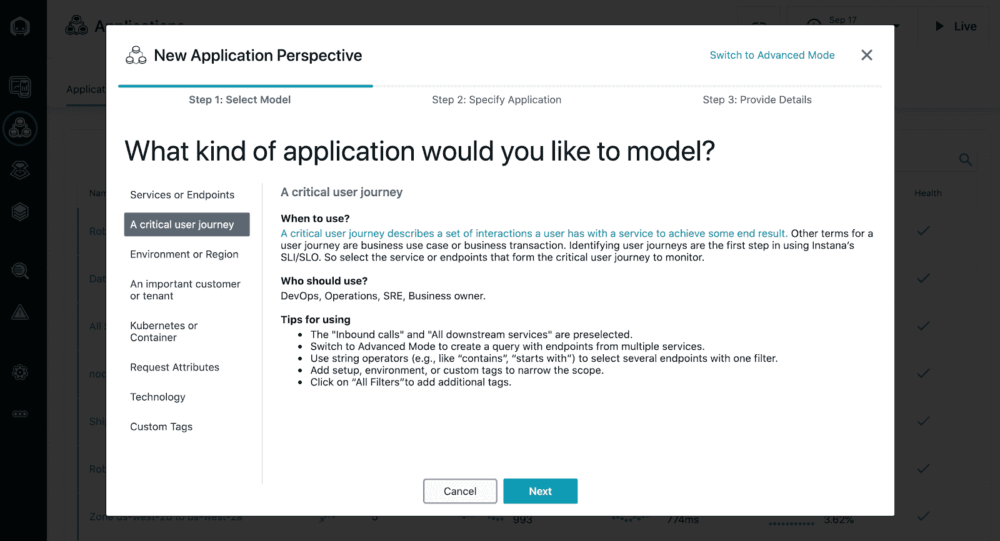

# Instana 使维护应用服务级别变得更加容易

> 原文：<https://devops.com/instana-makes-maintaining-app-service-levels-easier/>

Instana 今天宣布，在采用其应用性能管理(APM)平台时，开发运维团队可以更轻松地实现和维护应用的服务水平目标(SLO)。

在由 CloudBees 主办的 [DevOps World 2020 大会上宣布，用于配置、监控和管理 SLO 的](https://www.cloudbees.com/devops-world) [Instana 工具基于一系列向导](http://www.prweb.com/releases/instana_announces_availability_of_integrated_service_level_initiative_and_objective_management/prweb17413379.htm)，DevOps 团队可以使用这些向导来创建一个仪表板，通过该仪表板他们可以监控组成特定应用服务的所有组件。应用透视图创建向导指导 IT 团队选择过滤器，从他们需要监控的应用服务中消除不相关、不相连的系统。

Instana 的技术总监兼 APM 策略师 Chris Farrell 表示，由于微服务的兴起，IT 环境变得越来越复杂，IT 组织需要访问从头设计的 APM 平台，以监控、调整和优化依赖于分布在扩展企业中的服务的应用。 [Instana 自动将传感器部署到应用程序堆栈的每个部分](https://devops.com/instana-discovers-root-cause-of-a-microservices-crash/)，跟踪所有应用程序请求并分析每个进程，而无需 IT 人员配置这些代理或重启应用程序。对应用程序环境的任何更改也会自动反映在 Instana 创建的 IT 环境模型中。

Farrell 说，Instana 现在正在扩展其 APM 平台，以使 it 团队更容易满足服务水平保证，而不管应用程序的复杂性如何。

鉴于微服务之间存在的所有依赖性，某种类型的可观测性平台现在是一个基本需求。以前，由于成本问题，IT 团队倾向于只采用 APM 平台来监控他们最关键的整体应用程序。相比之下，几乎每个基于微服务的应用都需要进行测试，以使 DevOps 团队能够优化性能。基于微服务的应用旨在通过在出现可用性问题时重新路由应用流量来适度降低应用性能。虽然这种方法防止了应用程序崩溃，但它也使得发现应用程序问题的根本原因对开发运维团队来说更具挑战性。

随着部署在企业 It 环境中的基于微服务的应用数量稳步增长，尚不清楚在现有 APM 平台上实现标准化的组织可能愿意在多大程度上替换这些平台。然而，现在有更多的 IT 组织刚刚开始采用 APM 平台来更好地处理这些应用程序。大多数人还采用最佳 DevOps 实践，将可观察性作为持续部署和更新应用程序的核心原则。

随着这些开发运维实践的不断发展，大多数 IT 组织将转向监控驱动业务流程的应用服务，而不是单一应用的孤立实例。

无论选择哪种 APM 平台，部署和管理应用程序的方式显然正在发生根本性的转变。现在的问题是确定如何最好地可视化这些应用程序环境，因为毕竟，没有人能够管理他们实际上看不到的东西。