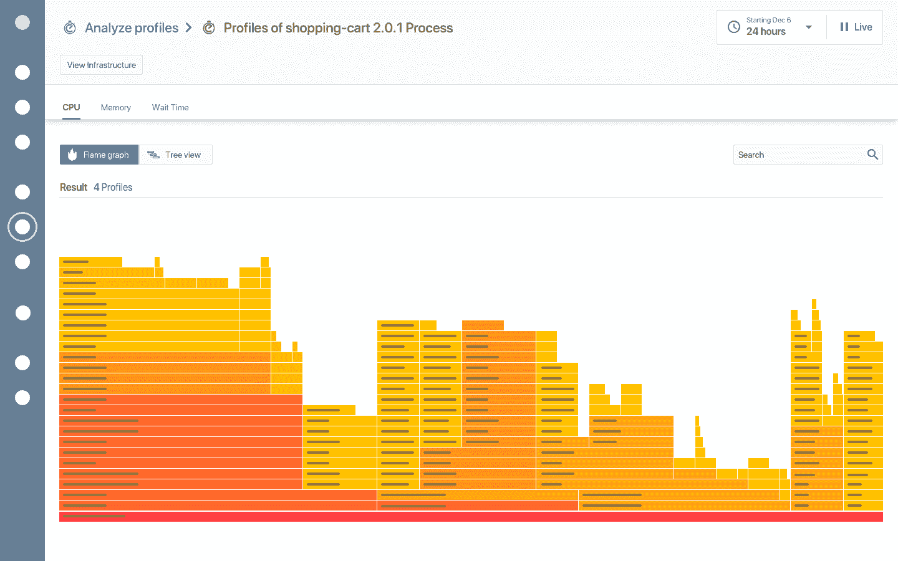

# Instana 累计收购 3 家公司以扩大 APM 覆盖范围

> 原文：<https://devops.com/instana-rolls-up-3-acquisitions-to-extend-apm-reach/>

Instana 今天透露，它已经[收购了三项技术](https://www.prweb.com/releases/instana_augments_real_time_application_performance_management_solution_with_three_acquisitions/prweb16793440.htm)，这些技术将扩展针对基于微服务的应用而优化的应用性能管理(APM)平台的功能。

添加到 Instana 平台的功能包括 StackImpact，StackImpact GmbH 开发的多语言生产应用程序分析器，可应用于以多种语言构建的应用程序；由 BeeInstant 开发的高频度量分析工具；以及 JINSPIRED B.V .开发的分析复杂系统信号的工具。

Instana 已经直接收购了 StackImpact 和 BeeInstant，并且只收购了 JINSPIRED B.V .开发的软件。

Instana 首席执行官 Mirko Novakovic 表示，随着组织采用通常使用部署在 Kubernetes 集群上的容器构建的微服务，IT 组织发现他们现有的 APM 平台无法监控和观察基于微服务的应用程序到所需的深度。

Instana APM 平台通过为应用技术堆栈的每个部分自动部署监控传感器来实现这一目标。这些传感器跟踪所有应用程序请求，无需任何配置或应用程序重启。Instana 还检测应用程序环境中的变化，允许它实时调整模型和可视化。

随着 IT 组织采用 Instana APM 平台来管理基于微服务的应用，Novakovic 表示，他们发现他们也可以利用 Instana 来监控传统的单片应用，使他们能够在一个 APM 平台上实现标准化。他说，Instana 目前声称有 300 多个客户，其中大多数都在使用其 APM 来监控多种类型的应用程序工作负载。

总的来说，Novakovic 表示，组织更换 APM 平台变得越来越容易，因为许多传统 APM 平台所依赖的专有代理正在被开源计划所取代，这使得从多个平台收集指标成为可能。事实上，随着 APM 平台的不断发展，Novakovic 说，很明显，用于追踪、跟踪指标和日志分析的工具都开始融合。

当然，Instana 和 APM 平台的其他提供商今天面临的最大挑战是，许多开发人员依赖在云本地计算基金会(CNCF)赞助下开发的开源 Prometheus 软件。Instana 和其他 APM 平台提供商正在为提供更丰富的可视化和比 Prometheus 更容易使用的商业平台寻找理由。

现在说 APM 平台之战会如何发展还为时过早。然而，微服务之间的所有依赖关系使得 APM 平台成为当今的一项需求。从历史上看，由于成本的原因，许多 IT 组织选择将 APM 平台仅用于其最关键的整体应用程序。许多未来的组织可能会尝试在 APM 成本和更广泛地监控应用服务的需求之间取得平衡。

自然地，一个组织中不同的 DevOps 团队可能最终更喜欢使用不同的 APM 平台。然而，在单一 APM 平台上实现标准化以控制成本的压力只会随着时间的推移而增加。

— [迈克·维扎德](https://devops.com/author/mike-vizard/)