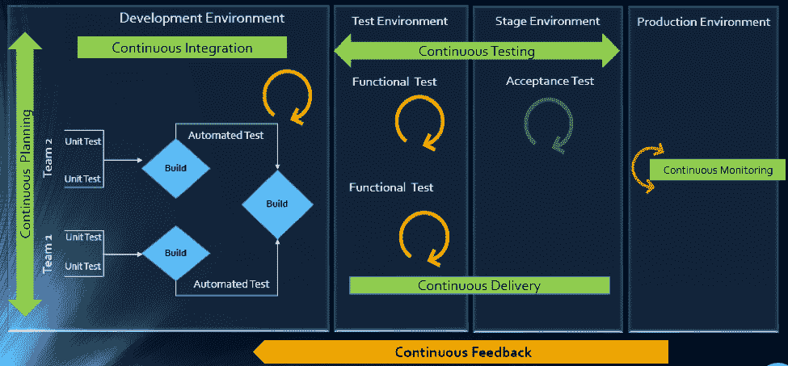
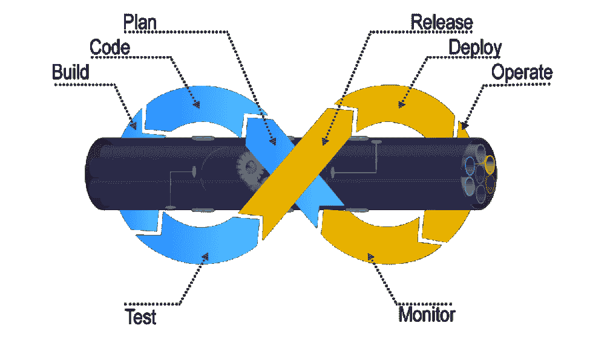
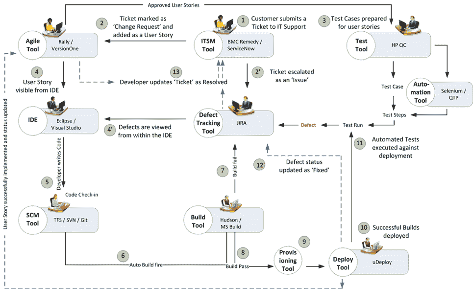

# 集成工具系统如何帮助实现 DevOps

> 原文：<https://devops.com/integrated-tool-ecosystem-helps-implement-devops/>

DevOps 是应用开发团队和系统运营团队的结合，他们的理念和行动。

在敏捷环境中，开发、测试和运营都必须协同工作，以满足频繁的迭代、发布和交付目标。这需要一个支持与其他生命周期工具进行数据编排的协作开发环境。

本文将解释多工具集成支持如何帮助组织执行 DevOps 生命周期，包括持续规划、持续集成、持续测试、持续监控、持续交付和持续反馈机制。

## **devo PS 的司机**

如今，随着竞争的加剧和对早期市场发布的需求，软件开发行业正在经历一场范式转变。敏捷已经成为所有组织不可避免的过程。此外，更短的 ROI 周期跨度、频繁的发布、增加的 CRs 以及不同的 IT 系统和工具技术使得情况变得严峻。

从开发到交付的每个阶段，行业都需要更高的透明度、最大的可见性、最短的周转时间、更少的人工干预和高效的流程。

然而，当涉及到跨工具链的数据编排和流程自动化时，使用专业工具来管理构建、部署和交付流程的组织继续面临困难。

在一个敏捷的环境中，开发人员和测试人员不仅需要确保代码变更能够正常工作和集成，还需要确保频繁的迭代不会使产品变得不稳定。因此，无缝的跨工具协作在这里非常重要。

由**代码—>构建—>供应—>测试—>缺陷修复—>部署—>发布**组成的流程链需要连续平稳地运行，而不影响交付期限或产品质量。

## **自动化是主线**

随着对持续交付和基于 sprint 的开发的需求不断增长，手动设置测试、构建和部署环境是繁重而耗时的。

软件团队需要自动化测试环境的构建、供应和部署的整个周期，包括工具、脚本和测试数据，以确保快速交付。他们还需要围绕应用程序架构进行协作，并监控基于事件-动作的机制，以实现跨工具链的无缝数据流。

[报告](https://www.cioinsight.com/it-strategy/application-development/slideshows/devops-produces-major-enterprise-impact.html)显示最重要的 DevOps 组件是 IT 自动化、敏捷开发和人员协作团队。因此，如果没有工具的集中编排，实现 DevOps 是不现实的。由于组织将大约 73%的开发运维预算用于工具采购，因此他们知道如何让工具协同工作以克服开发运维障碍非常重要。

在连接现有工具集和新工具集的过程中，大多数组织都在寻找一种可伸缩、可靠且易于维护的集成方法。工具之间的点对点集成有所帮助，但程度有限。即使是集成规则中的一个变化，也会涉及复杂的编码和跨开发、测试和部署周期的高维护。

## **基于 ESB 的集成如何帮助**

企业服务总线(ESB)架构的集成中心连接现有工具和新工具，以支持它们之间在 DevOps 生命周期中的无缝数据流。

一旦集成，来自开发和操作工具的数据变得随时可供每个涉众使用。使用基于 ESB 的集成的好处是，您可以根据自己的连接需求添加或删除任何工具。

在典型的场景中，DevOps 团队使用一系列跨职能工具，从项目规划到交付和运营。这两个工具都没有内置的集成特性，这导致工具用户之间的信息流不一致。

项目经理使用应用生命周期管理(ALM)或敏捷规划工具来细化工作范围和跟踪进度报告。单元测试时，开发人员使用不同的工具将代码从他们的集成开发环境(IDE)签入到源代码管理(SCM)存储库中。在提交给 SCM 之前，他们还会执行代码质量分析。

在这种情况下，只有当开发人员将这些规划、单元测试、代码分析和配置管理工具放在一个屋檐下时，持续集成(CI)才能实现。也就是说，通过一个公共的集成中心连接这些工具。它还帮助开发人员从 IDE 中管理一切。

在成功检入之后，构建工程师触发 SCM 工具进行自动化构建和测试。在成功构建之后，测试人员使用手动和测试自动化工具进行连续测试，然后为连续部署做准备。他们还使用单独的工具执行负载测试、API 测试和安全测试。集成支持有助于保持构建和测试工具之间的实时数据流动不间断和无缝。

DevOps 系统还包括应用性能监控(APM)工具，用于持续监控内存消耗、CPU 使用、数据库健康和发布跟踪。运营团队使用服务台/ IT 服务管理(ITSM)工具来持续生成反馈和客户支持。交付经理使用连续交付工具，通过图形界面定义和跟踪发布渠道。

当所有这些工具都连接到一个中央集成中心时，产品发布和服务台操作将变得更快、更高效。开发和 ITSM 工具之间的集成促进了持续的反馈生成，这有助于提高产品质量。

通过集成的工具[生态系统](https://www.kovair.com/presentations/integrated-alm-cross-tool-reporting/)，项目经理可以创建基于业务逻辑的 DevOps 工作流，并自动化工具系统间的数据移动。业务分析师、开发人员、测试人员和交付经理也可以获得开发进度的实时更新，并跟踪可操作的项目。主管可以将跨工具数据发送到中央存储库，并在做出业务决策之前生成有意义的报告和分析。

** *图:* ** *便于采用 DevOps 的 ESB 集成总线*

基于 ESB 的集成工具通过在所有参与工具之间建立连接，帮助组织实现和利用最佳 DevOps 实践。集成的工具生态系统有助于实现以下目标:

*   开发、交付和运营工具之间的实时协作
*   从需求捕获和评审到设计和代码分析的连续计划
*   用于定义各种数据对象之间关系的跨工具可追溯性
*   持续测试的测试策略实现
*   通过在成功完成代码签入时自动触发构建来实现持续集成
*   通过基于工作流的手动和自动测试用例的自动触发进行连续测试
*   计划的测试自动化脚本执行支持连续交付
*   通过报告和仪表板持续监控发布质量
*   自动化缺陷识别和解决，帮助台响应更快
*   端到端的可追溯性提供了更好的发布可预测性和变更影响分析
*   用于快速决策的有意义的报告、指标和 KPI
*   通过跟踪发布渠道持续交付

## **工具间连接如何带来连续性** 

为了理解工程实践的各个阶段，让我们考虑一个 IT 服务组织中的简单 DevOps 场景。

该组织使用 ITSM 工具来管理客户提交的支持票证。在提交票证时，它会自动传递给 ALM 工具，作为内部开发的用户案例或缺陷。

在分配给 sprint 时，开发人员和测试人员从 IDE、SCM 和测试工具中查看用户故事或缺陷。一旦编码完成，代码在配置管理工具中被检入，自动构建就会被构建工具触发。成功完成构建后，通过虚拟机完成工具供应。

可以使用部署工具自动部署成功的构建，并且可以通过测试自动化工具执行自动化测试。然后，测试结果被捕获，并与测试用例以及可追溯性的源需求联系起来。

在缺陷跟踪工具中为失败的测试用例提出的缺陷可以被自动发送给开发人员进行修复。

** *图:***协同工具环境下实现的 DevOps 场景

一旦连接到集成的工具系统，用户就可以从他们自己的工具中获得工具记录及其关系的完整可见性。开发人员、测试人员和帮助台管理人员可以获得开发工件和变更请求或缺陷之间完整的可追溯性视图。

当参与 DevOps 的所有工具彼此同步时，开发人员可以直接从他们自己的 IDE 中轻松查看运营团队报告的支持票证。

每当开发团队实现了一个变更请求或者解决了一个缺陷时，帮助台团队也会得到一个实时更新。它在很大程度上消除了开发和运营团队之间的通信延迟。

此外，客户可以从帮助台团队获得频繁的更新，这使他们对产品性能感到满意和自信。

## **结论**

DevOps 的实现并不是“一劳永逸”的任务。仅仅向正确的用户部署正确的工具集是达不到目的的。如果您想要在开发和运营团队周围创建一个协作的工作环境，那么 DevOps 工具链之间的适当连接是必要的。

集成的工具系统节省了大量时间和精力，否则这些时间和精力将浪费在 DevOps 实施期间的手动执行、数据监控和报告上。

## 关于作者/ Sanat Singha

Sanat Singha 是一名高级技术和网络营销作家。他对作为一个行业的 ALM 过程、技术和工具集成特别感兴趣。Sanat 从事内容营销、专业博客、社交媒体推广和网站分析。