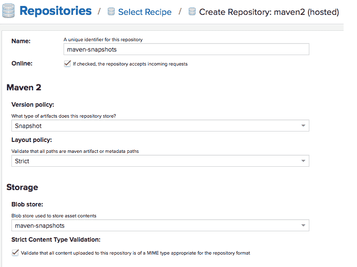

# 集成 Maven 和 Nexus，通过 Jenkins 实现持续交付

> 原文：<https://devops.com/integrating-maven-and-nexus-for-continuous-delivery-with-jenkins/>

本文演示了如何将 Maven 与 Nexus 存储库集成，并在构建过程中自动部署快照和发布工件。这也有助于理解使用 Maven 的版本升级。

在本文中，我们将讨论:

*   为快照和发布创建托管存储库。
*   创建指向 Maven Central 的代理存储库。
*   创建组存储库。
*   Maven 与 Nexus 库的集成。
*   项目 pom.xml 文件中的配置。
*   Jenkins 发布版本的配置。

## **代理存储库**

代理存储库是指远程存储库。对组件的初始请求被转发到远程存储库。然后，组件被检索并本地存储在存储库管理器中，存储库管理器充当缓存。对同一组件的进一步请求从本地存储器完成。


## **托管存储库**

托管存储库是在存储库管理器中存储组件的存储库，作为这些组件的权威位置。



对于发布，除了名称、版本策略和部署策略之外，请遵循与快照相同的配置。


## **组库**

将多个格式相同的存储库组合成一个项目就是一个存储库组。

Nexus Repository Manager 的这一特性让开发人员可以依赖一个 URL 来满足他们的配置需求。

创建一个新的 Maven(组)存储库，并对其进行如下配置:

****

## **Maven 与 Nexus 存储库的集成**

Nexus 存储库使用 Mavens settings.xml 文件与 Maven 集成。对于用户级配置，该文件通常位于($HOME/.m2，对于 Jenkins /var/lib/Jenkins/.m2)。该文件中的配置适用于用户启动的所有 Maven 构建。

一般来说，Maven 可以通过两种方式利用 Nexus/其他 artifactory。一种是下载依赖项并在构建期间将 artifactory 用作镜像，另一种是将构建的工件上传到存储库中。

Nexus 中的每个存储库和访问凭证都是在这个设置文件中配置的，因此可以在 pom.xml 中引用存储库，并利用它来构建项目工件并上传它们。

```
<?xml version=”1.0″ encoding=”UTF-8″?>

<settings xmlns=”http://maven.apache.org/SETTINGS/1.1.0″  xmlns:xsi=”http://www.w3.org/2001/XMLSchema-instance”  xsi:schemaLocation=”http://maven.apache.org/SETTINGS/1.1.0 http://maven.apache.org/xsd/settings-1.1.0.xsd“>

<servers>

<server>

<id>nexus-snapshots</id>

<username>admin</username>

<password>*******</password>

</server>

<servers>

<servers>

<server>

<id>nexus-releases</id>

<username>admin</username>

<password>*******</password>

</server>

<servers>

<mirrors>

<mirror>

<id>central</id>

<name>central</name>

<url>http://hostname:8081/repository/maven-group/</url>

<mirrorOf>*</mirrorOf>

</mirror>

</mirrors>

</settings>
```

## **项目 pom.xml 文件中的配置**

以下配置用于从 maven 组存储库下载依赖项:

```
<project …>

<repositories>

<repository>

<id>maven-group</id>

<url>http://hostname:8081/repository/maven-group/</url>

</repository>

</repositories>

</project>
```

这是将快照和发布工件发布到 Nexus 的配置:

```
<project …>

<distributionManagement>

<snapshot>

<id>nexus-snapshots</id>

<url>http://hostname:8081/repository/maven-snapshots/</url>

</snapshot>

</distributionManagement>

</project>

<project …>

<distributionManagement>

<releases>

<id>nexus-releases</id>

<url>http://hostname:8081/repository/maven-releases/</url>

</releases>

</distributionManagement>

</project>
```

将标记添加到 Maven 构建的 SCM 中:

```
<scm>

<connection>scm:git:http://gitlab.com/user/project.git</connection>

<url>http://gitlab.com/user/project</url>

<developerConnection>scm:git:http://gitlab.com/user/project.git</developerConnection>

</scm>
</scm>
```

运行–在 Jenkins 快照构建的 Maven 目标中清理部署。

## **詹金斯发布的配置构建**

在 Jenkins 构建配置中，启用具有所需发布目标的 a Maven 发布构建。此外，确保选择预选“指定 SCM 登录/密码”，这是在执行带验证的 Maven 发布时所必需的。

****

快照构建完成后，需要以下输入来执行 Maven 发布。这里，用户名和密码指的是 GitLab 管理员凭据。


## **结论**

按照上面的步骤，Maven 和 Nexus artifactory 可以在用户级集成，该用户的 Maven 执行继承了这个设置。使用 Maven 全局工具设置，可以在系统级完成类似的设置。

这些步骤帮助项目团队一次性配置快照和发布工件上传到 Nexus，以及 GitLab 中 pom.xml 的版本升级。可以对 JFrog 等其他工厂执行类似的设置。

— [穆罕默德·阿齐姆](https://devops.com/author/mohamed-azeem/)