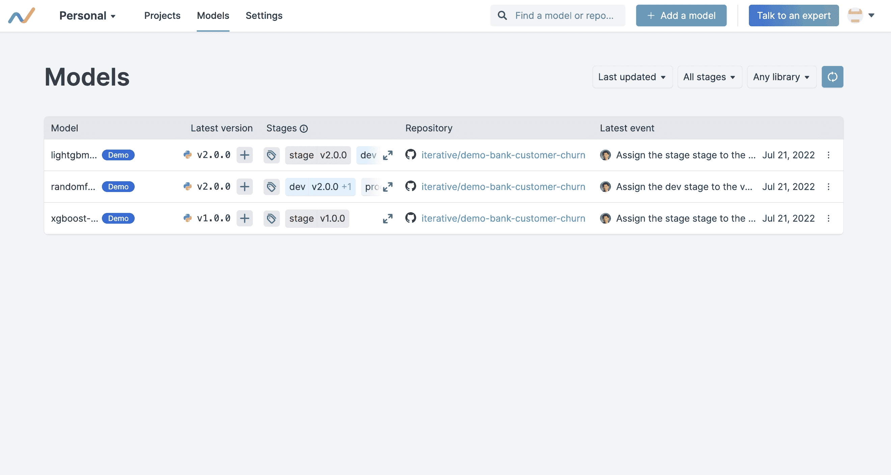

# 迭代将注册中心添加到 ML 模型的 GitOps 产品组合中

> 原文：<https://devops.com/iterative-adds-registry-to-gitops-portfolio-for-ml-models/>

Iterative 在其基于 Git 的工具组合中添加了一个机器学习模型注册表，用于将人工智能注入应用程序。

Iterative 首席执行官德米特里·彼得罗夫(Dmitry Petrov)表示，[Iterative Studio Model Registry](https://www.businesswire.com/news/home/20220726005244/en/Iterative-Introduces-First-Git-based-Machine-Learning-Model-Registry)旨在随着注入人工智能功能的应用数量的持续增长，让应用开发团队更容易跟踪哪些模型正在被使用。

可通过图形界面、命令行界面或应用程序编程接口(API)访问的 Iterative Studio Model Registry 使通过中央仪表板浏览模型(包括历史、版本和阶段)变得更加简单。团队还可以识别产生模型的实验，并跟踪模型版本是如何、何时以及由谁创建的。

由 Iterative 创建的数据版本控制(DVC)平台公开了一个类似 Git 的接口，使组织能够跨机器学习操作( [MLOps](https://devops.com/?s=MLOps) )工作流跟踪数据集、模型和管道的多个版本。这种方法使这些模型能够与其他软件工件一起存储在 Git 存储库中，而不是要求组织部署单独的平台来存储 ML 模型。

数据科学团队使用的平台提供商一直在为独立的存储库提供案例，以跟踪用于构建人工智能模型的工件。Iterative 认为在已经存储了其他类型的软件工件的地方使用 Git 存储库更有效，因为毕竟 ML 模型只是另一种类型的软件工件。

Petrov 指出，这种方法也使 DevOps 和数据科学团队的合作变得更简单，因为 DevOps 团队将更清楚地了解什么样的人工智能模型最终需要整合到应用程序中。

组织面临的挑战是数据科学和应用程序开发团队之间的文化差异。如今，数据科学团队通常已经使用各种图形工具定义了自己的工作流流程。然而，随着几乎每个应用程序都将在某种程度上注入机器学习和深度学习算法变得越来越明显，弥合 DevOps 和数据科学团队之间当前鸿沟的需求将变得更加迫切。

事实上，DevOps 团队应该假设更多的人工智能模型不仅在路上，而且这些模型需要不断更新。每个人工智能模型都是基于一组假设构建的；然而，随着越来越多的数据变得可用，人工智能模型会随着时间的推移而发生漂移，导致准确性下降。组织甚至可能决定需要替换整个人工智能模型，因为做出假设的业务条件不再有效。无论如何，人工智能模型的更新和调整很可能很快成为另一个通过 DevOps 工作流管理的连续过程。

当然，没有哪个 IT 组织能够管理它无法跟踪的东西。随着组成应用程序环境的工件类型数量的增加，注册中心已经成为 DevOps 工作流的重要组成部分。ML 模型在多大程度上成为另一个软件人工制品还有待观察，但是无论如何，It 组织中的某些人需要知道什么模型在什么应用程序中用于什么目的。