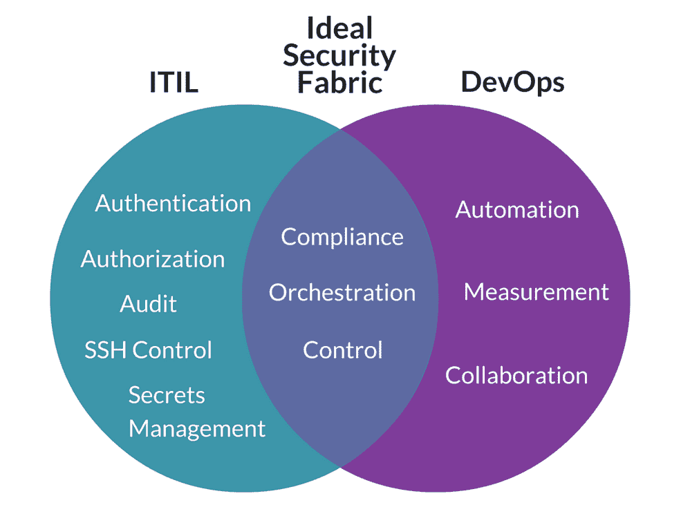

# ITIL 如何与德沃普斯共存

> 原文：<https://devops.com/itil-can-co-exist-devops/>

最初的 ITIL 框架定义发表于 20 世纪 80 年代，但是与许多观点相反，如果人们采取更灵活的观点，它*已经从那时起发展了*。快进到 ITILv3，框架已经转变为需要支持业务计划和战略的*服务*。

与此同时,“DevOps 运动”的势头越来越猛，现在已经成为许多前瞻性组织的“文化”。因此，这就引出了一个问题，“我能否拥有我的 ITIL 框架，同时仍然转变我的 IT 组织以采用 DevOps？”

首先，作为复习，让我快速概述一下 ITILv3 的关键组件。

1.  **服务策略** **—** 服务生命周期必须专注于满足业务目标。
2.  **服务设计—** 服务的架构蓝图
3.  **服务过渡—** 概述变更管理和发布周期实践
4.  **服务运营—** 关注服务的交付和控制流程
5.  **服务改进—** 关注如何*持续*改进服务交付流程

现在，让我们为文化向 DevOps 的过渡设计一个参与模型。

1.  **DevOps 战略—** 建立概述业务目标和价值的指标
2.  **开发运维设计—** 建立容量、可用性和安全性最佳实践
3.  **DevOps 过渡—** 建立组织结构并定义 SLA
4.  **DevOps 运营—** 转向敏捷；纲领性 CMDB 和变革
5.  **开发运维改进—** 自动化事件、问题和事件补救；反馈回路

正如你所看到的，这两个世界之间没有巨大的差距，我断言主要的变化是文化上的，而不是技术上的，但是人们可以用技术开始改变文化。

这就是 ***安全架构*** 的概念发挥作用的地方。以下是如何组织企业参考架构以结合 ITIL 和 DevOps 最佳部分的示例:

1.  **策略定义—** 允许您定义用户、组、主机、层和相互依赖关系
2.  **机密管理—** 允许您将机密存储在保险库中，并通过完整的审计日志以安全的方式以编程方式访问它们
3.  **SSH 管理—** 通过完整的审计日志，您可以安全地管理 SSH 公钥和会话交互
4.  **主机工厂—** 允许您在基础架构中实例化和注册新的主机或容器
5.  **身份/服务定义的授权—**允许您通过策略和网关守护设备控制主机或容器之间的交互

现在，它有了一个强大的平台来将业务目标映射到身份、主机和流程。一旦建立了这种映射，以前静态和脆弱的活动，如管理秘密和 SSH 公钥，就可以转移到持续交付管道中，直接映射改进服务转换、操作和持续改进。

通过各种工具以编程方式增加灵活性和规模，这允许无摩擦和可审计的变更请求，以及对事件、事件和问题的快速响应。

下图试图形象地展示 ITIL 和 DevOps 的共存，以及两者之间的 ***安全结构*** 的特征是如何相同的。

向 DevOps 文化的转变应该被视为一种持续的进化。ITIL 是一个很好的开始框架，但随着时间的推移，增加了太多的结构和刚性。您可以利用 DevOps 的最佳实践来克服这一点，并转变为极其敏捷和高效的环境。

## 关于作者/迈克·凯尔

Mike Kail 曾是雅虎的首席信息官和基础设施 SVP，负责公司的 IT 和数据中心职能。在加入雅虎之前，他拥有超过 24 年的 IT 运营经验，专注于高度可扩展的架构。最近，凯尔在网飞担任 IT 运营副总裁。在此之前，他是 Attensity 的 IT 运营副总裁，负责美洲数据中心运营团队；包括使用 Hadoop 集群、HBase 和 MongoDB 组件管理各种大数据系统。他因在 Twitter 上发表的见解深刻的行业评论而得到广泛认可，最近被《赫芬顿邮报》评为“Twitter 上 100 位最具社交能力的首席信息官”之一。他拥有爱荷华州立大学的计算机科学学士学位。在[推特](https://twitter.com/mdkail)或 [LinkedIn](https://www.linkedin.com/in/mdkail) 上联系他。