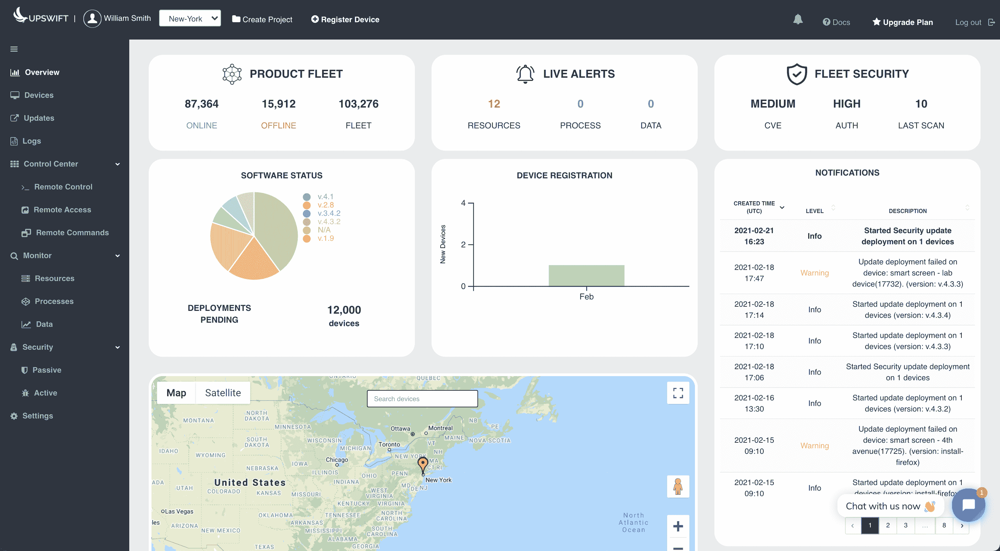

# jfrog 获得升档将 devops 推向边缘

> 原文：<https://devops.com/jfrog-acquires-upswift-to-push-devops-to-the-edge/>

JFrog 今天透露，它已经[收购了 Upswift](https://www.businesswire.com/news/home/20210913005292/en/JFrog-Acquires-Upswift-Bringing-Software-Updates-and-Container-Deployment-for-IoT-Devices-to-Developers) ，作为将其 DevOps 扩展到边缘计算平台的努力的一部分。收购条款没有披露。

Upswift 已经创建了代理软件，该软件作为二进制文件部署在一个[边缘计算](https://devops.com/?s=edge+computing)平台上，使得跨一系列边缘计算设备和平台持续交付软件成为可能。这种方法使得组织可以部署软件，而不管目标平台是只运行 Linux、容器还是虚拟机。

JFrog 首席执行官什洛米·本哈姆(Shlomi Davis)表示，Upswift 开发的代理软件将与 JFrog 创建的持续集成/持续交付(CI/CD)平台相集成，使组织更容易管理部署在边缘计算平台上的应用工作负载的全生命周期。

本哈姆说，如今在边缘计算平台和设备上部署软件的组织通常会有大量积压的更新，他们无法及时部署。他指出，通过将 Upswift 代理软件连接到从头开始设计的支持二进制文件的(CI/CD)平台，就有可能减少积压，这是 JFrog 描述的部署软件的“液体愿景”的一部分。

此外，在[收购 Vdoo](https://devops.com/jfrog-acquires-vdoo-to-advance-decsecops/) 以获得一套发现应用程序二进制漏洞的分析工具后，JFrog 还将能够为边缘计算应用程序带来 DevSecOps 最佳实践，本哈姆指出。

随着组织寻求在更接近数据创建和消费点的地方处理和分析数据，部署在边缘计算平台上的应用程序工作负载数量正在急剧增加。事实上，这种转变是数字业务转型计划的核心，这些计划依赖于边缘计算平台和运行物联网(IoT)应用程序的设备来近乎实时地处理数据。

Upswift 首席执行官 Amit Ezer 表示，很明显，在边缘计算平台和设备上更新软件的现有过程能够处理软件的涌入。他补充说，Upswift 创建了它的工具，使开发人员能够对这些过程进行更多的控制，因为管理和保护软件的责任继续向左转移。在许多情况下，问题是组织缺乏在边缘计算平台上一致部署软件的能力，这导致创建了大量自行开发的工具来使用大量手动流程在边缘计算平台上部署软件。

现在说有多少软件将被部署在边缘还为时过早，但也许有一天边缘的软件会比云中的多。当然，真正的挑战将是统一开发运维流程的管理，无论任何给定的软件可能部署在哪里。事实上，随着边缘计算的不断发展，边缘计算和云计算之间的界限将继续模糊，直到它们只是彼此的自然延伸。