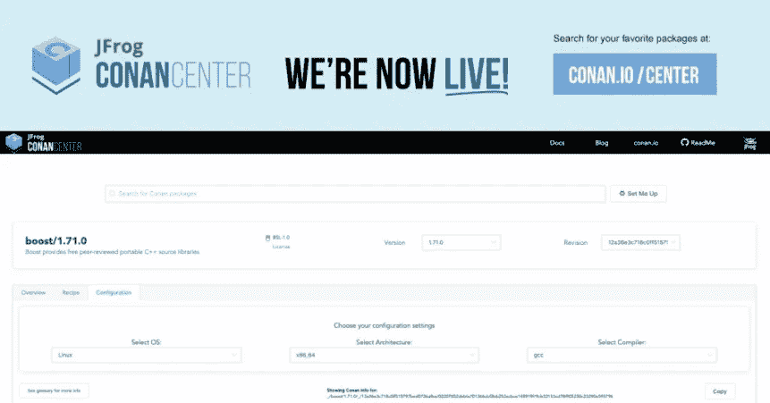

# JFrog ConanCenter 将 DevOps 扩展到 C++

> 原文：<https://devops.com/jfrog-conancenter-extends-devops-reach-to-c/>

JFrog 本周宣布，它已经更新了 ConanCenter，这是一个存储和发现可以免费下载的软件包的仓库，包括对 C++工件的支持。

JFrog 社区和合作伙伴工程副总裁 Jagan Subramanian 表示，ConanCenter 为开源的柯南包管理器提供了一个存储库，JFrog 将它作为其持续集成/持续交付(CI/CD)平台的一部分。Subramanian 说，通过使 ConanCenter 免费可用，JFrog 正试图鼓励依赖 C++构建应用程序的组织接受最佳 DevOps 实践。

JFrog 还提供了其 Artifactory CI/CD platform for C/c++的免费社区版供下载，并计划在本季度晚些时候将 ConanCenter 与其他 JFrog 工具集成在一起，使安全访问软件包变得更加容易。

作为一种通用编程语言，几十年来，C++一直被用来在资源受限的 IT 环境中构建应用程序，如嵌入式系统。Subramanian 说，许多依赖 C++来构建这些类型的应用程序的组织正面临着与其他软件开发同事一样的加速应用程序开发的压力。

他说，为了实现这一目标，JFrog 现在正在扩展其 DevOps 组合，以包括对使用 C++工具开发的应用程序的支持。ConanCenter 不仅提供了一种基于它们生成的元数据发现工件的方法，而且还提供了一系列配置选项和一个免费的二进制构建服务，可以跨多个操作系统、平台和编译器应用。

尽管 C++寿命很长，替代编程语言也在兴起，但它仍然在一系列垂直行业中扮演着独特的角色。仍然有很多 C++开发人员在开发一些最具挑战性的应用程序。事实上，随着涉及自动驾驶汽车的机器人和物联网(IoT)应用的兴起，使用 C++构建新类别应用的兴趣正在上升。ConanCenter 存储库承诺让 C++开发人员更容易在那些不同的项目之间共享工件。

就依赖 C++的组织采用最佳 DevOps 实践而言，Subramanian 说现在还为时过早，因为大多数仍处于概念验证阶段。然而，他说大多数人经常会遇到最佳 DevOps 实践解决的所有棘手问题，这应该会推动更多的组织在未来的几个月和几年中采用 DevOps。

现在猜测依赖 C++的组织接受 DevOps 需要多长时间还为时过早。几十年来，他们中的许多人一直依赖基于瀑布的过程来构建和部署应用程序。然而，就像在其他编程环境中一样，更快地构建和部署应用程序的需求要求开发团队拥抱变化。然而，与往常一样，DevOps 面临的最大挑战与核心技术平台关系不大。相反，IT 组织的现有文化总是被证明是最大的障碍。

— [迈克·维扎德](https://devops.com/author/mike-vizard/)