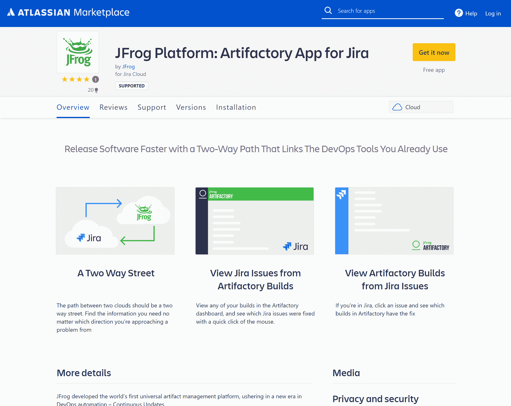

# JFrog 加强了与吉拉云版本的集成

> 原文：<https://devops.com/jfrog-tightens-integration-with-cloud-edition-of-jira/>

JFrog 本周宣布，其作为软件即服务(SaaS)交付的 DevOps 平台现在可以与来自 Atlassian 的作为云服务交付的吉拉项目跟踪和管理应用程序集成。

JFrog 全球业务开发副总裁 Casey O'Mara 表示，这种双向集成使得将吉拉问题(如 bug 修复)与 JFrog Artifactory 存储库中的二进制文件或构建链接起来成为可能，JFrog DevOps 平台的一部分。

O'Mara 表示，这种整合可以通过从 Atlassian Marketplace 下载的应用程序来实现，扩展了两家公司之间的现有联盟。例如，Atlassian bit bucket Cloud for continuous integration 和 JFrog Artifactory repository 之间已经实现了集成。

O'Mara 补充说，与吉拉问题建立联系将使合作更加容易，例如，使人们更容易理解为什么要创建一个特定版本的艺术品，如容器图像。

Artifactory 已经能够从 Git 收集与构建一起记录的问题关键消息。用于构建信息的 Artifactory dashboard 在“问题”选项卡中显示每个引用的吉拉问题的链接。现在，吉拉的用户可以链接到 Artifactory 中的构建。

吉拉仍然是软件开发的主要项目跟踪和管理应用程序。随着越来越多的组织意识到他们现在对软件的依赖程度，O'Mara 指出，随着对应用程序开发进度的跟踪越来越密切，使用吉拉的组织中的利益相关者的数量也开始增加。O'Mara 指出，Atlassian 现在正在使吉拉更易于作为云服务使用，以帮助促进更多的采用。

Atlassian 现在正在为将其客户群转移到[云](https://devops.com/?s=cloud)做准备。今年第三季度，除了提高内部产品的价格之外，它还计划停止销售新的服务器许可证。具有讽刺意味的是，该公司最近第三季度的初步结果显示，收入在 5.66 亿美元至 5.72 亿美元之间。这比最初的预测高出 8500 万美元，因为预计今年晚些时候将无法提供本地产品，因此对本地产品的需求有所增加。

总的来说，Atlassian 和 JFrog 都是开发运维最佳方法的强烈支持者。JFrog 最近一个季度的收入为 4270 万美元，增长了 39%。该季度云收入增长 69%，至 980 万美元，占总收入的 23%。

目前还不清楚企业转向云计算的速度。随着新冠肺炎疫情带来的经济衰退，迁移到云中的工作负载数量无疑已经加快。然而，大部分数据继续驻留在内部环境中，许多组织出于性能、安全性和合规性方面的考虑，没有立即将其所有应用程序迁移到云的计划。

无论 DevOps 平台位于何处，总会有集成它们的需求。当组成工作流的所有工具都在云中运行时，可能更容易实现这个目标。