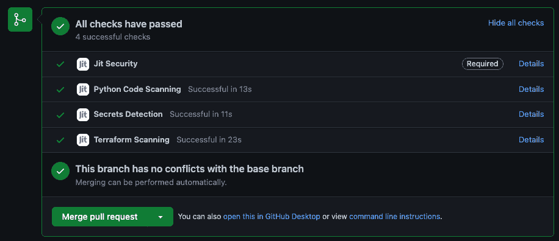

# Jit 的出现是为了解决网络安全策略即代码编排的问题

> 原文：<https://devops.com/jit-emerges-to-address-cybersecurity-policy-as-code-orchestration/>

Jit 今天秘密地出现了一个免费的同名编排平台测试版，它可以自动地将安全计划作为代码来实现。

Jit 首席产品官 Aviram Shmueli 表示，该公司将在 GitHub 中提供其开发的安全计划代码。此外，Jit 将提供一项服务，客户可以通过这项服务提交文档和电子表格，Jit 将把这些文档和电子表格转换成可以作为代码执行的定制安全计划。

Shmueli 说，Jit 刚刚筹集了 3850 万美元的种子资金，旨在通过使网络安全政策能够更容易地通过其编排平台作为代码来实现，来推动采用 [DevSecOps](https://devops.com/?s=DevSecOps) 最佳实践。他指出，Jit 平台使开发人员和 DevOps 团队能够利用图形工具，只需单击一下，就可以在 DevOps 工作流中自动实施安全策略。

Shmueli 补充说，我们的目标是消除独立开发团队创建安全策略的需要，每个团队都需要单独管理这些策略。

理论上，DevSecOps 最佳实践要求将安全责任转移给应用程序开发团队。挑战在于开发团队通常不具备制定有效的网络安全政策所需的专业知识。Jit 正在为一个平台提供一个案例，这个平台使得自动执行经过审查的网络安全策略变得更加简单。

应用程序安全的责任到底会向左转移多远还有待观察。开发人员通常喜欢花尽可能多的时间来创建业务逻辑，而不是实施网络安全策略。因此，经常需要 DevOps 团队找到一种方法，在多个应用程序之间一致地实施网络安全策略。每个 DevOps 团队都需要决定他们可以在多大程度上依赖 Jit 定义的策略，而不是选择实现一组由他们内部网络安全团队定义的策略。经常出现的问题是网络安全团队缺乏编程技能；定义网络安全策略的唯一方法是某种类型的文档或电子表格，以某种方式需要转换成代码。

鉴于[网络安全专业知识](https://securityboulevard.com/2022/06/workforce-shortage-affecting-cybersecurity-posture/)的长期短缺，很明显，在应用程序环境继续快速扩展并增加整体复杂性的时候，需要更有效的方法来共享网络安全最佳实践。

无论采用哪种 DevSecOps 方法，在一系列引人注目的网络安全违规事件发生后，解决应用程序安全的压力都在增加。各种规模的组织现在都在重新审视日益成为网络犯罪分子目标的[软件供应链](https://devops.com/?s=software+supply+chain)。安全策略代码工具可以确保应用程序不会在没有明确许可的情况下与外部系统进行通信。

无论如何，随着更多指令的实施，目前达到的应用程序安全级别将在未来几个月中得到提高。剩下的唯一真正问题是实现该目标所需的对现有流程的破坏程度。