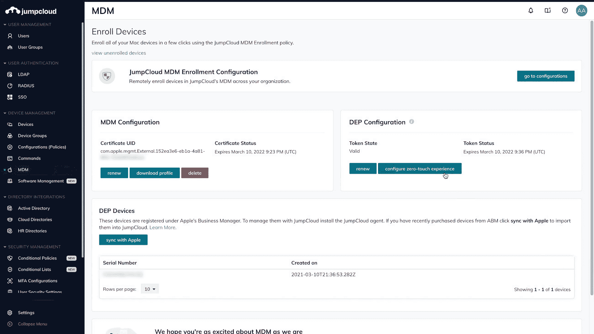

# JumpCloud 为 Mac 带来了零接触供应

> 原文：<https://devops.com/jumpcloud-brings-zero-touch-provisioning-to-the-mac/>

JumpCloud 今天宣布，它将为其云目录平台增加一项针对 MAC 电脑的零接触注册功能，该功能还将随着时间的推移扩展到应用程序。

JumpCloud 首席技术官 Greg Keller 表示，这一新功能通过利用 JumpCloud 平台中的数据，将 Apple Business Manager(以前称为苹果设备注册计划(DEP))扩展到了特定用户。

每当用户登录新的 Mac 时，它可以自动与 JumpCloud 目录同步，然后使用该最终用户的身份来配置设备，此外还通过他们的 JumpCloud 凭据提供对所有公司资源的适当访问。

Keller 说，在新冠肺炎疫情之后，对 IT 管理零接触方法的需求变得更加迫切。即使疫情最终平息后，员工在家工作的频率也越来越高，Keller 指出，IT 团队可以物理配置 Mac 的日子正在消逝。

虽然苹果 MAC 电脑在一年内出货的所有个人电脑中仍占不到 10%，但凯勒指出，中小型企业采用 MAC 电脑的速度比大型企业更快。随着终端变得更加多样化，凯勒表示，JumpCloud 平台为管理 Windows 和 Mac 设备提供了微软活动目录的替代方案。当然，苹果去年[收购了 Fleetsmith](https://devops.com/devops-deeper-dive-apple-adds-fuel-to-itsm-fire/) 以获得供应工具。然而，这些工具还没有与任何类型的目录集成。

最近，JumpCloud 增加了一个工具，使 IT 团队能够远程将软件安装到最终用户的 Windows 设备上，并与 Slack、Salesforce、Atlassian、GitHub 和 Amazon Web Services (AWS)集成。

JumpCloud 刚刚筹集了额外的 1 亿美元资金，正在为使用目录来验证每个终端用户的身份的零信任方法管理终端提供理由。JumpCloud 为个人和小型团队提供免费版平台，已经被 100 多个国家的 10 万多个组织使用。包括 Cars.com、GoFundMe、Nimbus Therapeutics、Grab、Pulselive、SlimPay、Foursquare、Beyond Finance and Funding Societies 在内的 3，700 多家组织都是付费客户。

从长远来看，可能有一天会采用口头命令来为特定的最终用户提供端点。与此同时，配置和供应这些终端的过程变得更加自动化。IT 团队现在能够远程管理终端设备群，而无需实际接触它们。事实上，IT 经理可能没有必要回到办公室，因为任务变得越来越自动化，能够远程执行。

虽然有很多选项可以实现这一目标，但 Keller 表示，与目录紧密集成以确保正确的系统最终到达正确的最终用户手中的选项数量很少。现在的挑战是让组织重新考虑他们的目录要求，因为人们越来越期望 IT 团队提供个性化的白手套服务，而不管最终用户位于何处。