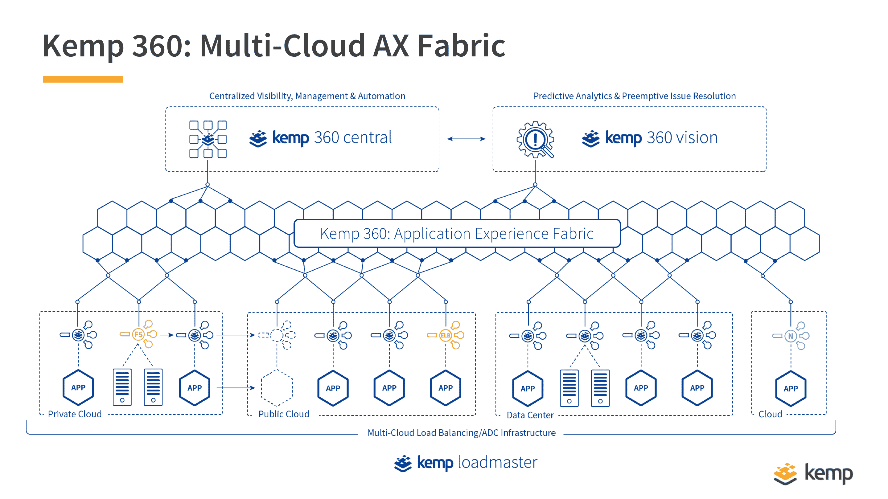

# Kemp 将预测分析添加到 ADC 中以提高 DevOps

> 原文：<https://devops.com/kemp-adds-predictive-analytics-to-adc-to-advance-devops/>

Kemp 本周[增强了其应用程序开发控制器(ADC)中的自动化和预测分析功能](https://www.businesswire.com/news/home/20190220005271/en/Kemp-Recharges-Brand-Bolstering-Automation-Predictive-Analytics),作为简化跨多云计算环境部署应用程序的努力的一部分。

公司首席执行官雷·道恩斯表示，在应用程序比以往任何时候都更加分散的时候，目标是让开发运维团队更容易避免过度配置 it 基础设施。

Kemp ADC 产品由物理和虚拟设备组成，现已部署超过 60，000 次。道恩斯说，这些部署产生的数据量现在使 Kemp 可以通过 360°中央监控工具应用预测分析，例如，现在可以根据当前的利用率提出关于在哪里部署工作负载的建议。

他指出，Kemp 现在还可以提供比较分析。例如，该公司透露，其分析显示 61%的应用程序体验问题与容量问题引起的事件有关，如应用程序服务器故障或降级。Kemp 还透露，48%的组织每周会遇到多达 9 起应用程序事件。

既然 Kemp 已经开始将预测分析应用于其 ADC 平台，道恩斯表示，下一个合乎逻辑的步骤将是应用机器学习算法来帮助进一步自动化应用部署。

虽然 ADC 提供了重要的负载平衡功能，但作为开发运维团队的可操作情报来源，它们往往被忽视。这些数据比以往任何时候都更加重要，因为随着 IT 组织通过采用更复杂的微服务来实现其应用程序组合的现代化，他们中的许多人发现每个应用程序都将很快需要自己的负载平衡功能。以前，ADC 的主要作用是让尽可能多的应用高效共享同一 IT 基础设施。现在的目标是在一系列松散耦合的微服务之间协调和优化 IT 基础设施资源的分配。Kemp ADC 旨在使 DevOps 团队能够定义分布式 IT 环境中所有负载平衡器的理想状态，包括 F5 Big-IP、AWS 弹性负载平衡器、Nginx 和 HAproxy 负载平衡器。这种能力使得部署分布式应用服务变得更加容易。

随着时间的推移，道恩斯说，Kemp 将把这种能力扩展到开源负载平衡器，如特使，这是开始部署在 Kubernetes 集群之上。Kubernetes 和 Envoy 都是在云本地计算基金会(CNCF)的支持下开发的。然而，与 Kubernetes 集群内的负载平衡一样重要的是，道恩斯指出，分布式应用程序将跨越云原生和传统 IT 基础设施环境以及多个 Kubernetes 集群。

DevOps 团队可能需要一段时间来完全理清何时何地采用何种形式的 ADC 平台和负载平衡功能。但是，随着 IT 变得更加分散，人们越来越有兴趣确保这些应用程序的 IT 基础架构利用率尽可能高，而不管它们是如何开发的。

— [迈克·维扎德](https://devops.com/author/mike-vizard/)