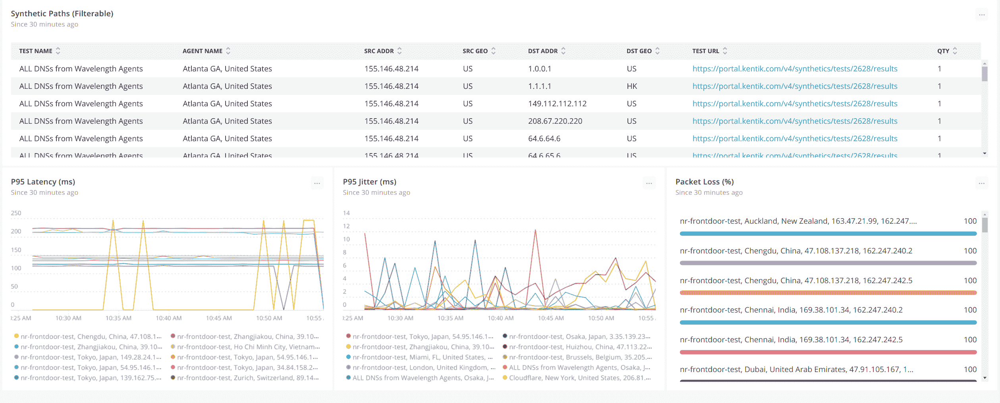

# Kentik 开源五个项目以提高网络可观测性

> 原文：<https://devops.com/kentik-open-sources-five-projects-to-advance-network-observability/>

Kentik 今天推出了一个开发者中心，名为 Kentik Labs，通过这个中心，它可以提供五个开源项目，作为推进跨网络操作(NetOps)可观测性的努力的一部分。

这五个项目是:

**kTranslate:** 一个用于拉和推网络数据的系统，这是该公司为新遗迹可观测性平台创建的 Kentik 消防软管集成的基础

**NetDiag:** 低级网络诊断的可扩展异步实现

**Convis:** 示例代码展示了如何使用 eBPF 通过 Linux 内核将流程和容器信息归因于网络流量

**kProbe:** 高性能主机和传感器网络探头(PCAP)

**Grafana App:** 摄取和查询网络数据的实时工具

Kentik 业务开发副总裁兼 Kentik Labs 联席主席 Nick Stinemates 表示，目标是使 DevOps 团队能够将网络操作纳入已经用于以编程方式管理其余 IT 的工作流中。

Stinemates 指出，随着 IT 环境变得更加分散，管理网络运营变得更具挑战性。如果出现故障，DevOps 团队可能很难确定问题是由于应用程序代码、底层基础架构还是其他根本原因。他补充说，Kentik Labs 致力于提供工具来帮助 DevOps 团队缩短他们的平均恢复时间(MTTR)。

大多数网络运营团队越来越依赖软件来管理分布式网络，这些软件要么是路由器和交换机供应商提供的图形工具，要么是使用 Python 编程语言和开源 Ansible automation framework，使 IT 团队能够以声明方式管理 IT 基础设施。

随着管理网络运营的团队对这些工具越来越熟练，将它们整合到更大的 DevOps 团队的结构中变得更加简单。虽然 DevOps 团队多年来一直以编程方式管理 IT 基础设施即代码(IaC ),但网络管理在很大程度上仍停留在一个单独的孤岛中。然而，Stinemates 说，随着越来越多的应用程序被部署在云中，很明显，NetOps 需要与用于部署和管理高度分布式 it 环境的其余工作流更加集成。

不太清楚的是，组成混合云计算环境的网络将在多大程度上继续由网络管理员管理，而[站点可靠性工程师](https://devops.com/?s=site+reliability+engineer) (SREs)开始承担管理计算和存储的责任。

无论谁管理网络，下一代基于微服务的应用程序都依赖于应用程序编程接口(API)来调用各种服务，比前几代应用程序对延迟更加敏感。由于网络问题，这些应用程序中有许多会经常遇到性能问题，而这些问题对于开发运维团队来说往往并不明显。目标应该是，至少，在召开“作战室”以确定如何解决问题之前，用确认这些问题的来源所需的工具武装那些开发运维团队。