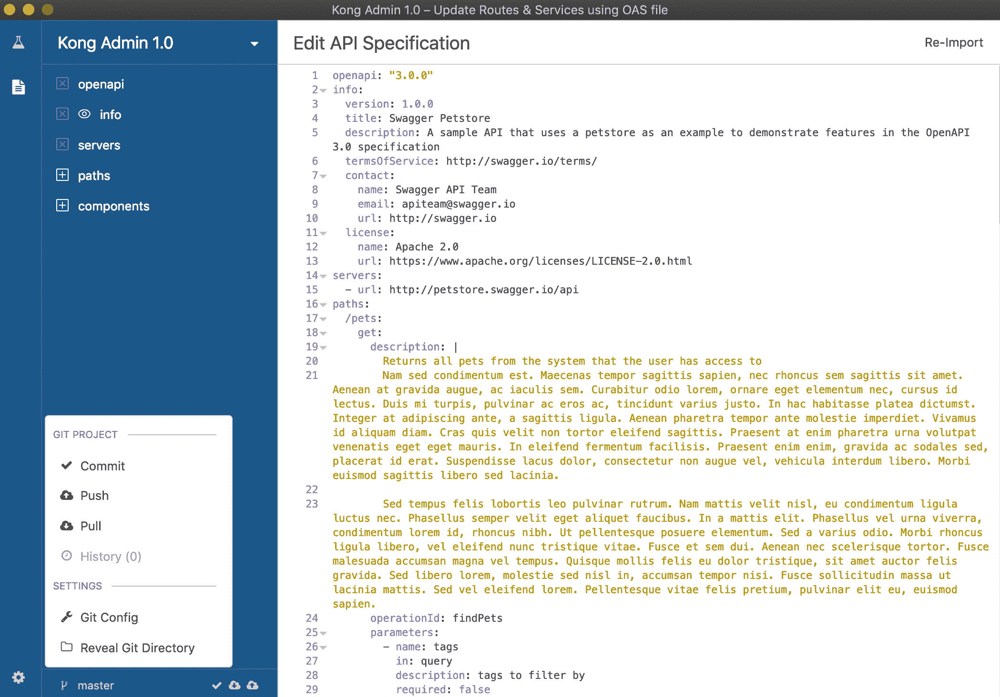

# 孔利用机器学习扩展服务控制

> 原文：<https://devops.com/kong-employs-machine-learning-to-extend-services-control/>

在 [Kong Summit 2019](https://konghq.com/kong-summit) 大会上，Kong 今天宣布收购了一款面向应用编程接口(API)的开源测试工具失眠症。此外，它还为其服务控制平台增加了对 REST、Kafka Streams、gRPC、GraphQL 以及用 Go 编写的插件的支持。

Kong 还以可视化服务地图的形式添加了更多基于机器学习算法的功能，这是一个 Kong 免疫模块，可检测跨多个平台的服务异常。

此外，该公司正在提供 Kong Studio，这是一套基于 API 测试和调试工具失眠症的工具，用于设计、构建和维护 REST 和 GraphQL 端点的 API，然后可以发布到 Kong Gateway，这是一种用于部署和管理分布式 API 的代理软件。Kong Gateway 的 2.0 版本为平台分离了数据和控制平面，并提供了通过 Kong 的插件开发工具包在 Go 中编写插件的能力。

Kong CTO Marco Palladino 表示，总的来说，这种方法使在设计阶段解决大量潜在的 API 问题变得更加容易，而不是在 API 被推入生产环境之后。

最后，孔还更新了库马，这是一个基于特使代理软件的服务网格的开源控制平面，该软件是在云计算原生计算基金会(CNCF)的支持下开发的。

Kong 一直在为一个名为 Kong Brain 的服务控制平面提供支持，该服务控制平面跨越云原生环境和传统单片环境，并广泛使用机器学习算法。Palladino 表示，随着越来越多的服务在现有的单片和云原生应用程序环境中激增，IT 组织将无法在不更多地依赖机器学习算法来管理在更复杂的 IT 环境中几毫秒内发生的事件和流程的情况下保持同步。

事实上，Palladino 指出，IT 组织不应该期望一种环境取代另一种环境，而应该期望看到服务在单一和云原生应用程序环境中激增。他说，管理所有这些不同类别的服务将需要一个能够跨越多种环境的服务控制平台。

随着时间的推移，机器学习算法将使服务控制平台变得更加智能，因为 IT 环境将过渡到端到端管理服务，而不是继续关注单个应用程序。Palladino 说，自然地，已经完成这种过渡的组织与那些采用 DevOps 来构建、部署和管理这些服务的组织之间有很高的相关性。他指出，最成功的组织采用 DevOps 来部署和更新 API，就好像它们是一个独立的应用程序，而不是一组往往会随着时间的推移而被遗忘的附加功能。

API 和 DevOps 的融合最终将如何改变 It 的管理方式还有待观察。唯一可以确定的是，隔离管理应用程序的日子终于要结束了。

— [迈克·维扎德](https://devops.com/author/mike-vizard/)