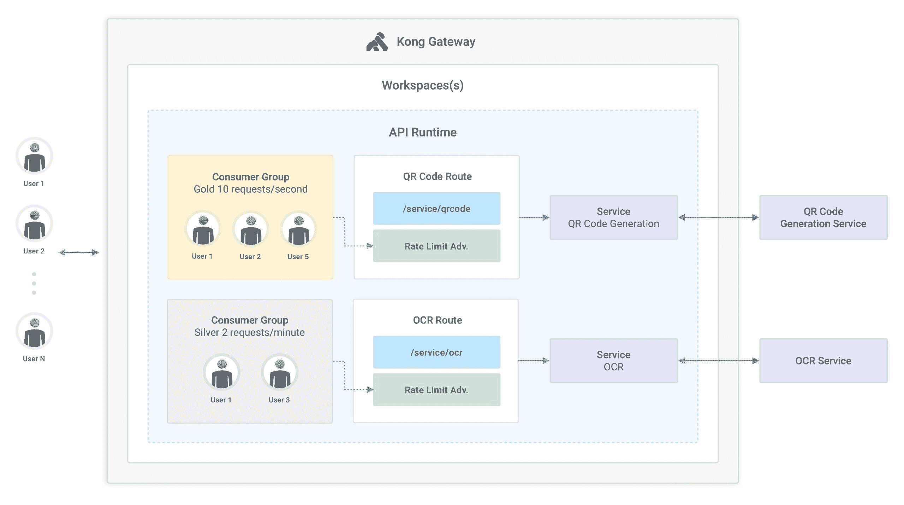

# Kong Enterprise 2.7 简化 API 管理

> 原文：<https://devops.com/kong-enterprise-2-7-simplifies-api-management/>

Kong Inc .本周推出了其服务连接平台战略，对 Kong Enterprise 进行了更新，使集中管理应用程序编程接口(API)组变得更加简单。

Kong，Inc .的开发者体验主管 Michael Heap 说，这一能力将使为不同层次的 API 分配速率限制变得更简单。

此外，Kong Enterprise 版本增加了对涉及开源 Kafka 流平台和 webhooks 的实时和基于事件的用例的支持。Heap 指出，随着越来越多的组织采用要求[接近实时处理](https://devops.com/how-stream-processing-goes-beyond-real-time/)的数字业务转型计划，而不是依赖传统的面向批处理的应用程序，事件驱动架构的使用正在增加。

最后，IT 团队现在还可以安全地存储可能用于访问 Kong Gateway 的机密信息，如用户名/密码、API 令牌、数据库凭证和私钥。Kong Manager UI 的改进用户界面使得为 Kong 网关配置 Kong OpenID Connect (OIDC)插件变得更加简单。

总的来说，Heap 说，最新的更新还提供了 25%的吞吐量增加和改进的延迟。在第三方研究公司 GigaOM 进行的测试中，Kong Enterprise 2.7 实现了每秒 52，250 个事务(TPS)的最大吞吐量，成功率为 100%。

Kong 正在为一个服务连接平台提供案例，该平台通过为单片和基于微服务的应用程序集成所有第 4 层到第 7 层服务，使 IT 团队能够在更高的抽象级别上管理 API。该抽象层使管理依赖于各种 API 的分布式应用变得更加简单，而不必在孤立的孤岛中管理一系列网络服务和相关服务。

总的来说，在过去的几年里，组织内部和外部使用的 API 的数量有了巨大的增长。现在的挑战是找到一种方法，不仅管理和保护所有这些 API，而且在新服务上线时让它们退役。许多 API 被创建并被遗忘，因为他们的开发者忽略了通知 IT 操作他们的存在。当网络罪犯发现他们可以通过这些 API 偷偷窃取数据时，这些所谓的“僵尸 API”就会成为网络安全的负担。

当然，API 是任何软件供应链不可或缺的一部分。但是，随着备受瞩目的安全漏洞将软件供应链安全置于聚光灯下，it 团队寻找更有效的方法来大规模管理和保护 API 只是时间问题。

不可避免地，这也意味着组织将需要决定在更大的服务连接平台的背景下，他们希望在多大程度上依赖代理软件、API 网关和服务网格来实现这一目标。

同时，独立于 IT 组织的其他部分管理 API 的日子即将结束。剩下唯一要确定的是 API 开发者需要在他们正在进行的生命周期管理中有多投入。