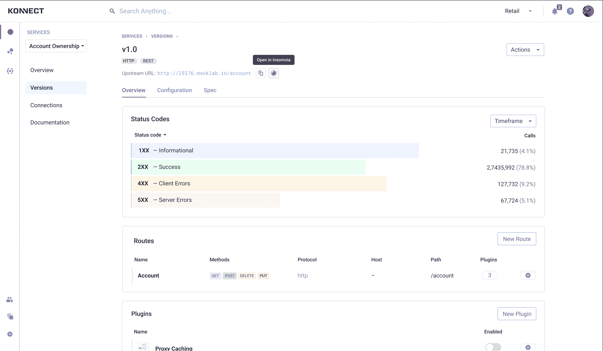

# 孔预览应用连接服务

> 原文：<https://devops.com/kong-previews-application-connectivity-service/>

Kong Inc .在其在线 [Kong Summit 2020](https://konghq.com/kong-summit/) 会议上展示了 Kong Konnect，这是一种云服务，开发者可以通过它[利用应用编程接口(API)和微服务来集成分布式应用](https://www.prnewswire.com/news-releases/kong-summit-2020-kong-inc-brings-breakthrough-api-and-microservices-connectivity-into-the-end-user-era-with-new-managed-service-301147651.html)。

Kong Konnect 作为私有测试版提供，它承诺让开发人员更容易创建跨越 API 网关、Kubernetes 入口控制器和服务网格运行时的复杂工作流。

公司首席技术官 Marco Palladino 表示，Kong Connect 使开发人员能够通过一个接口将集成运行时作为服务来使用，该接口允许他们只调用他们需要的特定服务。

Kong Konnect 计划于明年年初全面上市，它基于 ServiceHub 平台，通过任何组织开发的目录为所有服务创建单一的真实来源。Kong Konnect 还提供对运行时管理器的访问，该运行时管理器除了使 IT 团队能够跨混合云计算环境管理 Kong 运行时之外，还支持基于角色的自助服务供应。

Kong Konnect 还集成了该公司的 API 网关、入口控制器和 [Kong Mesh](https://devops.com/kong-donates-kuma-service-mesh-to-the-cncf/) ，后者是一个基于开源特使代理软件的服务网格，以及 Kong Vitals，一个用于实时监控 Kong 服务和交易的工具。Kong Konnect 还与失眠症集成，使用一种与任何基于 Git 的存储库和 Kong 开发者门户集成的工具来设计 API，开发者可以通过该门户发布自己的服务。

Palladino 表示，目标是提供一种全包服务，自动提供开发人员所需的所有第 4 层到第 7 层网络服务，以集成运行在虚拟机上的单片应用程序以及运行在 Kubernetes 集群上的新兴微服务应用程序。他说，Kong Konnect 通过单个 API 向任何类别的开发者按需提供通用服务连接。

随着应用程序环境变得更加分散，开发人员在基本连接问题上花费的时间比以往任何时候都多。该公司正在为云服务做准备，该云服务将所有这些服务统一在一个公共控制平面下，由它代表开发者进行管理。帕拉迪诺说，这项服务将解放开发者，让他们把更多的时间花在编写代码上，而不是集成应用服务。

Palladino 补充说，随着 IT 组织开始在边缘计算平台上部署更多应用程序，这些应用程序需要与公共云和内部 IT 环境上运行的各种应用程序服务集成，这种能力将变得尤为重要。

现在说 It 组织在多大程度上准备依赖服务而不是继续自己管理连接还为时过早。实际上，Kong 正在使用一个 API 来调用从简单的 API 网关到旨在集成数百个微服务的服务网格的所有内容，从而抽象出连接和网络的所有底层复杂性。

无论选择哪条道路，有一点是明确的，即新的应用程序连接即服务时代终于到来了。