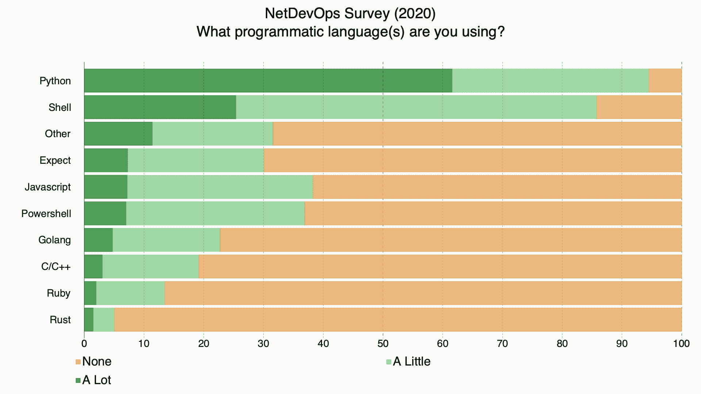

# 语言和 DevOps:网络

> 原文：<https://devops.com/languages-and-devops-network/>

讨论过去几十年来网络运营的变化很有趣。我们兜了一圈，老实说，最终到了一个更好的地方。网络专家是超级命令行奇才，他们让我们不断前进，几乎看不到 GUI。每个人都认为下一个迭代将是图形用户界面，因此网络操作将可以被更多的命令行专家访问。“每个人”大多是对的；我们确实朝那个方向走了。这是可选的，许多网络运营的朋友指出，使用[命令行](https://devops.com/?s=command+line)，你还可以做得更多、更快。在 GUI 有机会赶上命令行之前，自动化就出现了。然后是 DevOps。最后，*配置即代码。很快，通过单个产品的 GUI 做任何事情的能力被认为是一个弱点。网络运营人员正在与更多的供应商打交道，以处理网络化(这也是一个词！我只是编出来的)常见的开发活动，比如安全的某些方面。现在，API 和命令行控制着 DevOps 和网络的结合点。

**最后——到目前为止，至少是*

这表现在语言上。Shell 脚本和 Python 是这场表演的主角，几乎没有来自任何其他语言的竞争。我们可以就 shell 脚本是否是编程进行大规模的讨论，但我们不会，因为至少在网络中，*肯定是*被认为是编程。

有一次，当我们追踪一个涉及到所有这些的问题时，我和一些严肃的网络极客坐在一起，惊叹于他们能够在一瞬间从命令行实现他们想要的一切，以及他们解析命令输出的能力。谈到人际关系，我并不笨，但他们很容易让我感到羞愧。我和他们中的一些人聊了聊，一致认为他们热爱计算，但讨厌编程。网络对他们来说是有意义的。这解释了为什么联网 DevOps 的人在继续使用 Shell 脚本的同时又采用 Python。

**Python 和 Shell**

Shell 是网络中的一个给定对象。有很多现存的 shell 脚本可以做各种各样的事情，自动化以跟上敏捷的需求使得 Shell 脚本成为一个合理的选择。

Python 的出现是因为它是“共同点”。对于大多数网络人员来说，做他们需要做的事情是足够直观的，并且对于大多数开发人员来说是已知的。说到用法，Python 已经超过了 Shell(不要相信我的话，看看 GitHub 上的 [NetDevOps 调查的出色工作，或者浏览一下下面由他们创建的图表)事实上，Shell 和 Python 占据了如此多的网络开发空间，因此您可能最好只是确保将它们记下来，并将您的空闲时间集中在其他问题上，如完全不同的网络命令，甚至是数据中心与云的技能。投资回报率会更高。](https://github.com/dgarros/netdevops-survey)

**但是等等，还有更多**

最近的主要运营变化是围绕 GitOps 和向 DevOps 工具链反馈报告。人们不再希望你的设备或应用程序有一个漂亮的图形用户界面，他们希望它向提供自动化和更大图形用户界面的工具报告。许多供应商已经在那里，但许多还没有。这就产生了对工具的需求——产品、开源项目或内部开发的——来完成集成，同时等待供应商赶上。Python 很好地解决了这些问题，尽管其他能够处理 API 的语言也是可行的。

我们正在走向一个系统检测异常并做出反应加以纠正的世界，但我们还没有到那一步——至少在战略层面上没有。我们可能在一段时间内不会，因为自动化大规模网络更改是一个可怕的命题，并且将需要时间来使用这些系统进行检测，监控他们*可能*已经做了什么，然后组织才会愿意让他们“只是这样做”

**继续进行**

与此同时，NetDevOps 正被整合到 DevOps 中，在许多组织中，使用基础架构即代码或 GitOps，就像生命周期的任何其他部分一样进行部署和管理。所以我们在前进。对于我的网络窥视者来说，你的工作将继续变化，但它肯定不会消失。你对平稳运行的系统至关重要，虽然网络可能变得更加虚拟，但它仍然是网络。在这个虚拟网络下将是…一个物理网络。因此，继续踢它，开辟一条从用户到应用的道路，同时保护这些应用并确保它们有足够的资源。哦，如果我在午夜旋转另一个实例，你会跳上去，并确保它有流量定向到它，对不对？对吗？！