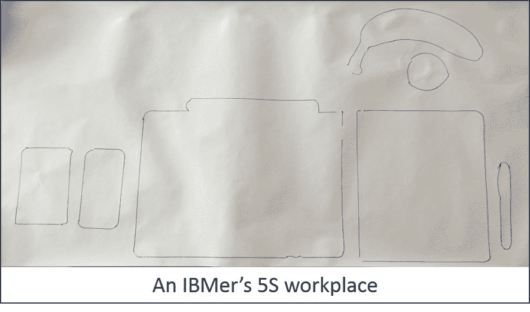
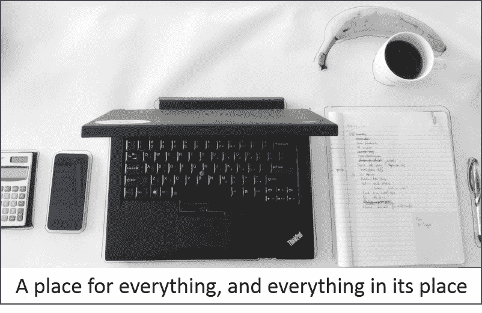

# 向 DevOps 倾斜:可以移动香蕉吗？

> 原文：<https://devops.com/lean-for-devops-is-it-ok-to-move-the-banana/>

有一个关于精益部署的城市传说，在一个车间应用 5S 的过程中，在桌子上画了线来指示每个工人应该把他们的香蕉放在哪里。

 

对于外行来说，5S 是精益实践者组织工作空间的一套原则——它可能适用于虚拟的共享工作空间或 Sharepoint 存储库，也可能适用于后台办公空间或工厂车间。

*   分类——识别并清除不必要的物品
*   整理好——整理好剩下的东西，让每样东西都有一个合理的位置——包括决定香蕉摆放的最佳位置
*   闪亮——整理和清洁你的新工作空间
*   标准化——记录并划定你新组织的工作空间的界限，这样所有东西都应该放在哪里就很明显了——包括在香蕉周围画一条线
*   持续——建立系统、任务和行为，以确保你的工作场所保持整洁、有序和无杂乱

 这些都是适用于任何共享工作空间的伟大原则——标准化将加速您采用 DevOps 原则。标准化我们组织信息的方式允许可替换性，因此质量经理可以在短时间内切换团队，并快速了解他们新团队的工作方式，并访问他们需要的信息。在某种程度上标准化存储是 Docker 和其他模块化代码概念背后的原则。标准化可以减少错误:如果以一致的方式捕获用户需求，那么在我们开始工作之前，很容易一眼就能看出是否有任何基本信息丢失。标准化确保了一致性，例如，将预先确定的决策树和标准应用于增强请求将允许快速和公平地做出优先级决定。

但是你可以拥有太多的好东西，创造性的活动和解决问题的任务通常是直觉的，或者需要人们采取各种方法，直到他们找到一个合适的。清单在这里可能没什么用。此外，DevOps 的目标之一是提高灵活性和上市速度。所以，如果你的标准开始妨碍你，你就迷失了方向。

作为一名精益蔻驰，我在开发生命周期中与我看到的需求变动量进行了斗争:乍一看，这像是返工。但事实上，这是一个迭代、响应过程的健康特征。许多 it 部门试图通过将 IT 标准化来管理人员流失——为新员工设置截止日期，并制定艰巨的变更控制程序。一旦您将治理置于流程之上，您就需要一条捷径和快速路线。

> 我最近为一个 IT 团队举办了一个精益研讨会，在此期间，我们发现 30%的变更请求正在经历一个“紧急”过程。显然，标准流程不起作用。

DevOps 要求在“按需”的基础上实现标准化。这包括处理快速变化和变异的标准方法。标准的方法必须是轻接触治理:使正确的方法成为最简单的方法。我要大胆地说，让员工存放零食的地方标准化太过分了。