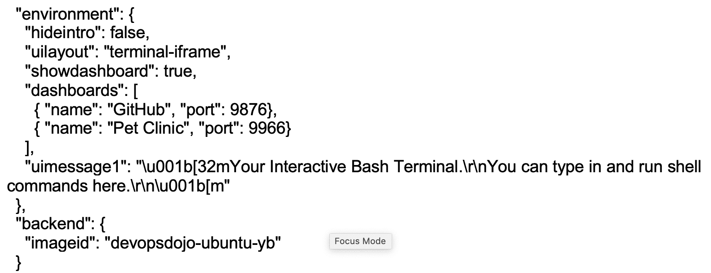

# 学习 DevOps:你需要的只是一个浏览器

> 原文：<https://devops.com/learning-devops-all-you-need-is-a-browser/>

IT 职业最令人兴奋的事情之一是不断变化的环境，提供了几乎无限的学习机会。但这也是 IT 职业生涯面临的巨大挑战之一:掌控一切太难了。因此，人们学习一些技能，找到一个合适的位置，并在那里过得很舒服，这并不罕见。问题是，舒适的利基市场随着时间的推移被挤压关闭，机会逐渐消失。这就是[提高技能变得重要的地方](https://devops.com/devops-institute-advances-the-human-elements-of-devops-with-skil-framework/)——增长新技能，找到新的定位，享受新鲜的舒适。

由于 DevOps 已成为当今景观中如此重要的一部分，因此对 DevOps 技能的需求很高。令人欣慰的是，DevOps 社区认识到了培养人才的必要性。正如 Richard Cook 博士在[安全文化、精益和开发运维](https://www.youtube.com/watch?v=gtxtb9z_4FY)的 it 革命研讨会上所说，“开发运维不仅仅是解决问题或提高速度的实践。DevOps 也是建立一个做 DevOps 的人的社区的实践。“这可以通过多种方式实现:在职辅导和指导、聚会、会议、培训课程和认证。问题是，由于人们需要时间和地点来聚在一起，其中许多都很难扩展，而且那是在我们面临社交距离带来的挑战之前。

令人欣慰的是，在过去几年里，交互式在线培训平台已经兴起，为用户提供了一个易于访问的基于浏览器的入口。在幕后，这些平台利用基于云的基础设施或容器作为服务来提供真实的环境和可扩展性。课程内容通常采用 markdown 或类似的结构，以及定义流程、小测验和学生需要完成的任何挑战的文件。这使得培训可以在网络范围内进行，覆盖的受众比面对面的研讨会多得多，而且每个学生的成本也低得多。它还为学生提供了一个安全的环境，让他们在打包的课程流程之外进行尝试和探索。这种安全性是 DevOps 通过实验持续学习的第三种方式的重要支持，因为它允许学生尝试一些事情，而不用担心搞乱环境或增加云提供商的账单。同样值得注意的是，DevOps 学习之旅通常更像是一个小部分的迭代过程，因为 DevOps 的三种流动、反馈和通过实验持续学习的方式适用于学习 DevOps，就像它们适用于实践 DevOps 一样。

在某些情况下，课程内容是开源的，这使得一个好奇的学生可以看到幕后的事情是如何工作的(并可能提出改进或修复的建议)。开源还为课程内容提供了修改和重新组合以适应不同环境和用例的机会。

 *环境配置示例代码从* [*在安全模块*](https://github.com/dxc-technology/online-devops-dojo/blob/master/online-devops-dojo/shift-security-left/index.json) 上左移

课程还可以通过包括 webhooks 和身份令牌在内的机制来利用系统之间基于 API 的互连性。这使得培训平台之外的系统，例如协作源代码控制，能够被整合到整体体验中。这也意味着可以定制培训环境，以使用组织采用的特定工具和实践，以便人们可以以熟悉的方式工作(或习惯新的工作方式)。

网络规模的在线培训平台首先出现，帮助人们了解工具和平台。但是现在，我们可以用它们做的事情范围已经大大扩展了，这意味着它们已经成为了解更多 DevOps 的宝贵资源。无论你是刚刚开始使用 DevOps，还是希望发展更深层次的技能，网上可能会有一些东西可以帮助你。这些课程也倾向于一口大小的模块，这意味着如果你有时间，你可以浏览一大堆，或者在等待构建完成或下载大规模升级时将它们扔掉。