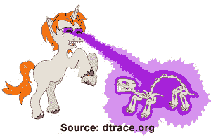

# 让我们继续倒计时:StackStorm 加入战斗的第二个原因

> 原文：<https://devops.com/lets-keep-countdown-going-reason-2-stackstorm-join-fray/>

> ## * StackStorm is a new company focusing on automation, operation and development. Evan Powell, its co-founder and CEO, has been keeping a diary, because the company is ready to emerge from stealth. This is the second article in Powell's series about the thoughts and experiences of the new DevOps company going public. f*

* * *

在昨天的 hello DevOps.com 和“hello world”帖子中，我们将顶级 DevOps 运营商的生产力提升了 10-100 倍置于历史背景下。这就像软件一下子赶上了摩尔定律无情的指数增长节奏。转变正在改变世界，已经改变了世界。

然而，障碍是存在的。像许多技术生命周期一样，一个根本的限制是我们——参与这一转变的人。

这就是我们启动 StackStorm 的第二个驱动因素:

世界上没有足够多的 DevOps 独角兽，而且永远也不会有。

理想的 DevOps 工程师是一个全栈工程师，至少可以用 python 编码，并且真正擅长跨职能协作。我们是这种类型的独角兽的磁石——我们已经雇佣了一些，并且在我们绝对牛逼的顾问委员会中也有一些。

然而:

a)做一个全栈工程师真的真的很难；在我领导 Nexenta 的时候，我们很高兴找到了一个对虚拟化有所了解并能深入了解存储的人，虽然这种情况很少见，但这并不是一个完整的堆栈视角。

b)除了真正的全栈工作规范之外，还知道如何编写足够好的代码，以使您的脚本可靠地工作并受到信任，这是非常罕见的。

c)然后，将这一点与似乎在 DevOps 的“反孤岛”世界中茁壮成长的人格类型结合起来，是非常非常罕见的。

拥有属性 1、2 和 3 的人——能够带领团队团结一致地交付产品——是物有所值的。软件需要介入，以帮助扩展和自动化这些全栈独角兽自动机。

顺便说一句，我可能有偏见，因为多年来我一直很高兴在 Nexenta 产品中使用 DTRACE，但这肯定是最棒的独角兽形象:

将所有事情自动化是很棒的。自动化机器人甚至更好。

这就是我们前进的方向。大型运营商已经在那里了。亚马逊、脸书、谷歌、贝宝和其他公司已经建立了系统，并在运营系统中应用了某种程度的机器学习，以使它们能够大规模运营并获得改进。他们已经进入了良性循环。毫不奇怪，这些运营系统背后的 IP 并没有免费与外界共享。在亚马逊和其他地方开发的组件可能会被共享，但操作自动化平台和智能很少被共享。

这就是我们和更广泛的社区介入的地方。这就引出了下一个驱动力:社区。明天我将讨论 OpenStack 和相关社区的成功如何引导我们创建 StackStorm。

如果你有兴趣受邀参加 StackStorm 运营自动化软件的私人测试版，请在此注册:www.stackstorm.com/beta