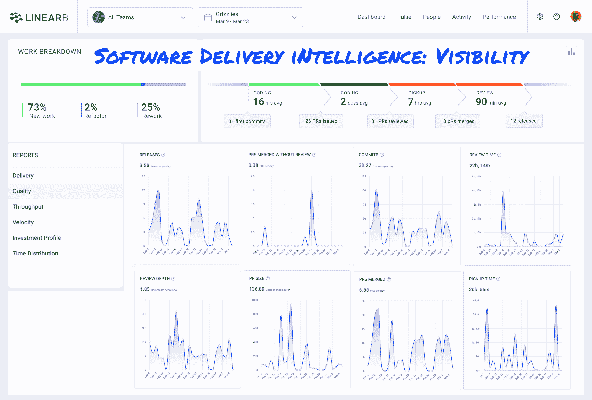

# LinearB 为软件交付智能筹集了 1600 万美元

> 原文：<https://devops.com/linearb-raises-16m-for-software-delivery-intelligence/>

LinearB 今天宣布，它已经筹集了[1600 万美元的额外资金](https://www.prnewswire.com/news-releases/linearb-secures-16-million-series-a-funding-led-by-battery-ventures-for-software-delivery-intelligence-301244412.html)，以推动软件交付智能平台的采用。

LinearB 首席执行官 Ori Keren 表示，现在可以从构建软件所用的工具和平台中自动收集所有相关数据，而不是依赖于要求软件开发团队通过将数据重新输入项目管理应用程序来跟踪进度的过时流程。

LinearB 平台[将从代码、Git、项目和发布中收集的 DevOps 管道数据](https://devops.com/linearb-looks-to-automate-devops-project-management/)关联起来，为开发团队的每个成员提供可见性和上下文。LinearB 采用机器学习算法来实时构建和关联这些数据，以提供对项目状态的准确洞察。Keren 说，这一点至关重要，因为它让团队中的每个人都能够在不等待明确指示的情况下，就优先处理哪些任务做出明智的决定。

Keren 补充说，LinearB 将在一定程度上使用这笔资金来构建与更广泛的 DevOps 平台和工具的集成。

软件交付智能不同于[价值流管理](https://devops.com/?s=value%20stream%20management) (VSM)平台；Keren 说，虽然他们提供了类似的见解，但 LinearB 提出的见解是针对开发人员的，而不是针对试图在多个团队中优化有限资源部署的高管。凯伦补充说，在许多方面，LinearB 收集的数据可以用来更好地为 VSM 平台提供信息。

相比之下，LinearB 使用仪表板中的度量标准，例如跟踪周期时间，可以更容易地识别哪些团队和项目需要额外的帮助。目标是提供更容易预测和消除项目延迟的见解，在高风险代码被纳入生产环境之前对其进行补救，消除瓶颈，并确保 DevOps 团队的重点仍然是最高优先级的任务。

超过 1500 个软件开发团队已经在使用 LinearB 作为传统项目管理应用的替代方案。Keren 说，这些客户中的大多数都在构建商业应用程序，所以现在的目标是将 LinearB 的应用范围扩展到企业。

当然，LinearB 并没有消除对项目经理的需求。然而，它确实消除了项目经理催促开发人员更新项目管理应用程序的需要。考虑到应用程序开发项目的更新速度，项目管理应用程序中的许多数据在输入后不久就会过时。

如今，应用程序开发团队的压力很大。在新冠肺炎疫情带来的经济衰退之后，许多项目已经加速，作为更快速地拥抱数字商业转型的努力的一部分。许多开发人员面临的挑战是，他们也在家里工作，以帮助对抗病毒的传播。这经常导致在缺乏背景的视频会议上与经理的互动。访问软件开发智能平台应该能够让每个对应用程序部署速度感兴趣的人更快地做出更明智的决策。