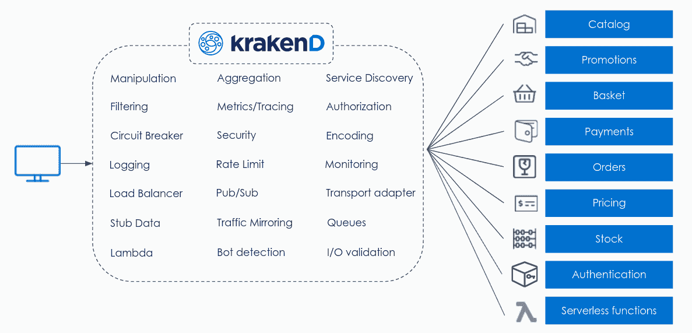

# Linux 基金会拥抱轻量级 API 网关

> 原文：<https://devops.com/linux-foundation-embraces-lightweight-api-gateway/>

Linux 基金会今天宣布，一个被称为 KrakenD 的开源应用编程接口(API)网关已经成为它将监督的最新项目。

轻量级无状态 API 网关被重新命名为 Lura 项目，最初由 KrakenD 开发，该公司计划继续提供该平台的企业版。

KrakenD 首席执行官 Albert Lombarte 表示，其开发的 API 网关提供了一种更简化的方法来管理[API](https://devops.com/?s=APIs)，不需要组织安装单独的代理或数据库。大多数组织需要的所有反向代理功能都已经嵌入到 API 网关中。Lombarte 补充说，这种方法也使 it 团队更容易将后端服务器应用程序与客户端应用程序分离，因为现在 API 可以更容易地更新，而不会影响客户端应用程序。

已经为 API 网关的持续开发做出贡献的组织包括 99P、Hepsiburada、Openroom、Postman 和 Stayforlong。Lombarte 说，API 网关也嵌入到各种其他平台中；他指出，运行该网关的服务器数量现在每月超过一百万台。

多年来，API 网关已经以各种形式出现，但是随着微服务的兴起，组织需要部署和管理的 API 数量持续稳定增长。每个添加到环境中的微服务都会添加另一个 API。当基于微服务的应用成为许多数字业务转型计划的核心时，IT 团队必须采用更灵活的方法来管理 API 之间的交互。

部分由于 API 在实现数字业务转型中发挥的作用，它们也越来越频繁地成为网络犯罪分子的目标，这些网络犯罪分子已将 API 视为一种高效的数据泄漏或向应用环境中注入恶意软件的方式。

尚不清楚 Linux 基金会的支持会对组织选择一个 API 网关还是另一个 API 网关产生什么影响。事实上，许多组织仍在尝试导航何时采用 API 网关，而不是依赖代理软件来管理少量 API，或者使用服务网格来管理数千个 API。Lombarte 说，问题不仅在于有多少 API，还在于所用平台的总重量。他指出，服务网格通常需要更多的时间和精力来部署和管理。

随着 IT 环境中 API 数量的不断增加，可能有一天组织将不得不重新审视 API 是如何创建和维护的。很多时候，API 仍然是在应用程序创建后才创建的。它们容易变脆，因此仍然经常断裂。需要基于一组 DevOps 最佳实践的更全面的 API 管理方法。面临的挑战是，当有如此多的其他问题需要他们关注时，让 DevOps 团队优先考虑 API。然而，很明显，在许多情况下，API 对于业务来说变得太具有战略意义，以至于它们的管理不能留在单个开发团队的手中。