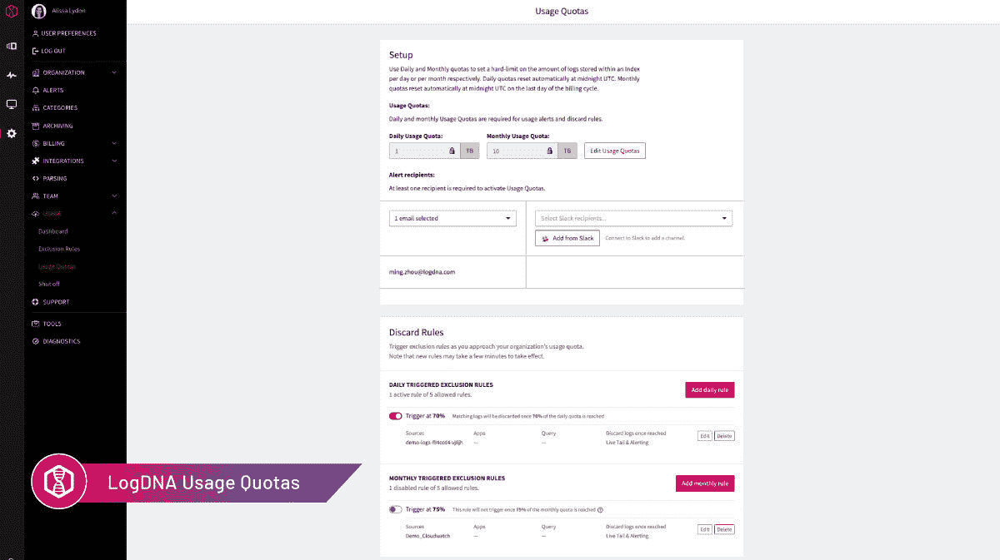

# LogDNA 增加了使用配额工具来帮助控制成本

> 原文：<https://devops.com/logdna-adds-usage-quota-tools-to-help-control-costs/>

LogDNA 今天宣布，它将使 it 团队能够[应用使用配额](https://www.businesswire.com/news/home/20210304005516/en/LogDNA-Introduces-Logging-Usage-Quotas)来帮助控制日志管理成本。

LogDNA 首席执行官 Tucker Callaway 表示，随着应用程序变得越来越复杂，部分原因是微服务的兴起，DevOps 团队可以收集的日志数据量显著增加。Callaway 说，IT 团队现在可以为 DevOps 团队分配硬配额和软配额，以限制在特定时间段内收集的日志数据量。

IT 团队可以对存储的日志量设置每日或每月的硬限制，或者也可以设置每日或每月的软配额，这些配额可以应用节流逻辑，以确保当使用量接近限制阈值时，任务关键型日志数据将继续流经 LogDNA。Callaway 说，然后将由每个 It 团队根据手头的任务来决定是否让 DevOps 团队超越这些阈值。

Callaway 指出，IT 团队还可以利用软限制，根据特定时间段内可能生成的日志数据量，将存储资源从一个开发运维团队重新分配给另一个团队。

每当达到配额，或者由于达到配额而触发排除规则时，LogDNA 都会通知团队成员。这些警报也可以与电子邮件系统或 Slack 消息平台集成。未保留的日志不会计入每月账单，但会显示并触发其他相关警报。

随着新冠肺炎疫情带来的经济衰退，IT 组织通常对成本更加敏感。与此同时，他们中的许多人鼓励开发人员承担更多的应用程序生命周期管理的责任，因为他们接受 DevOps 最佳实践。Callaway 说，使用配额旨在使 IT 团队能够在两个相互竞争的议程之间取得更好的平衡。Callaway 补充说，IT 领导不一定试图阻止 DevOps 团队收集日志数据，因为他们试图确保成本是可预测的。

当然，日志数据是任何[可观察性](https://devops.com/?s=observability)策略的核心元素之一。虽然可观察性一直是 DevOps 的核心原则，但能够有意义地实现这一原则的组织数量有限。然而，随着组织开始部署具有多种依赖关系的微服务，在对这些应用程序进行故障排除时提供上下文的需求变得更加迫切。

尚不清楚对日志数据更细粒度的控制会在多大程度上使 It 组织倾向于一个平台而不是另一个平台。然而，当需要向高级 it 和业务领导证明一个选择的合理性时，在某个时候，说明一个决策与另一个决策相比如何对底线产生更积极的影响总是一个好主意。