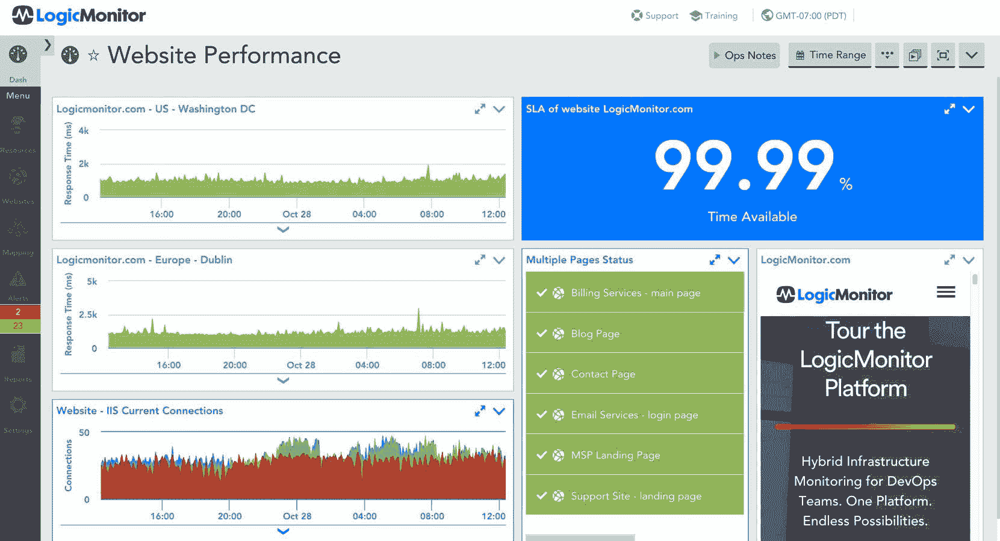

# logicmonitor 获得异常以推进 aiops

> 原文：<https://devops.com/logicmonitor-acquires-unomaly-to-advance-aiops/>

LogicMonitor 本周透露，它已经[收购了 Unomaly](https://www.logicmonitor.com/press/logicmonitor-acquires-aiops-company-unomaly/) ，这是一家注入机器学习算法的工具提供商，可以更容易地分析大量日志数据。

LogicMonitor 首席产品官 Tej Redkar 表示，收购 Unomaly 将推进此前宣布的 AIOps 计划，LogicMonitor 将通过该计划将高级分析和自动化功能嵌入其核心 IT 监控平台。LogicMonitor 认为 AIOps 只是 IT 监控平台的下一个逻辑迭代的一个元素[，而不是要求 DevOps 团队获得一个单独的平台来利用 AIOps。](https://devops.com/logicmonitor-embraces-aiops/)

Redkar 说，Unomaly 将通过识别流日志数据中的模式来帮助 LogicMonitor 实现这一目标，这些模式表明需要进一步调查的异常。Unomaly 首先为 IT 环境建立一个基线。然后，它记录每个日志事件的配置文件，包括事件的结构、来源、频率模式和间隔。然后，将相似的配置文件合并为一个聚合配置文件，使用动态参数将需要分析的数据量减少几个数量级。如果在单个日志源上的滚动 60 秒窗口内发生异常事件，Unomaly 会将这些事件汇集在一起，根据异常的类型和数量来识别和评估情况。
Redkar 指出，这种方法不仅提供了更多的事件背景信息，还极大地减少了需要存储的日志数据量。Unomaly 还被设计为接受任何格式的数据。

随着 IT 变得越来越复杂，各种规模的组织都需要更多的可观察性。然而，由于 IT 环境中的所有依赖关系都变得过于复杂，无法手动跟踪，IT 组织将需要更多地依赖机器和深度学习算法来观察 IT 环境。

自然，对算法的日益依赖将改变 IT 运营团队的角色。Redkar 说，大多数 IT 运营团队会发现自己在监督出现问题的算法并提出建议。他指出，AIOps 将主要用于管理大规模运行的 IT 环境，而不是消除对 IT 运营专业知识的需求。

随着人工智能模型的可解释性等问题的解决，这种转变还需要一些时间。毫无疑问，IT 运营环境中的一些低级职能将被取消，因此工作角色将发生变化。然而，许多这些功能将是许多 IT 专业人员不特别喜欢执行的机械任务。

当然，IT 供应商参与了类似于算法军备竞赛的事情，将人工智能注入他们的管理平台。在某些情况下，他们会自己开发这些能力。在其他情况下，他们会收购初创公司，以获得 AIOps 平台。大多数 IT 供应商将混合和匹配他们自己开发和收购的各种人工智能技术。不管采用哪种方法，现在的问题不再是 AIOps 是否适用于管理 it，而是何时适用。

— [迈克·维扎德](https://devops.com/author/mike-vizard/)